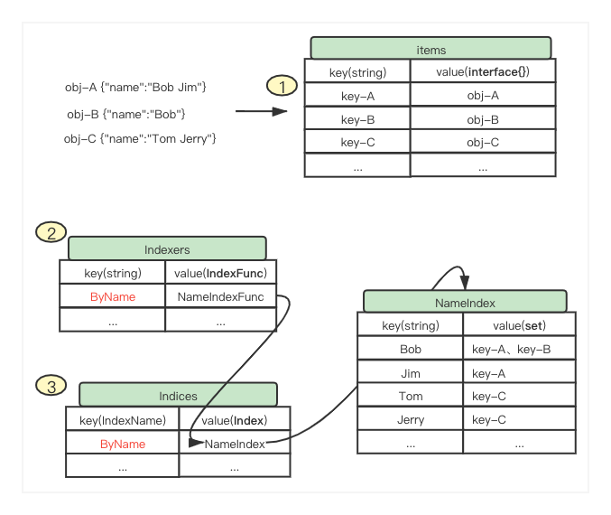

# Indexer(local store)

local store 是 Informer 机制中的本地存储（也会被称为 Indexer，但是为了和内部的实现机制中的 Indexers 区别开(多了个's')，我们接下来将 Indexer 这个模块称作 local store 更加合适一些。

## local store 存在的意义

最主要的目的就是为了**减少对 apiServer 的访问压力**。在 K8s 内部，每一种资源的 Informer 机制都会使用对应的 local store 来缓存本地该资源的状态，并只在 informer 首次启动时全量拉取( list )一次，后续通过 watch 增量更新 local store。从而在 worker 期望 get、list 对应的资源时，不必访问远端的 apiServer，而是直接访问本地的 local store 即可。同时支持在本地 local store 和 DeltaFIFO 之间的信息定时 reSync 来 reconcile.

## local store 与 apiSerer 的数据同步

本地的 local store 中的数据与远端 apiServer 侧的最新数据通过 `ListAndWatch` 机制来同步，也即是首先通过 List 所有的资源，之后通过 Watch 来同步数据。如果出现了 IO 错误，比如：网络错误等。这时会从 apiServer 重新 reList 该资源所有的最新数据，并再次进入 watch. 需要注意的是，reList 的数据，首先都到 DeltaFIFO 中，再通过 HandleDeltas 将最新的数据同步到 Listeners 和 local store 中。同时，local store 和 deltaFIFO 之间也支持定期进行 reSync。

## 重点概念

在 local store 中最主要的是有4个概念需要理解：

1. `Indexers`: type **Indexers** map[string]IndexFunc
2. `IndexFunc`: type **IndexFunc** func(obj interface{}) ([]string, error)
3. `Indices`: type **Indices** map[string]Index
4. `Index`: type **Index** map[string]sets.String

这几个概念可能会有些许的容易混淆，接下来我们详细解释一波：

1. `Indexers`：索引函数的集合，它为一个 map，其 key 为索引器的名字 IndexName (自定义，但要唯一)，value 为对应的索引函数 IndexFunc
2. `IndexFunc`: 索引函数，它接收一个 obj，并实现逻辑来取出/算出该 obj 的索引数组。需要注意是索引数组，具体取什么或算出什么作为索引完全是我们可以自定义的。
3. `Indices`: 索引数据集合，它为一个 map ，其 key 和 `Indexers` 中的 key 对应，表示索引器的名字。Value 为当前到达数据通过该索引函数计算出来的 Index。
4. `Index`: 索引与数据 key 集合，它的 key 为索引器计算出来的索引数组中的每一项，value 为对应的资源的 key(默认 namespace/name )集合。

让我们通过一个简单的例子，更加直观的理解。


首先来了 ABC 三个 obj 等待被存入 Indexer 中，第一步将 obj 们存储于 items，在 items 中以 key 和 obj 的方式来存储，这里是真正存储 obj 真身的地方。下面开始构建和更新索引。第二步，从 Indexer 中遍历所有的索引方法，我们以`ByName` 对应的索引方法 `NameIndexFunc` 为例，该索引方法能够按照 name 属性中的多个名字来进行索引。第三步，在 Indices 中拿到`ByName` 对应的索引存储 `NameIndex`，并通过刚才获得的 NameIndexFunc ，将 obj 的 key 放入 NameIndex 之中。这就完成了索引的存储。

当然示例中展示的有限，还有更新索引、删除索引等一些功能。结合源码也比较好理解。

### 补充

为了加深对 store 中四个概念的理解，以下 `Indexers`、`IndexFunc`、`Indices` 与 `Index` 进行数据示例。

1. **Indexers** map[string]IndexFunc：包含多个索引函数，为了计算资源对象的键值方法。

```bigquery
说明：
Indexers: {
    "索引器名1": 索引函数1,
    "索引器名2": 索引函数2,
}

示例：
Indexers: {
    "namespace": MetaNamespaceIndexFunc,
    "label": MetaLabelIndexFunc,
    "annotation": MetaAnnotationIndexFunc,
}

```

2. **IndexFunc** func(obj interface{}) ([]string, error)
   就是用来求出索引键的方法，如 **cache.MetaNamespaceIndexFunc** (k8s内置的索引方法)，也可以自定义实现不同的索引器。

```bigquery
说明：
Indexers: {
    "索引器名1": IndexFunc1,
    "索引器名2": IndexFunc2,
}

示例：
Indexers: {
    "namespace": MetaNamespaceIndexFunc,
    "label": MetaLabelIndexFunc,
    "annotation": MetaAnnotationIndexFunc,
}

```   
3. **Indices** map[string]Index：包含所有索引器及其 key-value 对象(即：Index 对象)

```bigquery
说明：
Indices: {
    "索引器1": {
        "索引键1": ["对象1", "对象2"], 
        "索引键2": ["对象3", "对象4", "对象5"], 
    },
    "索引器2": {
        "索引键3": ["对象1", "对象2"], 
        "索引键4": ["对象3"], 
    }

}

示例：
Indices: {
    "namespace": {
        "default": ["default/kube-root-ca.crt", "default/configmap-test1", "default/configmap-test2"], 
        ...
    },
    "labels-test": {
        "label-test2": ["default/configmap-test2"], 
        "label-test": ["default/configmap-test1"], 
    }
    "annotation-test": {
        "annotations-test": ["default/configmap-test1"],
        "annotations-test2": ["default/configmap-test2"],
    }
    ...
}
```

4. **Index** map[string]sets.String
   就是某个索引键下的所有对象，方便快速查找。

```bigquery
说明：
Indices: {
    "索引器1": Index对象1,
    "索引器2": Index对象2,

}

示例：
Indices: {
    "namespace": {
        "default": ["default/kube-root-ca.crt", "default/configmap-test1", "default/configmap-test2"], 
        ...
    },
    "labels-test": {
        "label-test2": ["default/configmap-test2"], 
        "label-test": ["default/configmap-test1"], 
    }
    "annotation-test": {
        "annotations-test": ["default/configmap-test1"],
        "annotations-test2": ["default/configmap-test2"],
    }
    ...
}
```

p.s.：详细代码请参考：demo/examples/indexer/indexinformer_test.go

## local store源码解析

### `Indexer`

定义了两方面的接口：第一类为**存储类型**的接口 Store，包含了 Add、Update、Delete、List、ListKeys、Get、GetByKey、Replace、Resync 等数据存储、读取的常规操作；第二类为**索引类型**的接口，(接口名中包含 index)。

```go
type Indexer interface {
	Store
	// 通过indexers[indexName]获得indexFunc，通过indexFunc(obj)获得indexValues
	// 通过Indices[indexName]获得对应的Index，最后返回Index[indexValues]中对应的所有资源对象的key
	// 注意indexValues可以为数组
	Index(indexName string, obj interface{}) ([]interface{}, error)
	// 通过Indices[indexName]获得对应的Index，之后获得Index[indexValues]，
	// 并排序得到有序key集合
	IndexKeys(indexName, indexedValue string) ([]string, error)
	// 获得该IndexName对应的所有Index中的index_key集合
	ListIndexFuncValues(indexName string) []string
	// 返回Index中对应indexedValue的obj集合
	ByIndex(indexName, indexedValue string) ([]interface{}, error)
	// 返回indexers
	GetIndexers() Indexers

	// 添加Indexer
	AddIndexers(newIndexers Indexers) error
}
```

### `cache`

实现了`Indexer` 接口，内部定义了 `ThreadSafeStore` 接口类型的 cacheStorage，用来实现基于索引的本地存储。以及 `KeyFunc` 代表使用的索引值生成方法。

```go
// `*cache` implements Indexer in terms of a ThreadSafeStore and an
// associated KeyFunc.
type cache struct {
	// ThreadSafeStore由 threadSafeMap 实现
	cacheStorage ThreadSafeStore
	//默认使用 MetaNamespaceKeyFunc 也即是key为namespace/name
	keyFunc KeyFunc
}
```

### `ThreadSafeStore`

接口定义了常规的存储、读取、更新接口，以及对于索引的一些接口。

~~注意：添加新的索引 `addIndexers` 只能在 local store 还没有启动，也就是还没有数据存储的时候才能够使用。如果 local store 已经启动，调用该方法会报错。~~

```go
type ThreadSafeStore interface {
	Add(key string, obj interface{})
	Update(key string, obj interface{})
	Delete(key string)
	Get(key string) (item interface{}, exists bool)
	List() []interface{}
	ListKeys() []string
	Replace(map[string]interface{}, string)
	Index(indexName string, obj interface{}) ([]interface{}, error)
	IndexKeys(indexName, indexKey string) ([]string, error)
	ListIndexFuncValues(name string) []string
	ByIndex(indexName, indexKey string) ([]interface{}, error)
	GetIndexers() Indexers

	// AddIndexers adds more indexers to this store.  If you call this after you already have data
	// in the store, the results are undefined.
	AddIndexers(newIndexers Indexers) error
	// Resync is a no-op and is deprecated
	Resync() error
}
```

### `threadSafeMap`

实现了 `ThreadSafeStore` 接口，此处为真正实现 local store(Indexer) 的地方，通过 `items` 来存储数据、`indexers` 来存储索引方法、`indices` 来存储索引，实现基于索引的存储。并实现了 `ThreadSafeStore` 的所有接口。

```go
// threadSafeMap implements ThreadSafeStore
type threadSafeMap struct {
	lock  sync.RWMutex
	items map[string]interface{}

	// indexers maps a name to an IndexFunc
	indexers Indexers
	// indices maps a name to an Index
	indices Indices
}
```

其中最重要的还是理解[重点概念](#重点概念)，并结合示例理解透，这样再去看`threadSafeMap` 内部各种方法的实现就会好理解很多。

## 一些思考

* 如果在 local store 中已经存在数据，可以再添加新的索引方式 indexFunc(indexers) 吗？

> 在 k8s 1.30 之前是不可以的。
> 添加新的索引方式通过函数 `AddIndexers` 来实现。内部首先判断 indexer 中是否存在数据(查看其中的 items 的大小是否为0)，
> 如果存在数据，则返回 err，不做任何操作。如果不存在数据，查看当前添加的 indexers 中的 indexName 和已存在的 indexName 是否有重复的，一旦重复就返回 err。
> 通过以上两种判断就可以将新的 Indexers 添加至当前的 Indexers 中。代码逻辑如下：

```go
func (c *threadSafeMap) AddIndexers(newIndexers Indexers) error {
	c.lock.Lock()
	defer c.lock.Unlock()

	if len(c.items) > 0 {
		return fmt.Errorf("cannot add indexers to running index")
	}

	oldKeys := sets.StringKeySet(c.indexers)
	newKeys := sets.StringKeySet(newIndexers)

	if oldKeys.HasAny(newKeys.List()...) {
		return fmt.Errorf("indexer conflict: %v", oldKeys.Intersection(newKeys))
	}

	for k, v := range newIndexers {
		c.indexers[k] = v
	}
	return nil
}
```

> 在 k8s 1.30 之后，支持了 informer 开启之后（即 local store 中存在数据之后）添加 indexers 的能力。
> 主要通过修改 `AddIndexers` 函数实现，在添加 indexer 之前去掉了对于 `items` 是否为空的判断。
> 在完成 indexer 的新增之后，对于 `items` 中已经存在的数据，则根据新的 indexers 逐个添加新的 index.
> 代码逻辑如下：

```go
func (c *threadSafeMap) AddIndexers(newIndexers Indexers) error {
	c.lock.Lock()
	defer c.lock.Unlock()

	if err := c.index.addIndexers(newIndexers); err != nil {
		return err
	}

	// If there are already items, index them
	for key, item := range c.items {
		for name := range newIndexers {
			c.index.updateSingleIndex(name, nil, item, key)
		}
	}

	return nil
}
```

* 如果 indexFunc 返回的 key 列表为空 `[]string{}`，那么对于这个 obj 还会添加到索引中去吗？

> 这种情况表示在此 indexName 建立的索引中不关心这个 obj，所以不会给该 indexName 对应的 Index 的索引中中添加这个 obj 的 key(namespace/name)。

* client 端 watch 到 ApiServer 侧对象的变更（add/update/delete）之后，是先变更本地数据，还是本地索引？会出现通过索引到拿到 key，但是最终的 obj 已经被删除的情况吗？

> 不会出现这种情况。对于 informer 机制而言，client 端使用的 Indexer 是「带索引能力的存储」，对于索引和最终数据的变更都会通过一个锁包装成原子操作，所以不会出现通过 Get 查询到索引和数据不一致的情况。

```go
func (c *threadSafeMap) Update(key string, obj interface{}) {
	c.lock.Lock()
	defer c.lock.Unlock()
	oldObject := c.items[key]
	c.items[key] = obj
	c.index.updateIndices(oldObject, obj, key)
}

func (c *threadSafeMap) Get(key string) (item interface{}, exists bool) {
	c.lock.RLock()
	defer c.lock.RUnlock()
	item, exists = c.items[key]
	return item, exists
}
```
