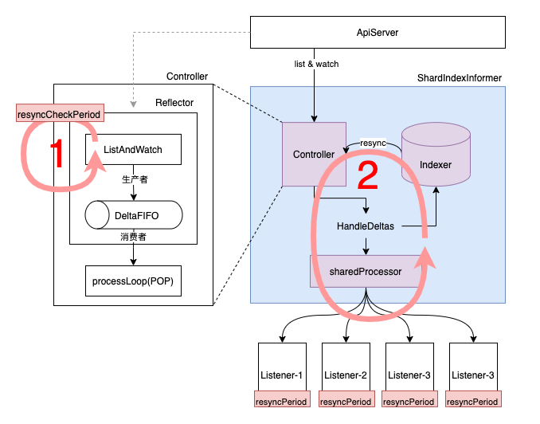
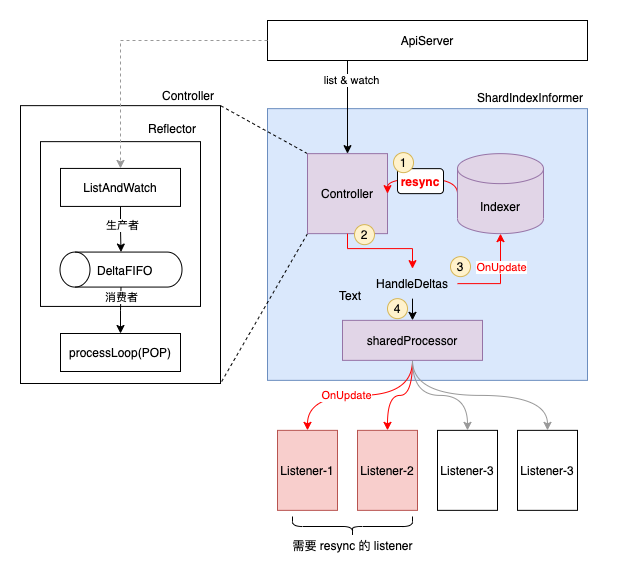
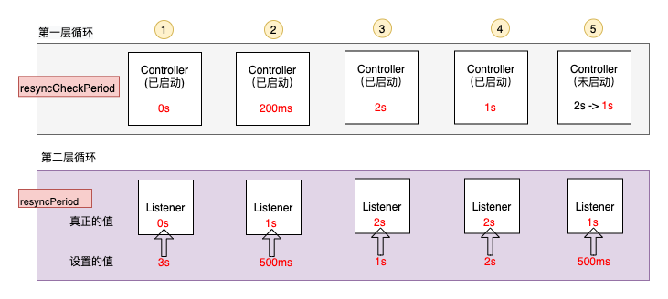

# Informer机制 - Resync
- [前沿](#前沿)
- [resync的流程](#resync的流程)
- [不同resync时间的说明](#不同resync时间的说明)
- [一些思考](#一些思考)
- [待解答问题](#待解答问题)

# 前沿
在具体使用 k8s informer 机制时，一段必要的代码如下：
```go
factory := informers.NewSharedInformerFactory(kubeClient, 0)
```
这里会产生一个疑问，在调用 NewSharedInformerFactory 的时候，第二个参数是做什么的呢？，去查看定义如下：
```go
func NewSharedInformerFactory(client kubernetes.Interface, defaultResync time.Duration) SharedInformerFactory {...}
```
第二个参数是一个 defaultResync，这是做什么的呢？更近一步还可以如下通过 WithCustomResyncConfig 自定义指定资源的 resyncPeriod 时间：
```go
sharedInformerFactory := informers.NewSharedInformerFactoryWithOptions(kubeClient, 200*time.Millisecond,
	informers.WithCustomResyncConfig(map[metav1.Object]time.Duration{
		&v1.Pod{}: 1 * time.Second,
	}))
```
同时在添加不同的 Listener（eventHandler）时，也可以自定义如下所示的 resyncPeriod：
```go
podInformer.Informer().AddEventHandlerWithResyncPeriod(cache.ResourceEventHandlerFuncs{
	AddFunc:    nil,
	UpdateFunc: nil,
	DeleteFunc: nil,
}, 3 * time.Second)
```
其定义如下：
```go
AddEventHandlerWithResyncPeriod(handler ResourceEventHandler, resyncPeriod time.Duration)  
```
那么此时会有一些疑问：
1. 这么多的 resync 时间设置分别都是干什么的？
2. 以及 resync 究竟在做什么呢？有什么意义？
3. 有哪些细节需要注意？

# resync的流程



上图展示了整个 informer 机制的流程，具体介绍见：[Informer 机制 - 概述](./Informer机制%20-%20概述.md)。对于 ShardIndexInformer 而言，主要涉及 3 个组件：
1. **Controller**：一方面使用 ListerWatcher 从 ApiServer 拿取最新的事件（对象），并放入 DeltaFIFO 中，另一方面不停的 POP DeltaFIFO 中的对象。所有 POP 出来的  Deltas 事件都会被 ShardIndexInformer 内的 HandleDeltas 处理。
2. **Indexer**：本地带索引的存储，通过 list & watch 机制实时同步 ApiServer 测更新的数据。通过访问 Indexer 而不是直接访问 ApiServer，一方面能够极大的减轻 ApiServer 的访问压力，另一方面能够加快数据访问速度。
3. **SharedProcessor**：维护了该 Infromer 上所有添加的 Listener，并负责将从 DeltaFIFO 中 POP 出的事件通知给所有的 Listener。这里有 2 种事件通知方式，对于 Sync 类型的事件只通知给需要 syncing 的 Listener。对于其余类型的事件，通知给所有的 Listener。（NOTE：这里的 Sync 事件是指 old 和 new 对象的 resourceVersion一致，包括 Sync/Replaced Delta 类型）

整个 resync 的流程，从逻辑上来说分为如上图所示的2层循环，其中第二层循环通过第一层循环来驱动，具体如下：

**第一层循环**

在 Controller（Reflector）的 ListAndWatch 内部周期性执行，具体的执行周期 `resyncCheckPeriod` 通过 NewSharedInformerFactory 为所有资源的 informer 设置默认值，可选的通过 NewSharedInformerFactoryWithOptions 来为某个资源特定设置。

在第一层循环中会定期遍历所有 listener 来查看是否需要真正启动 resync 流程，也就是驱动第二层循环（只要存在一个 listener 需要 resync，那么第二层循环就会被驱动）。

可以看到每一个 listener 都拥有自己的 `resyncPeriod` 时间，这个时间表示此 listener 期望以多长的时间周期来接收 resync 操作。
因此在第一层循环的每一轮中，都会查看一圈是否有 listener 的同步时间已经到达，如有没有，就不会驱动第二层循环，只会等待下一次的第一层循环。

**第二层循环**

需要明确，第二层循环是被第一层循环驱动的。也就是说只有在第一层循环中发现有 listener 需要同步的时候，才会开始执行第二次循环。



在这层循环中，主要有如上图所示的4个步骤：
1. 从 Indexer 中遍历所有的 Obj，并将当前<u>没在(划重点)</u> DeltaFIFO 中出现的 Obj 放入 DeltaFIFO 中
2. HandleDeltas 不停的处理从 DeltaFIFO 中 POP 出 Deltas
3. 处理第一步，先使用 OnUpdate 方式，更新至 Indexer （需要说明，这个OnUpdate是没有副作用的，所以可以无限重入，符合 resync 的场景）
4. 处理第二步，将 Sync 事件分发给对应需要同步的 Listener。这部分由 sharedProcessor 来负责完成，其内部会维护所有 listener 当前是否需要同步的状态（这个状态计算在第一层循环中完成）。如图中的 Listener-1，Listener-2。（说明：Sync 事件最终反应到 Listener 的 `OnUpdate` eventHandler 中）

# 不同resync时间的说明
**第一层循环**

对于 Controller 而言（第一层循环），其设置的同步时间 `resyncCheckPeriod` 来源有以下 3 处：
1. 通过新建 SharedInformerFactory 时所带的默认时间周期参数
2. 通过 NewSharedInformerFactoryWithOptions 所带的特定资源的同步时间周期，这个的优先级要高于来源 1
3. 通过 AddEventHandlerWithResyncPeriod 添加 listener 时设置的 resyncPeriod。若要此来源设置的时间生效，需要同时满足以下条件：
  - 此时 informer 还未启动
  - 来源 1 与 2 设置的时间周期大于本次设置的 resyncPeriod

> Note: 来源 3 最小可以设置的可用时间为 1s ，来源 1 和 2 最小时间设置需要大于 0s。（说明：设置为 0 表示不同步）

**第二层循环**



结合上图所示，对于 listener 而言（第二次循环），其设置的同步时间 `resyncPeriod` 有 4 种情况：
1. 如果 informer（第一层循环） 设置为了0， 那么 listener 的同步时间一定为 0，也即是表示不 resync
2. 设置的 `resyncPeriod` 如果小于 1s, 修改为 1s。也即是不得低于阈值 1s 的限制。
3. 如果 infromer 已经启动，并且设置的`resyncPeriod`小于`resyncCheckPeriod`，那么取`resyncCheckPeriod`
4. 其余 informer 已经启动的情况，选择 AddEventHandlerWithResyncPeriod 设置的时间值
5. 如果 informer 未启动，并且设置的`resyncPeriod`大于等于 1s（小于 1s 的会被改修改为 1s），小于`resyncCheckPeriod`（示例中为 2s ），此时将`resyncCheckPeriod`修改为`resyncPeriod`，也即是 1s。


# 一些思考
1. 为什么需要 resync？
>resync 的目的是为了让 listener 能够定期 reconcile Indexer 内的所有事件，来保证对应事件关心的对象（可能是系统内，也可能是系统外）状态都是预期状态。如果此时 reconcile 过程中发现对象状态不是预期状态，就会驱动其向预期状态发展。

> eg: 一个易理解的例子：我们实现了一个 listener，其会通过对象描述的磁盘规格（大小，类型等等）来向云服务商购买对应的磁盘。对于对象 A 而言，listener 在第一次 reconcile 对象 A 时，通过调用云服务商的接口，购买了其对应规格的磁盘，并在购买完成之后，在对象 A 的 status 中添加上了购买完成的信息，之后本轮 reconcile 就结束了。之后，用户通过云服务商控制台将磁盘误删除了，但是此时 listener 是感知不到这个操作的，并且对象 A 的 status 中一直维持着购买成功的信息，这可能会导致依赖这个 status 的程序出现意外的错误。在这种场景下，通过 resync 功能，在 listener 的同步时间到达之后，就会重新处理对象 A，此时 listener 发现控制台上并没有该磁盘，就会重新调用接口再创建一次，这样就将用户在控制台误删除的动作给修正了）

2. 没有 resync，整个 infromer 机制能 run 吗？
> 可以跑，是否开启 resync 功能不与整个 informer 流程强相关。需要根据具体的需求场景决定 resync 的开关。在下述场景中，可以开启 resync：listener 在 reconcile 事件过程中，会请求外围系统，并将外围系统的状态推动到目标状态。在这种场景下，通过定期的 resync 来保证外围系统状态能够一直保持与 listener 内的预期状态一致。（因为外围系统可能在 listener 第一次 reconcile 成功（达到预期状态），随后就被修改（人为或其他外围系统）为其他状态（预期外的状态），但是在 listener 内感知不到外围的状态已经发生了改变）

3. resync 和 ApiServer 断连有关吗？
> 没有关系。在 ApiServer 断连的情况下（也即是 Informer 和 APiServer 之间的 list&watch 中断了），这表明本地和远端发生了断连，此时会触发 relist（不是 resync），从 ApiServer 拉取指定 ResourceVersion 之后的所有对象事件（需要注意这里不是拉取全部对象事件）。resync 操作只会定期在 Controller 的 listAndWatch 中执行。

4. resync 会通知所有的 Listener 吗？
> 不会。在 Informer 开启 resync 的前提下，resync 事件只会通知给开启 resync 需求，并且距离上次 resync 达到 resyncPeriod 时间的 listener。具体实现过程中，会通过下述 sharedProcessor 内的 map listeners 来存储该 listener 是否需要 resync，其中通过方法 shouldResync 来计算更新该 map。
```
type sharedProcessor struct {
	...
	// Map from listeners to whether or not they are currently syncing
	listeners map[*processorListener]bool
	...
}

// shouldResync queries every listener to determine if any of them need a resync, based on each
// listener's resyncPeriod.
func (p *sharedProcessor) shouldResync() bool {
	...
	now := p.clock.Now()
	for listener := range p.listeners {
		// need to loop through all the listeners to see if they need to resync so we can prepare any
		// listeners that are going to be resyncing.
		shouldResync := listener.shouldResync(now)
		p.listeners[listener] = shouldResync
		...
	}
	...
}
```

5. 把 listener resync 的周期设置为 3s，那 3s 就一定会 resync 一次吗？

> 不一定。这里使用者通过 AddEventHandlerWithResyncPeriod 传递了 3s 的 resync 时间周期，但是不一定真正应用的同步时间为 3s。需要分为三种情况来说：
> - 被设置为了 0，表示不进行 resync。这是因为 informer（Controller） 的 resyncCheckPeriod 被设置为了 0，表示 Informer 内的 controller 不进行 resync，那么 resync 过程的事件源头都没有了，后续的 listener 的同步时间只能为 0。
> - 真正设置为了 3s，此时 informer 设置的 resyncCheckPeriod 小于或者等于 3s，真正 resync 的时间在 3s 左右。注意：这里是 3s 左右，不是精确的 3s。举个例子：假如此时 reflector 的 resyncCheckPeriod 为 2s, 那么真正 lister 同步的时间为4s左右。(因为第一轮 2s 的时候，该 listener 的同步时间未到，第二轮 4s 时，已经超过该 listener 的同步时间)（NOTE：这里没有计算第一层循环中遍历所有的 listener 查看是否需要同步，以及真正执行同步，从 Indexer 拉取数据到 DeltaFIFO 的时间）
> - 真正被设置为了 informer 的同步时间，该时间一定大于 3s。因为 informer（controller） 为 resync 的事件源头，下属所有 listener 的 resync 时间不能快于 informer 的同步时间。

6. resync 过程中是把Indexer中所有的 Obj 全放入 DeltaFIFO 中吗？

> 思路上是这样的，但是不准确，严格来说是错误的。在 resync 的过程中，会遍历所有在 Indexer 中的 Obj，但是并不会将所有的 Obj 都放入 DeltaFIFIO 中，这里只会将当前未在 DeltaFIFO 的 Obj，以 \<Sync,Obj\> 的形式放入 Items中。这样做是为了避免 Indexer 中陈旧的 Obj 影响最新从 ApiSever 发送来的 Obj （data race）。也就是说，如果将 Indexer 中所有的 Obj 放入 DelaFIFO 中可能会导致部分数据覆盖（污染）的情况。 

7. reflector 内的第一层 resync 会不会过于快，导致 deltaFIFO 内 sync 类型的 delta 事件还没有被消费完，下一轮的 resync 就开始了?
> 理论上是会存在这种情况的。但是在下一次的 resync 时，如果确认有需要同步的 listener，会遍历 Indexer 内的所有 Obj 来放入 DeltaFIFO 时，在这个过程中，如果 Obj 已经在 DeltaFIFO 中出现，就不会再重复添加，避免了同一个 Obj 的重复 Sync 事件。

# 待解答问题
1. sync 的目标是为了让 listener 能够重复的处理到 Indexer 内的 Obj，但是因为是在第一层循环内决定哪些 listener 是需要同步的，在第二层循环中真正处理 Sync 类型 Delta，所以会有概率出现第二层循环中并没有把所有的 Sync 事件处理完时，第一层循环就重新计算了需要同步的 listener，导致 listener 并不一定能够接收到 Indexer 内的所有 Obj。那么是不是有概率，每一轮处理都漏过了某些对象，导致这些对象就一直不会被同步到 :) ？


