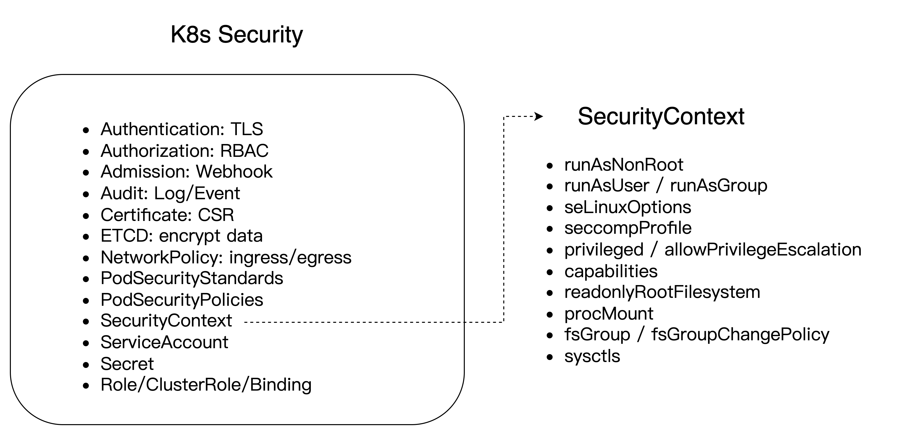

TOC
- [1. 概述](#1-概述)
- [2. 认识容器](#2-认识容器)
- [3. 容器镜像](#3-容器镜像)
  - [3.1 Container 从哪里来](#31-Container-从哪里来)
  - [3.2 内容可寻址](#32-内容可寻址)
- [4. 容器底层实现](#4-容器底层实现)
  - [4.1 Namespace](#41-Namespace)
  - [4.2 UnionFS](#42-UnionFS)
  - [4.3 Cgroup](#43-Cgroup)
- [5. 容器与 Docker/K8s 关系](#5-容器与-DockerK8s-关系)
  - [5.1 K8s CRI](#51-K8s-CRI)
  - [5.2 High-level 运行时](#52-High-level-运行时)
  - [5.3 Low-level 运行时](#53-Low-level-运行时)
- [6. 容器管理](#6-容器管理)
  - [6.1 Containerd-shim](#61-Containerd-shim)
  - [6.2 父子进程管理](#62-父子进程管理)
  - [6.3 runc](#63-runc)
  - [6.4 Docker/containerd 重启](#64-Dockercontainerd-重启)
- [7. 容器 1 号进程](#7-容器-1-号进程)
  - [7.1 Dockerfile shell/exec 模式](#71-Dockerfile-shellexec-模式)
  - [7.2 Kill 1 号进程](#72-Kill-1-号进程)
- [8. 容器 GC 机制](#8-容器-GC-机制)
  - [8.1 Docker GC 操作](#81-Docker-GC-操作)
  - [8.2 Containerd GC 配置](#82-Containerd-GC-配置)
  - [8.3 Kubelet GC 配置](#83-Kubelet-GC-配置)
- [9. 容器安全](#9-容器安全)
- [10. 小结](#10-小结)


## 1. 概述
Container 容器是 Docker、K8s 系统的核心管理对象，围绕着容器生命周期（容器创建、启动、运行、销毁、清理等）进行管理，因此熟悉 Container 管理机制将会使我们更加深入理解 Docker、K8s 的容器编排原理，以期更好的服务各类业务。

要理解 K8s Container 管理机制，可以从回答以下问题开始：
- 容器怎么来的？
- 容器底层实现？
- 容器怎么管理？
- Dockershim 和 containerd-shim 是什么？
- 容器与 Docker/K8s 的关系？
- 容器中 1 号进程是什么？可以 kill 吗？
- Docker 或 containerd 重启会影响运行中的容器吗？
- 容器 GC 机制是怎样的？
- 容器安全有哪些注意点？

本文将从容器镜像、容器底层实现、容器管理、容器与 Docker/K8s 关系、容器 1 号进程、容器 GC 与安全等方面，说明 K8s 中 Container 的管理机制。

> 本文基于 K8s v1.30，不同版本 API 略有不同。

## 2. 认识容器
- Container 容器：共享主机操作系统内核，仅打包应用及其依赖，通过内核机制隔离进程、网络和文件系统。具有轻量级、可移植性强、快速部署等特点。


- VM (Virtual Machine) 虚拟机：在宿主操作系统上模拟完整的计算机系统，包括硬件和操作系统。具有资源隔离性好、安全性高、可移植性弱等特点。


## 3. 容器镜像
### 3.1 Container 从哪里来
Container 从编写的 Dockerfile => build 构建为 Image => run 实例化为具体的 Container。


### 3.2 内容可寻址
以 Docker 运行时为例，默认的容器镜像及 Container 存储在 `/var/lib/docker` 目录，里面的文件及目录列表如下：
- image：存放容器镜像相关元数据。
- containers：存放容器运行时的数据目录，包括正在运行（running）、已经退出的（exited）。
- overlay2：存放容器镜像各层（layer）真正的数据文件，overlay2 为默认的存储格式（storage driver）。


可以看到，overlay2 里面又分为了多个目录，分别表示：
- committed：执行 docker commit 时，容器层的 diff/ 目录内容会被复制并转换为新的只读镜像层，生成一个唯一的哈希目录（如 e3020ce39f40...）。
- diff/：存储该层相对于父层的变更内容（新增、修改的文件）。镜像层为只读，容器层为可读写。
- link：指向 l/ 目录中该层的短哈希符号链接，避免因长路径导致挂载参数超限。
- lower（仅镜像层存在）文本文件，记录该层依赖的父层 ID 路径（如 l/BKRH7CIKDG:l/CDLJNURS），用于构建层叠关系。
- merged/：联合挂载后的统一视图，容器运行时看到的完整文件系统（合并所有下层和当前层）。
- work/：OverlayFS 内部使用的临时工作目录，用于保证文件操作（如复制、删除）的原子性，用户无需直接操作。


镜像各层（layer）之间具有父子关系，通过 `Content-Addressable` 内容可寻址机制，使得每一层内容都有自己唯一的 sha256 ID，实现了不同镜像相同的 layer 只需要存储一份数据目录，在镜像构建（build）与拉取（pull）时相同的 layer 可以直接复用。


## 4. 容器底层实现
容器的底层实现基于 Linux 内核的三大核心技术：命名空间（Namespaces）、控制组（Cgroups）和联合文件系统（Union File System）。


### 4.1 Namespace
Namespace 通过内核的命名空间机制，容器实现进程、网络、文件系统等资源的逻辑隔离，使每个容器拥有独立的系统视图。支持的 Namespace 类型如下：
- PID Namespace：隔离进程 ID，容器内首个进程 PID=1。
- NET Namespace：隔离网络栈（IP、端口、路由表），默认通过 veth 虚拟网卡连接宿主机网桥 docker0/cbr0/cni0。
- MNT Namespace：隔离文件系统挂载点，容器拥有独立根目录视图。
- IPC Namespace：隔离进程间通信（信号量、消息队列）。
- UTS Namespace：隔离主机名和域名。
- User Namespace：隔离用户/组 ID，提升安全性（如容器内 root 非宿主机 root）。

> 在 Docker 中默认网桥名称为 docker0，在 K8s 中默认网桥名称为 cbr0 或 cni0。

### 4.2 UnionFS
UnionFS 使用联合文件系统（UnionFS）实现镜像的分层存储。UnionFS 是一种文件系统堆叠技术，它允许多个文件系统层透明地合并为一个虚拟文件系统。

- 镜像分层：镜像由多层只读层组成，每层对应 Dockerfile 的一条指令（如 COPY、RUN）。
- 容器读写层：容器启动时，在镜像层顶部添加可写层（容器层）。
- 添加文件：新文件直接创建在顶层可写层（upperdir），不会影响底层的只读镜像层（lowerdir）。
- 修改文件：写时复制（COW，Copy-on-write）机制，修改文件时，从镜像层复制到容器层再修改，保持镜像不变。
- 删除文件：Whiteout 机制，删除文件时，在可写层创建同名 whiteout 文件（格式：.wh.xxx），隐藏下层文件。

### 4.3 Cgroup
Cgroup 控制组（Cgroups）限制容器对 CPU、内存、磁盘等资源的使用，防止单一容器耗尽宿主机资源。在 Linux 系统中，Cgroup 的配置存放在 /sys/fs/cgroup 目录下。其中，每个子目录都对应一个 Cgroup，可以对其进行资源控制。

在 K8s 中，不同 QoS (Quality of Service，服务质量) 类型的 Pod 对应的 Cgroup 资源限制目录如下：
- Guaranteed：最严格的资源限制，并且最不可能面临驱逐。 在这些 Pod 超过其自身的限制或者没有可以从 Node 抢占的低优先级 Pod 之前， 这些 Pod 保证不会被杀死。这些 Pod 不可以获得超出其指定 limit 的资源。
- Burstable：有一些基于 request 的资源下限保证，但不需要特定的 limit。如果未指定 limit，则默认为其 limit 等于 Node 容量，这允许 Pod 在资源可用时灵活地增加其资源。因为 Burstable Pod 可以包括没有资源 limit 或资源 request 的容器， 所以 Burstable Pod 可以尝试使用任意数量的节点资源。
- BestEffort：如果 Pod 不满足 Guaranteed 或 Burstable 的判据，则它的 QoS 类为 BestEffort。换言之，只有当 Pod 中的所有容器没有内存 limit 或内存 request，也没有 CPU limit 或 CPU request 时，Pod 才是 BestEffort。


从图中可以看到，Guaranteed 类型 Pod 并没有单独建一个目录，原因是：
- 分配独立的 cgroup，可以避免与其他 Pod 共享资源池，减少层级嵌套；
- Cgroup 层级越深，资源限制的生效路径越长（需逐层继承父级配置）。Guaranteed 的短路径减少了内核遍历层级树的耗时，提升资源分配效率。

## 5. 容器与 Docker/K8s 关系
Container 与 Docker/K8s 的关系总结如下图所示，核心由 K8s CRI、High-level runtime、Low-level runtime 几部分构成。


### 5.1 K8s CRI
CRI（Container Runtime Interface，容器运行时接口）是 K8s 定义的一组与容器运行时进行交互的接口，用于将 K8s 平台与特定的容器实现解耦。在 K8s 早期的版本中，对于容器环境的支持是通过 Dockershim (hard code) 方式直接调用 Docker API 的，后来为了支持更多的容器运行时和更精简的容器运行时，K8s 在遵循 OCI 基础上提出了 CRI。

当 K8s Pod 创建时，通过 Kubelet 组件调用 CRI 接口，实现 Pod 里面一个或多个 Container 的拉起，最终实现 Pod Running。

### 5.2 High-level 运行时
CRI 接口的具体实现，在容器管理上层称为 high-level runtime，当前实现了 CRI 的容器运行时有如下：
- [Containerd](https://kubernetes.io/docs/setup/production-environment/container-runtimes/#containerd)：由 Docker 公司创建，并且在 2017 年捐赠给了 CNCF，2019 年毕业。社区推荐的容器运行时。
- [CRI-O](https://kubernetes.io/docs/setup/production-environment/container-runtimes/#cri-o)：基于 OCI 规范的作为 CRI 和 OCI 之间的一座桥梁，底层通过 runc/Kata 管理容器的生命周期。
- [Docker Engine](https://kubernetes.io/docs/setup/production-environment/container-runtimes/#docker)：Docker 运行时的支持，由 cri-dockerd 进行实现，可以理解为早期 K8s Dockershim（已废弃）的 Docker 官方实现。
- [Mirantis Container Runtime](https://kubernetes.io/docs/setup/production-environment/container-runtimes/#mcr)：Docker 企业版(Enterprise Edition) 运行时的支持，由 Mirantis Container Runtime(MCR) 进行实现。

### 5.3 Low-level 运行时
- OCI（Open Container Initiative，开放容器计划）：是在 2015 年由 Docker、CoreOS 等公司共同成立的项目，并由 Linux 基金会进行管理，致力于 container runtime 标准的制定和 runc 的开发等工作。

> 所谓 container runtime，主要负责的是容器的生命周期的管理。OCI 主要分为容器运行时规范(runtime-spec) 和镜像规范(image-spec) 两部分，runtime-spec 标准对容器的创建、删除、查看、状态等操作进行了定义，image-spec 对镜像格式、打包(Bundle)、存储等进行了定义。

- runc：是由 Docker 贡献的对于 OCI 标准的一个具体实现，是一个可以用于创建和运行容器的 CLI(command-line interface) 工具。runc 直接与容器所依赖的 Cgroup/OS 等进行交互，负责为容器配置 Cgroup/Namespace 等启动容器所需的环境，创建启动容器的相关进程。

## 6. 容器管理
### 6.1 Containerd-shim
Containerd-shim 是 Docker/Containerd 管理底层容器的一个垫片层，核心作用是解耦容器运行时 (Docker/containerd) 与底层真正容器的进程父子关系、stdio 标准输入输出管道，containerd-shim 进程与容器进程一对一（有多少个容器进程，就有多少个 shim 进程），使得容器进程的运行不再依赖容器运行时，这样运行时重启或版本升级不会影响下面的容器。

> 【分层解耦】这里又一次体现了软件管理中的分层架构，多个组件可以通过加一个中间层来解耦组件间的直接依赖关系。


> Dockershim 是 Kubernetes 的一个组件，主要目的是为了通过 CRI 操作 Docker。Kubernetes 在创建之初便采用 Docker 作为它的默认容器进行时，后续代码当中包含了很多对 Docker 相关的操作逻辑。后期 Kubernetes 为了能够做解耦，兼容更多的容器进行时，将操作 Docker 相关逻辑整体独立起来组成了 dockershim。
> 
> 2020 年，K8s [宣布弃用 dockershim](https://kubernetes.io/blog/2022/02/17/dockershim-faq/)，标志着容器运行时正式向 CRI 切换，以满足对更多 Runtime 的支持，提高 K8s 生态的开放性和扩展性。

### 6.2 父子进程管理
容器中的进程父子关系是怎么管理的呢？

下图是一个包含了容器运行时（Docker/containerd）、containerd-shim、runc、my-biz（业务进程）等所有进程的父子进程关系图，可以看到每个子进程都是父进程通过 fork 方式创建的，之后 wait 子进程运行或退出，绿色部分表示 stdio（标准输入输出）管道的 fd (0/1/2) 传递，最终实现了 CLI 客户端（如 docker/crictl/kubectl 等）可以与容器里面的业务进程进行输入、输出操作。


为什么 runc 拉起进程后要退出呢？
- 如果 runc 一直运行，则 runc 的重启或升级会影响业务进程；
- 控制权交给 container managers 如 Docker/containerd；
- detached 模式才支持 fd 传递，进而支持 stdio 的管道操作；

> runc 只是一个编译好的二进制 CLI 客户端，需要的时候调用即可。支持 foreground（拉起进程后不退出）、detached（拉起进程后立即退出） 两种模式。
> 
> 在 Docker/containerd 运行时中，runc 都是以 detached 模式运行。

### 6.3 runc
runc 是由 Docker 贡献的对于 OCI 标准的一个具体实现，是一个可以用于创建和运行容器的 CLI (command-line interface) 工具。runc 直接与容器所依赖的 Cgroup/OS 等进行交互，负责为容器配置 Cgroup/Namespace 等启动容器所需的环境，创建启动容器的相关进程。


runc 支持的容器管理命令有：
- create：创建容器
- start：启动容器进程
- state：查看容器状态（running/stopped）
- list：列出从指定 root 拉起的所有容器
- exec：在容器内执行新进程（如 bash 进程）
- update：更新容器资源限制（如 cpu/memory）
- kill：杀掉容器进程（默认 SIGTERM）
- delete：删除容器及相关资源
- pause：暂停容器内的所有进程运行
- resume：恢复容器内所有已暂停的进程
- checkpoint：冻结正在运行的容器（调用 CRIU）
- restore：恢复之前被冻结的容器（调用 CRIU）

> CRIU（Checkpoint and Restore in Userspace）：是一个用于 Linux 系统进程检查点和恢复的工具，可以实现进程的热迁移。CRIU 负责冻结进程，并将作为一系列文件存储在硬盘上。恢复的时候使用这些文件还原这个被冻结的进程。

### 6.4 Docker/containerd 重启
- Docker 重启默认会 kill 所有容器，containerd 重启不会 kill 容器；
- Docker 可通过设置 `/etc/docker/daemon.json` 文件中 `live-restore = true` 来实现 Docker 重启不 kill 容器；
- K8s 中 kubelet 默认会自动拉起退出的容器，容器重启策略支持：Always（默认）、OnFailure、Never 三种模式。

## 7. 容器 1 号进程
### 7.1 Dockerfile shell/exec 模式
Dockerfile 支持两种编写模式：shell/exec 模式，区别如下图所示：

> 镜像构建：docker build -t ubuntu-shell . -f Dockerfile-shell
> 
> 运行容器：docker run -itd --name ubuntu-shell-test ubuntu-shell
> 
> 进入容器：docker exec -it ubuntu-shell-test sh


- shell 模式：容器内 1 号进程为 `/bin/sh -c xxx`，但此时 1 号进程（sh）不接受信号 SIGKILL/SIGSTOP/SIGTERM，导致 kill 1 或 kill -9 1 都无法杀掉 1 号进程。
- exec 模式：容器内 1 号进程为可执行文件本身 `sleep xxx`，但此时 1 号进程（sleep）不接受信号 SIGKILL/SIGSTOP/SIGTERM，导致 kill 1 或 kill -9 1 都无法杀掉 1 号进程。

> Linux 信号编号为 1-31，常见信号有：
> 
> 9-SIGKILL，15-SIGTERM，19-SIGSTOP 等，kill 1 不指定时默认为 15-SIGTERM。

### 7.2 Kill 1 号进程
为什么杀不死 1 号进程呢？


- 操作系统有三种信号响应：Ignore、Catch、Default；
- 1 号进程不会响应 SIGKILL 和 SIGSTOP 这两个特权信号；
- 对于其他的信号，如果注册了 signal handler，1 号进程可以响应；

在容器中查看 1 号进程的信号捕获位图（十六进制）如下：
```sh
cat /proc/1/status | grep -i SigCgt

SigCgt: 0000000000010002 # /bin/sh
SigCgt: 0000000000000000 # sleep
SigCgt: fffffffe7ffafeff # top（注册了 SIGTERM 信号捕获）
```

> SigCgt bitmap（信号捕获位图）是 Linux 内核用于记录进程对信号（Signal）的自定义处理行为的位图数据结构，存储在 /proc/<pid>/status 文件中。
> 
> 查看规则：十六进制转换为二进制 (hex) 0000000000010002 => (bin) 10000000000000010，第 2/17 为 1，分别对应 SIGINT/SIGCHLD，但是没有注册 SIGTERM，因此不响应 kill [-15] 1。

因此，图中 1 号进程 sh/sleep 都没有注册 SIGTERM 信号，所以 kill 1 或 kill -9 1 都无法杀掉 1 号进程。top 进程注册了 SIGTERM 信号捕获，因此 kill 1 可以杀死。

## 8. 容器 GC 机制
Container 过多会导致很多问题，因此在 Docker/containerd/kubelet 多个组件内都实现自己的 GC 机制，分别介绍如下。

### 8.1 Docker GC 操作
Docker 管理的容器在退出（exited）之后，默认是不会自动清理的，包括 `docker pull` 拉取的镜像也不会自动清理，这样积累越来越多就会导致磁盘存储压力，因此 Docker 支持了以下命令行 API 来支持 image/container/volume/network 等各类资源的清理。

- docker system prune -a --volumes：清理全部对象，包括清理停止的容器、未被使用的网络/数据卷、悬空镜像及构建缓存；
- docker container prune → 删除所有停止的容器；
- docker image prune -a → 删除所有未被容器引用的镜像；
- docker volume prune → 删除未使用的数据卷；
- docker network prune → 删除未使用的网络（如 iptables 规则、网桥及路由表）；
- docker builder prune --all：删除所有构建缓存；

> Docker 管理的 container 可以通过 `docker ps -a` 来查看，正在运行、退出的容器都可以看到，Docker 默认不会去自动清理已退出的容器。
> 
> 悬空镜像：dangling images，无标签且无容器依赖的镜像。

### 8.2 Containerd GC 配置
Containerd 运行时支持了自动的 GC 机制，采用三色标记算法（Tricolor Marking）实现。可以通过配置文件 `/etc/containerd/config.toml` 来配置 containerd 的 GC 参数控制。

```toml
version = 2
[plugins]
  [plugins."io.containerd.gc.v1.scheduler"]
    pause_threshold = 0.02     # GC 暂停时间阈值（占操作时间比例）
    deletion_threshold = 0     # 删除操作累积阈值（0 表示仅按计划触发）
    mutation_threshold = 100   # 数据库变更累积阈值
    schedule_delay = "0ms"     # 触发 GC 的延迟
    startup_delay = "100ms"    # 服务启动后首次 GC 延迟
```

### 8.3 Kubelet GC 配置
K8s 在 kubelet 组件中也实现了自动 GC 机制，支持 image/container 资源的自动清理。另外，当机器磁盘存储压力大时，还会触发 Eviction 驱逐 Pod 到其他资源足够的 Node 上去。


清理的先后顺序为：
- exited containers：已退出的容器
- unused images：不再使用的镜像（包括关联的容器）
- soft eviction：达到软驱逐条件的 Pod 被驱逐（有宽限期）
- hard eviction：达到硬驱逐条件的 Pod 被驱逐（无宽限期，立即驱逐）

kubelet 默认的硬驱逐条件有：
- memory.available<100Mi (Linux nodes)
- memory.available<500Mi (Windows nodes)
- nodefs.available<10%
- imagefs.available<15%
- nodefs.inodesFree<5% (Linux nodes)
- imagefs.inodesFree<5% (Linux nodes)

## 9. 容器安全
容器安全也是容器管理中需要考虑的重点之一。容器安全需覆盖「构建 -> 部署 -> 运行」全链路，有如下一些安全实践：
- 容器安全：non-root 运行（设置 uid/gid）
- 运行时安全：Rootless（如 dockerd-rootless/Podman）
- 镜像安全：可信源验证、漏洞扫描、最小化构建
- 权限管理：最小化权限原则、RBAC 细粒度控制
- 网络安全：TLS 加密通信、NetworkPolicy (ingress/egress)
- 存储安全：存储加密、访问控制、卷隔离

下图是 K8s 中支持的一些安全策略：



## 10. 小结
本文通过介绍容器镜像、容器底层实现、容器管理、容器与 Docker/K8s 关系、容器 1 号进程、容器 GC 与安全等方面，说明了 K8s 中 Container 的管理机制。小结如下：
- 容器来源：镜像构建、OCI 规范、镜像内容寻址、镜像瘦身；
- 容器底层实现：Namespace (net/pid/mount/uts 等) 隔离、UnionFS、Cgroup 资源限制；
- 容器管理：分层管理，从上到下依次是 docker -> containerd -> runc -> container；
- Dockershim 和 containerd-shim：中间解耦层，与容器同生命周期；
- 容器与 Docker/K8s 关系：K8s CRI 规范支持多种容器运行时实现，运行时管理底层容器；
- 容器 1 号进程：pid 隔离、signal 信号捕获、shell/exec 方式差异；
- 运行时重启：Docker 重启默认会 kill 所有容器，containerd 重启不会 kill 容器；
- 容器 GC 机制：Docker/containerd 和 K8s kubelet 都有各自的 GC 机制；
- 容器安全：daemon root/rootless，privilege, securityContext (uid/gid/fsgroup)；


*PS: 更多内容请关注 [k8s-club](https://github.com/k8s-club/k8s-club)*


### 参考资料
- [容器与 VM](https://www.docker.com/resources/what-container/)
- [Container 运行时](https://kubernetes.io/docs/setup/production-environment/container-runtimes/)
- [runc 实现介绍](https://iximiuz.com/en/posts/implementing-container-runtime-shim/)
- [runc 命令](https://github.com/opencontainers/runc/tree/main/man)
- [kill 1 号进程](https://blog.csdn.net/qq_34556414/article/details/118957789)
- [top 信号捕获](https://gitlab.com/procps-ng/procps/-/blob/master/src/top/top.c#L4494)
- [Docker 重启](https://docs.docker.com/engine/daemon/live-restore/)
- [kubelet 驱逐](https://kubernetes.io/docs/concepts/scheduling-eviction/node-pressure-eviction/)
- [Docker GC](https://docs.docker.com/engine/manage-resources/pruning/)
- [containerd GC](https://github.com/containerd/containerd/blob/main/docs/garbage-collection.md)
- [K8s 安全](https://kubernetes.io/docs/concepts/security/)
