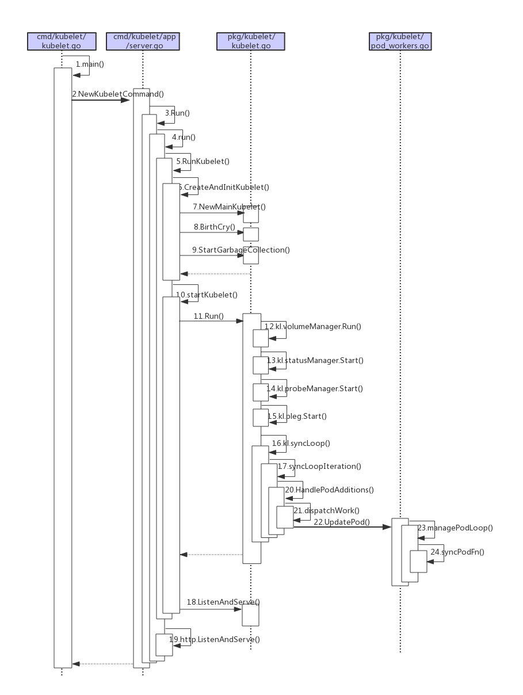

## K8s kubelet系列(一) 启动流程
目录：
- [1. 概述](#t1)
- [2. kubelet struct 重要字段](#t2)
- [3. kubelet启动流程](#t3)
- [4. 牛刀小试！](#t4)

本文基于 kubernetes v1.23 版本，版本有点旧，读者可自行查看更新版本，启动流程大同小异

### 1. <a name='t1'></a>概述：
在 k8s 中，kubelet 是每个节点上运行的最重要组件之一。可以将其视为工作节点上的代理(agent)，负责容器的生命周期，并与控制平面(如 api-server )进行交互。
我们可以先大致疏理一下 kubelet 主要提供的功能：
- 容器管理：kubelet 负责管理节点上运行的容器，通过与容器运行时接口调用(ex: Docker containerd 等) 进行交互(启动、停止、监控容器状态等)
- Pod 生命周期管理：kubelet 负责 Pod 的生命周期管理。通过与 api-server 通信，并接收 Pod 源请求事件，进行相关处理(创建、更新或删除)，还需要监控 Pod 的健康状态，并在需要时重启失败的容器。
- 资源管理：kubelet 负责监控节点的资源使用情况，并确保容器的资源请求与限制得到满足。
-  api-server 通信：kubelet 与 api-server 需要进行通信。它会定期向 api-server 发送节点状态、接收来自 api-server 的通知，并进行相应的处理。
- 健康检查和自愈能力：kubelet 负责执行容器的健康检查(probe)，并在容器不健康或故障时，采取相应的操作。(重启、替换或上报等)

### 2. <a name='t2'></a>kubelet struct 重要字段：
我们先来看看 kubelet struct 字段

由 kubelet 字段可看出，代码量爆炸多，存储了好多字段，以下列举较为重要的字段注解。

- 最重要的可以多关注下面两部分
  - 各种 Manager 字段，k8s 几乎把 Manager 管理器抽象为接口对象。
  > 其实我们可以模仿当中的设计方式，将其他模块或其他调用者需要使用的 struct "抽象"为接口对象，只对外暴露出特定方法。
  (这也比较直观，当你调用的是 struct ，而不是 interface ，通常内部代码都是一大坨一大坨的，你根本不知道哪些方法可用，哪些是内部方法，因此暴露出该给别人用的方法，这就是接口的用意)
  - podWorkers字段，kubelet 用于管理每个"Pod"的结构体字段

```go
// pkg/kubelet/kubelet.go
// Kubelet is the main kubelet implementation.
type Kubelet struct {
    // kubelet config 对象
    kubeletConfiguration kubeletconfiginternal.KubeletConfiguration
  
    // hostname is the hostname the kubelet detected or was given via flag/config
    hostname string
    // hostnameOverridden indicates the hostname was overridden via flag/config
    hostnameOverridden bool
    // 节点名称
    nodeName        types.NodeName
    // 运行时缓存，用于管理容器运行时的状态与信息
    runtimeCache    kubecontainer.RuntimeCache
    // 客户端
    kubeClient      clientset.Interface
    heartbeatClient clientset.Interface
    // kubelet根目录
    rootDirectory   string
    // podWorkers 用于处理 Pod 事件并同步 Pod 的工作器，重要对象
    // 处理每一个 Pod 的更新事件，创建 删除 更新等
    podWorkers PodWorkers
  
    // 提供接口来存储和访问 Pod 信息
    podManager kubepod.Manager
  
    // 当 Node 资源不足时，达到 evict 的策略时，会把 Pod 从 Node 上驱逐，来保证 Node 的稳定性
    evictionManager eviction.Manager
  
    // Optional, defaults to /logs/ from /var/log
    logServer http.Handler
    // 用于执行容器命令的接口
    runner kubecontainer.CommandRunner
  
    // cAdvisor 集成在 kubelet 中，收集节点和容器的监控信息 
    cadvisor cadvisor.Interface
    // 是否注册节点
    registerNode bool
    // 注册时加入的污点列表
    registerWithTaints []v1.Taint
    ...
    // informer Lister 相关
    serviceLister serviceLister
    serviceHasSynced cache.InformerSynced
    nodeLister corelisters.NodeLister
    nodeHasSynced cache.InformerSynced
    // a list of node labels to register
    nodeLabels map[string]string
    // Volume plugins.
    volumePluginMgr *volume.VolumePluginMgr
    // 健康检查或探针管理器
    probeManager prober.Manager
    livenessManager  proberesults.Manager
    readinessManager proberesults.Manager
    startupManager   proberesults.Manager
  
    ...
    // 事件发送器
    recorder record.EventRecorder
  
    // 各种 Manager 管理器
    ... 
    // statusManager
    statusManager status.Manager
    // volumeManager
    volumeManager volumemanager.VolumeManager
    ...
    // Reference to this node.
    nodeRef *v1.ObjectReference
  
    // Container runtime.
    containerRuntime kubecontainer.Runtime
    // Streaming runtime handles container streaming.
    streamingRuntime kubecontainer.StreamingRuntime
    // Container runtime service (needed by container runtime Start()).
    runtimeService internalapi.RuntimeService
    ...
    // 各种时间，主要用于上报操作
    nodeStatusUpdateFrequency time.Duration
    nodeStatusReportFrequency time.Duration
    lastStatusReportTime time.Time
    ...
  
    // nodeLeaseController 租约控制器
    nodeLeaseController lease.Controller
  
    // pleg Manager
    pleg pleg.PodLifecycleEventGenerator
  
    // Evented PLEG Manager
    eventedPleg pleg.PodLifecycleEventGenerator
  
    // Store kubecontainer.PodStatus for all pods.
    podCache kubecontainer.Cache
    
    // Watcher of out of memory events.
    oomWatcher oomwatcher.Watcher
  
    ...
  
    // Mounter to use for volumes.
    mounter mount.Interface
    // Manager of non-Runtime containers.
    containerManager cm.ContainerManager
    // Maximum Number of Pods which can be run by this Kubelet
    maxPods int
    ...
}
```
### 3. <a name='t3'></a>kubelet启动流程：
介绍完 kubelet 的重要字段后，我们再来看看 kubelet 启动流程，我们可以主要思考 kubelet 在启动过程中，对哪些组件进行初始化。

看主流程时，我习惯由项目的入口开始。和 k8s 其他组件一样，kubelet 也是使用 cobra 封装了启动程序。
```go
// cmd/kubelet/kubelet.go
func main() {
    // 启动 kubelet 入口
    command := app.NewKubeletCommand()
    code := cli.Run(command)
    os.Exit(code)
}
```

NewKubeletCommand()方法返回 *cobra.Command 对象，用于执行整个 kubelet 程序。
- 准备 opts 与 flags 相关的操作(创建对象、赋值等)
- 创建运行 Run() 方法需要的对象，ex: ctx kubeletServer kubeletDeps 等对象
- 调用 Run() 方法

```go
// cmd/kubelet/app/server.go
// NewKubeletCommand creates a *cobra.Command object with default parameters
func NewKubeletCommand() *cobra.Command {
    // 实例化 flag, opt 相关操作
    cleanFlagSet := pflag.NewFlagSet(componentKubelet, pflag.ContinueOnError)
    ...
  
    cmd := &cobra.Command{
        ...
        RunE: func(cmd *cobra.Command, args []string) error {
            
  
            // load kubelet config file, if provided
            if configFile := kubeletFlags.KubeletConfigFile; len(configFile) > 0 {
                // 获取 kubeletConfig 配置文件对象
                kubeletConfig, err = loadConfigFile(configFile)
                if err != nil {
                    return fmt.Errorf("failed to load kubelet config file, error: %w, path: %s", err, configFile)
                }
                ...
            }
            ...
            // construct a KubeletServer from kubeletFlags and kubeletConfig
            // kubelet 服务的配置选项
            kubeletServer := &options.KubeletServer{
                // flags 对象
                KubeletFlags:         *kubeletFlags,
                // kubeletConfig 对象
                KubeletConfiguration: *kubeletConfig,
            }
  
            // use kubeletServer to construct the default KubeletDeps
            // 返回 kubelet.Dependencies 对象 表示 kubelet 依赖项
            kubeletDeps, err := UnsecuredDependencies(kubeletServer, utilfeature.DefaultFeatureGate)
            if err != nil {
                return fmt.Errorf("failed to construct kubelet dependencies: %w", err)
            }
            ...
            ctx := genericapiserver.SetupSignalContext()
            ...
            // run the kubelet
            // 执行 Run 方法
            return Run(ctx, kubeletServer, kubeletDeps, utilfeature.DefaultFeatureGate)
        },
    }
  
    // flags 赋值等相关操作
  
    return cmd
  }
  
```
  
内部继续调用run()方法
  
```go
// cmd/kubelet/app/server.go
func Run(ctx context.Context, s *options.KubeletServer, kubeDeps *kubelet.Dependencies, featureGate featuregate.FeatureGate) error {
    ...
    if err := run(ctx, s, kubeDeps, featureGate); err != nil {
        return fmt.Errorf("failed to run Kubelet: %w", err)
    }
    return nil
}
```

run()方法：主要对前面传入的参数(KubeletServer Dependencies)中的字段进行初始化操作
- 异常检查或校验
- 初始化各种 中需要的对象(ex: client-go 权限 事件通知器 ContainerManager oom 及容器运行时等对象)
  - client-go：其中按照前面提到的 kubelet 会与 api-server 交互(上报节点状态、获取或同步pod信息等)，都是使用 client-go 实例来操作。
  - 权限相关：其中包含认证、校验等操作。
  - 事件通知：kubelet 会发送 event 事件。
  - ContainerManager：kubelet 资源限制使用的是 cgroups 实现，其中 kubelet 使用"层层限制"来隔离不同的资源管理。
container -> pod -> qos -> node -> 核心组件，确保 Node 的资源稳定性与隔离性。
  - 容器运行时：kubelet 最终是调用容器运行时对容器进行操作(可以简单理解为调用接口)，这里的调用就是 grpc 接口的调用，如此一来，我们可以把这步初始化简单理解成 kubelet 为了调用容器运行时，
初始化 grpc 客户端。
  - 启动健康检查 server
  - 阻塞整个进程

```go
// cmd/kubelet/app/server.go
// run 主要为kubelet启动做一些检查，准备及校验工作
// 1. 当前的配置文件注册到http server /configz url中
// 2. 初始化各种客户端
// 3. 初始化 auth cgroupRoot cadvisor ContainerManager
// 4. 为 kubelet 进程设置 oom 分数
// 5. 初始化 Runtime Server 设置CRI
// 6. 调用 RunKubelet 方法
// 7. 启动 Health http server
func run(ctx context.Context, s *options.KubeletServer, kubeDeps *kubelet.Dependencies, featureGate featuregate.FeatureGate) (err error) {
    // 省略中进行一系列的异常检查或校验
    ...
    // 获取 hostName nodeName 相关
    hostName, err := nodeutil.GetHostname(s.HostnameOverride)
    if err != nil {
        return err
    }
    nodeName, err := getNodeName(kubeDeps.Cloud, hostName)
    if err != nil {
        return err
    }
    
    switch {
    case standaloneMode:
        ... // 不需要初始化 client-go 实例
    
    case kubeDeps.KubeClient == nil, kubeDeps.EventClient == nil, kubeDeps.HeartbeatClient == nil:
        // 初始化 client-go 实例
        clientConfig, onHeartbeatFailure, err := buildKubeletClientConfig(ctx, s, kubeDeps.TracerProvider, nodeName)
        ...
    }
  
    // 权限相关初始化
    if kubeDeps.Auth == nil {
        auth, runAuthenticatorCAReload, err := BuildAuth(nodeName, kubeDeps.KubeClient, s.KubeletConfiguration)
        ...
    }
    ...
    // 启动事件广播器
    makeEventRecorder(kubeDeps, nodeName)
  
    // ContainerManager 相关，cgroup 相关
    if kubeDeps.ContainerManager == nil {
  
        // 不同 cgroup 需要的预留资源
        // 1. kube reserved
        // 2. system reserved
        // 3. QoS reserved
  
        machineInfo, err := kubeDeps.CAdvisorInterface.MachineInfo()
        if err != nil {
            return err
        }
        reservedSystemCPUs, err := getReservedCPUs(machineInfo, s.ReservedSystemCPUs)
        if err != nil {
            return err
        }
        ...
  
        kubeReserved, err := parseResourceList(s.KubeReserved)
        ...
        systemReserved, err := parseResourceList(s.SystemReserved)
        ...
        experimentalQOSReserved, err := cm.ParseQOSReserved(s.QOSReserved)
        ...
  
        // 实例化 ContainerManager
        kubeDeps.ContainerManager, err = cm.NewContainerManager(
            ...
        )
  
        if err != nil {
            return err
        }
    }
    ...
    
    // 设置 oom 分数
    oomAdjuster := kubeDeps.OOMAdjuster
    ...
  
    // 初始化 RuntimeService
    err = kubelet.PreInitRuntimeService(&s.KubeletConfiguration, kubeDeps)
    if err != nil {
        return err
    }
  
    // 启动 kubelet
    if err := RunKubelet(s, kubeDeps, s.RunOnce); err != nil {
        return err
    }
  
    // 启动 HealthzPort http server
    if s.HealthzPort > 0 {
        ...
        go wait.Until(func() {
            err := http.ListenAndServe(net.JoinHostPort(s.HealthzBindAddress, strconv.Itoa(int(s.HealthzPort))), mux)
            if err != nil {
                klog.ErrorS(err, "Failed to start healthz server")
            }
        }, 5*time.Second, wait.NeverStop)
    }
  
    if s.RunOnce {
        return nil
    }
  
    // 通知 systemd 启动完成
    go daemon.SdNotify(false, "READY=1")
  
    // 阻塞在这里
    select {
    case <-done:
        break
    case <-ctx.Done():
        break
    }
  
    return nil
}
```

RunKubelet() 方法：用前面初始化好的对象(kubeServer,kubeDeps)创建出 kubelet 对象
- 进行一些异常处理
- 创建出 kubelet 对象
  - 这里的实际返回是 kubelet.Bootstrap 接口对象，但底层其实就是 kubelet 对象
  - 其中 kubelet 会调用各种 Manager 管理器、Informer、PodSourceConfig(Pod 来源)、podWorker 等等
- 调用 startKubelet() 方法

```go
// cmd/kubelet/app/server.go
func RunKubelet(kubeServer *options.KubeletServer, kubeDeps *kubelet.Dependencies, runOnce bool) error {
    // 进行一些异常处理...
    ...
    // 创建 Kubelet 
    k, err := createAndInitKubelet(kubeServer,
        kubeDeps,
        hostname,
        hostnameOverridden,
        nodeName,
        nodeIPs)
    if err != nil {
        return fmt.Errorf("failed to create kubelet: %w", err)
    }
    ...
    // 非常重要的字段！！PodConfig 中的 updates chan 可以说是贯穿整个 kubelet 的结构
    podCfg := kubeDeps.PodConfig
  
    ...
    // 不同模式
    if runOnce {
        if _, err := k.RunOnce(podCfg.Updates()); err != nil {
            return fmt.Errorf("runonce failed: %w", err)
        }
        klog.InfoS("Started kubelet as runonce")
    } else {
        // 启动 kubelet 服务
        startKubelet(k, podCfg, &kubeServer.KubeletConfiguration, kubeDeps, kubeServer.EnableServer)
        klog.InfoS("Started kubelet")
    }
    return nil
}
```
startKubelet()方法：异步启动 kubelet。
- 启动 kubelet 主循环
- 根据不同情况，启动 http server
```go
// cmd/kubelet/app/server.go
// startKubelet 启动 kubelet
func startKubelet(k kubelet.Bootstrap, podCfg *config.PodConfig, kubeCfg *kubeletconfiginternal.KubeletConfiguration, kubeDeps *kubelet.Dependencies, enableServer bool) {
    // start the kubelet
    // 启动 kubelet 主循环，会监听 chan ，并处理本节点的 Pod 生命周期
    // 在一个新的 Goroutine 中调用 k.Run(podCfg.Updates()) 启动 kubelet 的主循环。
    go k.Run(podCfg.Updates())
  
    // 根据不同情况，启动 http server
    if enableServer {
        go k.ListenAndServe(kubeCfg, kubeDeps.TLSOptions, kubeDeps.Auth, kubeDeps.TracerProvider)
    }
    if kubeCfg.ReadOnlyPort > 0 {
        go k.ListenAndServeReadOnly(netutils.ParseIPSloppy(kubeCfg.Address), uint(kubeCfg.ReadOnlyPort))
    }
    if utilfeature.DefaultFeatureGate.Enabled(features.KubeletPodResources) {
        go k.ListenAndServePodResources()
    }
}
```
Run()方法：kubelet 主逻辑
- 启动各种 Manager：
  - 列举一些重要 Manager 的作用
    - pleg: 循环调用 container runtime 获取本节点的 Pod,之后比较本模块中之前缓存的 Pod 信息，比较最新的 Pods 中的容器的状态是否发生改变，当状态发生切换的时候，生成一个 eventRecord 事件，输出到 eventChannel 中
    - VolumeManager: 负责节点上 Pod 所使用的 volume 的管理
    - StatusManager负责 Pod 里面的容器的状态，接受从其它模块(其他 Manager 会调用其接口)发送过来的 Pod 状态改变的事件，进行处理，并更新到 api-server 中．
    - ContainerManager: 负责节点上运行的容器的 cgroups 配置信息
    - podManager: 提供了接口来存储和访问 Pod 的信息，并处理 static pod 和 mirror pod 的关系
- 上报节点状态：kubelet 向 api-server 上报信息主要分为两种：
  - NodeStatus: 使用 client-go patch 操作实现。
    - 在 kubelet 启动时，会调用 registerWithAPIServer() 方法注册节点给 api-server。
    - 后续会定时上报节点信息。
  - NodeLease: 使用内部租约控制器实现，NodeLease 只包含一些基本节点信息，如节点名称、健康状态和更新时间等，不会包含节点上所有信息。
- 进入 syncLoop() 调协过程

```go
// pkg/kubelet/kubelet.go
// Run starts the kubelet reacting to config updates
// kubelet 主逻辑
// 1. 先启动各种 Manager
// 2. 进入调协过程
func (kl *Kubelet) Run(updates <-chan kubetypes.PodUpdate) {
    // 启动一些 Manager: cloudResourceSyncManager imageManager oomWatcher resourceAnalyzer 等等
    ...
  
    // Start volume manager
    // 启动 volumeManager 管理器
    go kl.volumeManager.Run(kl.sourcesReady, wait.NeverStop)
    
	// 上报节点状态
    if kl.kubeClient != nil {
        // 启动两个 Goroutine 来更新节点状态
        // 第一个 Goroutine 每隔 kl.nodeStatusUpdateFrequency 时间向 api-server 报告节点状态，旨在提供定期的状态间隔。
        // 第二个 Goroutine 在初始化期间提供更及时的状态更新，并在节点准备就绪后向 api-server 发送一次状态更新，然后退出。
        go wait.JitterUntil(kl.syncNodeStatus, kl.nodeStatusUpdateFrequency, 0.04, true, wait.NeverStop)
        go kl.fastStatusUpdateOnce()
        
        // 启动同步租约（nodeLeaseController）的 Goroutine
        go kl.nodeLeaseController.Run(wait.NeverStop)
    }
    go wait.Until(kl.updateRuntimeUp, 5*time.Second, wait.NeverStop)
  
    ...
    
    // 启动 statusManager: 主要对比其他组件传入的修改状态与缓存内的比对
    // 如果有不一致，打 patch 给 api-server 更新其状态
    kl.statusManager.Start()
  
    // runtimeClassManager 启动
    if kl.runtimeClassManager != nil {
        kl.runtimeClassManager.Start(wait.NeverStop)
    }
    
    // 启动 Pod 生命周期事件生成器（pleg）
    kl.pleg.Start()
  
    // Start eventedPLEG only if EventedPLEG feature gate is enabled.
    if utilfeature.DefaultFeatureGate.Enabled(features.EventedPLEG) {
        kl.eventedPleg.Start()
    }
  
    // kubelet 核心调协
    kl.syncLoop(ctx, updates, kl)
}
```

#### 小节：
到此，我们从入口文件，到 kubelet 的 核心方法 syncLoop 之前，进行了简要的概述。

其中，我们浏览了 kubelet 中的 Manager 组件，这些 Manager 也分别实现 kubelet 中对应的业务逻辑。
> 我们可以试着思考，当某一组件逻辑十分复杂时，我们也能模仿 kubelet 这种设计思想，"分模块设计"，实现需要的 Manager，并在组件启动的主流程中，
> 分别引入依赖、启动 Manager。

读者可参考网上大老整理的流程图，方便整理。[原图来源](https://cloud.tencent.com/developer/article/1564951)



### 4. <a name='t4'></a>牛刀小试！：
经过上述的简要介绍了 kubelet 的启动流程，我只有一个感觉，我去！好复杂啊，一堆调用链，好多字段！！

不过冷静思考后，其实 kubelet 的核心就是前文所提到的"节点上的代理(agent)"。

> 说人话：kubelet 就是一干活的，它要做的就只有两件事情
> 
> 1. 跟领导说自己没死，还能接着干，并且定期说一下自己工作量，让领导知道工作饱不饱和
> 
> 2. 处理领导扔过来的需求，并且上报需求状态。

有了这两个需求，我们思考一下如何可以模拟出类似的功能？
> 上报领导 -> 代表需要跟 api-server 上报信息 -> Node 是 k8s 抽象出的一种资源对象 -> 也就是说我们可以使用 client-go 直接调用！

> 处理需求 -> 代表需要监听到调度到此节点的 Pod 资源 -> 也就是说我们可以使用 Informer 监听！ 

话不多说，直接上代码。

看代码之前，先说说前提：这仅用于**模拟**类似 kubelet 的最最最基本的功能，"并非"真的 kubelet。

[参考代码](../demo/examples/sample-kubelet)

- NewKubeletCommand()方法：用于启动 kubelet 
  - client-go 初始化
  - 注册 Node 
  - 定时上报给 api-server
  - 启动租约控制器
  - 启动 Informer

```go
func NewKubeletCommand() *cobra.Command {
    cmd := &cobra.Command{
        Use: "kubelet",
        RunE: func(cmd *cobra.Command, args []string) error {
    
          ctx, cancel := context.WithCancel(context.Background())
          defer cancel()
  
          nodeName := "test-node"
          // 1.client客户端
          clientSet := client.InitClient(filepath.Join(os.Getenv("HOME"), ".kube", "config"))
  
          // 2.注册node
          registeredNode := node.RegisterNode(clientSet, nodeName)
  
          // 3.定时上报node信息
          go wait.Until(func() {
              err := node.ReportNodeStatus(clientSet, registeredNode)
              if err != nil {
                  panic(err)
              }
          }, time.Minute*5, wait.NeverStop)
  
          // 4.启动lease租约控制器
          lease.StartLeaseController(clientSet, nodeName)
  
          // 5.启动informer
          informer.InitInformer(clientSet, nodeName)
          
          klog.Infoln("start sample kubelet...")
          
          select {
          case <-ctx.Done():
              break
          case <-wait.NeverStop:
              break
          }
          return nil
        },
    }
    return cmd
}
```
注册与上报 Node 状态，本质上就是调用 client-go。
```go
// ReportNodeStatus 上报节点状态
func ReportNodeStatus(clientset kubernetes.Interface, node *corev1.Node) error {
    // 构建节点状态的部分更新
    ...
  
    // 执行节点状态的部分更新
    _, err = clientset.CoreV1().Nodes().Patch(context.Background(), node.Name, types.MergePatchType, patchBytes, v1.PatchOptions{})
    if err != nil {
        return fmt.Errorf("failed to patch node status: %v", err)
    }
  
    return nil
}

// RegisterNode 注册节点
func RegisterNode(clientset kubernetes.Interface, nodeName string) *corev1.Node {

    ...
  
    // 创建Node
    createdNode, err := clientset.CoreV1().Nodes().Create(context.Background(), node, v1.CreateOptions{})
    if err != nil {
        klog.Fatalf("Failed to create Node: %v", err)
    }
  
    klog.Infof("Node created: %s\n", createdNode.Name)
    return createdNode
}

```
启动 Informer ，在启动时仅过滤出调度到**本节点**的 Pod ，并在 eventHandler 方法中处理 Pod。
(这个 demo 仅是简单改变了 Pod 状态，没有进行任何业务逻辑。)

```go
func InitInformer(clientset kubernetes.Interface, nodeName string) {
    // 创建InformerFactory
    // 使用 field 过滤，只过滤出"调度"到本节点的 pod
    informerFactory := informers.NewSharedInformerFactoryWithOptions(clientset, time.Minute*5, informers.WithTweakListOptions(func(options *v1.ListOptions) {
        options.FieldSelector = fmt.Sprintf("spec.nodeName=%s", nodeName)
    }))
    
    podInformer := informerFactory.Core().V1().Pods().Informer()
    // 注册事件处理函数到Pod的Informer
    podInformer.AddEventHandler(cache.ResourceEventHandlerFuncs{
        AddFunc: func(obj interface{}) {
            pod := obj.(*corev1.Pod)
            klog.Infof("Pod Added: %s\n", pod.Name)
            // TODO: 在这里可以处理Pod新增事件
            err := setPodStatus(clientset, pod, corev1.PodRunning)
            if err != nil {
                klog.Errorf("set Pod status running error: \n", err)
            }
        },
        UpdateFunc: func(oldObj, newObj interface{}) {
            //oldPod := oldObj.(*corev1.Pod)
            newPod := newObj.(*corev1.Pod)
    
            // TODO: 在这里可以处理Pod更新事件
            klog.Infof("Pod Updated: %s\n", newPod.Name)
            if newPod.Status.Phase == corev1.PodRunning {
                // 创建一个时间间隔为一分钟定时器，并更新pod状态
                // 只是为了"模拟"，pod的"状态流转"
                ticker := time.NewTicker(time.Minute)
                select {
                case <-ticker.C:
                    err := setPodStatus(clientset, newPod, corev1.PodSucceeded)
                    if err != nil {
                        klog.Errorf("set Pod status running error: \n", err)
                        break
                    }
                    klog.Info("Pod status change to Succeeded")
                }
            }
        },
    
        DeleteFunc: func(obj interface{}) {
            pod := obj.(*corev1.Pod)
            // TODO: 在这里可以处理Pod删除事件
            klog.Infof("Pod Deleted: %s\n", pod.Name)
            realDeletePod(clientset, pod)
        },
    })
    
    // 启动InformerFactory
    informerFactory.Start(wait.NeverStop)
    for gvr, ok := range informerFactory.WaitForCacheSync(wait.NeverStop) {
        if !ok {
            klog.Fatal(fmt.Sprintf("Failed to sync cache for resource %v", gvr))
        }
    }
    klog.Infoln("start kubelet informer...")
}
```

#### 测试
启动项目后，查看 kubectl ，已经是 Ready 状态，代表 Node 上报成功。
```bash
➜  sample-kubelet git:(main) ✗ kubectl get node | grep test-node
test-node   Ready      <none>          6h21m   
```
接下来，我们测试一下创建 Pod 。
Pod yaml 可使用 Demo 目录下 ./yaml/test-pod.yaml 示例
```yaml
apiVersion: v1
kind: Pod
metadata:
  name: busybox
  namespace: default
spec:
  nodeName: test-node   # 只调度在此节点上
  containers:
    - image: busybox
      command:
        - sleep
        - "3600"
      imagePullPolicy: IfNotPresent
      name: busybox
  restartPolicy: Always
```
如下所示，我们可以看到 Pod 状态已经改为 Running。
```go
➜  sample-kubelet git:(main) ✗ kubectl apply -f yaml/test-pod.yaml
pod/busybox created
➜  sample-kubelet git:(main) ✗ kubectl get pods                   
NAME      READY   STATUS    RESTARTS   AGE
busybox   0/1     Running   0          3s
```

一段时间后， Pod 状态改变为 Succeeded ，这是 Informer 中实现的逻辑。
```go
➜  sample-kubelet git:(main) ✗ kubectl get pods
NAME      READY   STATUS      RESTARTS   AGE
busybox   0/1     Succeeded   0          61s
```
删除操作。
```go
➜  sample-kubelet git:(main) ✗ kubectl delete pods busybox
pod "busybox" deleted
```
特别注意：当 Pod 在 Running 时，会发现  Pod 会阻塞在 Terminating 一会，之后才会被删除成功，这是因为有 deletionGracePeriodSeconds 与 deletionTimestamp 字段。
Pod 本身有优雅关闭的机制，当状态为 Running 时，需要处理这部份逻辑，然而 Demo 中没有处理这部份，需要特别注意。
```bash
➜  sample-kubelet git:(main) ✗ kubectl delete pods busybox
pod "busybox" deleted

➜  practice_kube git:(main) ✗ kubectl get pods -owide
NAME      READY   STATUS        RESTARTS   AGE   IP       NODE        NOMINATED NODE   READINESS GATES
busybox   0/1     Terminating   0          29s   <none>   test-node   <none>           <none>
```
