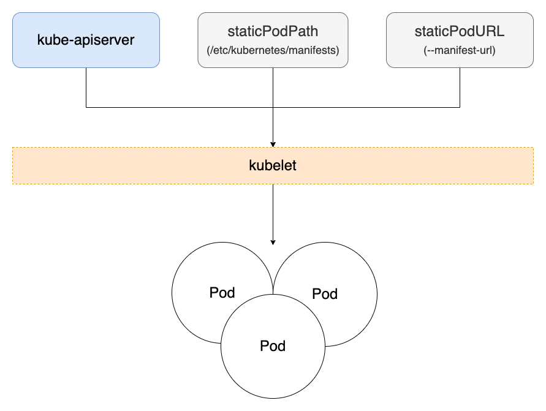
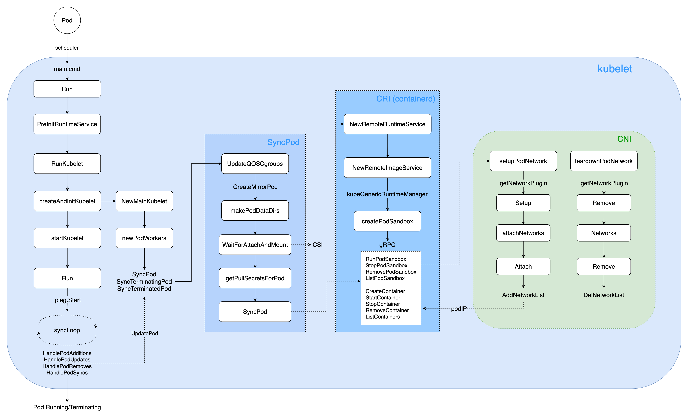
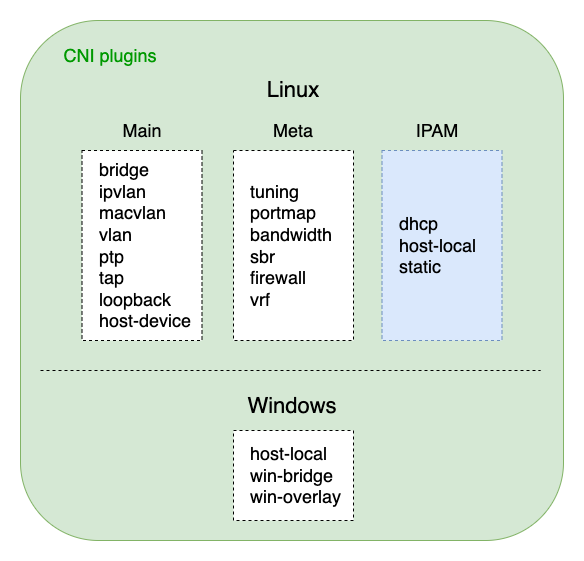

TOC
- [1. 概述](#1-概述)
- [2. K8s 中多种 IP](#2-K8s-中多种-IP)
  - [2.1 Pod IP CIDR](#21-Pod-IP-CIDR)
  - [2.2 Node CIDR](#22-Node-CIDR)
  - [2.3 Service IP CIDR](#23-Service-IP-CIDR)
- [3. Pod 生命周期](#3-Pod-生命周期)
  - [3.1 Pod 创建方式](#31-Pod-创建方式)
  - [3.2 kubelet 管理 Pod 生命周期](#32-kubelet-管理-Pod-生命周期)
- [4. Pod IP 分配流程](#4-Pod-IP-分配流程)
  - [4.1 CNI-IPAM 分配 IP](#41-CNI-IPAM-分配-IP)
  - [4.2 IPAM host-local 测试](#42-IPAM-host-local-测试)
  - [4.3 hostNetwork 使用 Node IP](#43-hostNetwork-使用-Node-IP)
- [5. Pod IP 双协议栈](#5-Pod-IP-双协议栈)
- [6. Pod IP 固定与回收](#6-Pod-IP-固定与回收)
- [7. 小结](#7-小结)

> 本文基于 K8s v1.27，CRI 已移除 Dockershim。

## 1. 概述
Pod 作为 K8s 中的一等公民，其承载了最核心的 Container(s) 的运行。同时，Pod 也是 K8s 中资源调度的最小单位，因此熟悉其初始化过程（包括网络、存储、运行时等）将会使我们更加深入理解 K8s 的容器编排原理，以期更好的服务各类业务。

Pod 初始化核心流程如下：

- kube-apiserver 收到客户端请求（Controller 或 kubectl 客户端）后，创建对应的 Pod；
- kube-scheduler 按照配置的调度策略进行 Pod 调度，选择最为合适的 Node 作为目标节点；
- kubelet（运行于每个 Node 上的 K8s agent）Watch 监听到调度到所在节点的 Pod(s)，开始真正创建 Pod；
- 由 CRI 首先创建出 PodSandbox，初始化对应的网络 net namespace，调用 CNI 获取 Pod IP；
- 接着 CRI 开始创建 Pod 中第一个 pause container，绑定到上一步创建的 net namespace 和 Pod IP；
- 接着由 CRI 依次创建和启动 Pod 中声明的 initContainers 和 containers 容器；
- 当所有的 containers 运行起来后，探针探测容器运行符合预期后，Pod 状态最终更新为 Running；

本文将从 K8s 中多种 IP CIDR、Pod 生命周期、kubelet 核心逻辑、CNI IPAM 分配 Pod IP、双协议栈（IPv4/IPv6）、IP 固定与回收等流程，说明 Pod IP 的分配机制。

## 2. K8s 中多种 IP
### 2.1 Pod IP CIDR
在 K8s 中最常见的 IP 类型就是 Pod IP，在初始化 K8s 集群的时候，通过 `--cluster-cidr` 参数控制 Pod IP CIDR 网段，所有 Pod 动态分配的 IP 都会落在此 CIDR 网段内。

具体参数控制如下：
通过 kube-controller-manager 组件的 `--cluster-cidr` 参数进行配置，根据集群规模一般会选择 16 位的网段来配置集群支持的 Pod IP CIDR 网段，如 10.0.0.0/16，理论上最大支持 2 ^ (32 - 16) = 65536 个 Pod IP 的分配。

> 【集群规模】可按需配置 Pod IP CIDR，K8s 官方支持的一个大集群（large cluster），最大支持约 5k Nodes、15w Pods。

### 2.2 Node CIDR
在通过 kube-controller-manager 组件的 `--cluster-cidr` 控制了 Pod IP 的 CIDR 网段后，首先会在集群中每个 Node 分配一个 subnet CIDR，他们都属于 `--cluster-cidr` 网段。

具体参数控制如下：
通过 kube-controller-manager 组件的 `--allocate-node-cidrs=true`、`--node-cidr-mask-size=24` 参数控制每个 Node 节点的 subnet CIDR 子网段，这样落在每个 Node 上的 Pod 最大的可分配 IP 数量为 2 ^ (32 - 24) = 256 个，各云厂商会根据自己的网络策略，一般会预留一部分，最终可分配的 IP 一般为最大个数的一半 (128 个)。

> 【双协议栈】若开启了 dual-stack IP，则可通过 `--node-cidr-mask-size-ipv4=24`、`--node-cidr-mask-size-ipv6=64` 分别控制 IPv4 和 IPv6 的 Node CIDR 子网大小。

在 K8s 标准集群中，通过 kubelet 组件的 `--max-pods=110` 控制了默认一个 Node 最大的 Pod 数量为 110 个。

### 2.3 Service IP CIDR
除了上面提到的 Pod IP CIDR 和 Node CIDR 外，K8s 中还有一类 Service IP CIDR，控制 Service 资源的 `ClusterIP` 网段范围。

具体参数控制如下：
通过 kube-apiserver 和 kube-controller-manager 组件的 `--service-cluster-ip-range=10.96.0.0/12` 控制 Service `ClusterIP` 的网段范围。

根据 Service Type 不同，除了 `Headless Service` 显式将 `.spec.clusterIP=None` 设置后，生成的 Service 将不会分配 ClusterIP，其他类型的 Service 则都会动态分配 ClusterIP。示例如下：

```
kubectl get svc -n demo

NAME                TYPE        CLUSTER-IP    EXTERNAL-IP   PORT(S)             AGE
demo-clusterip      ClusterIP   10.96.0.46    <none>        80/TCP              6d11h
demo-nodeport       NodePort    10.96.0.25    <none>        80:31666/TCP        6d11h
demo-loadbalancer   ClusterIP   10.96.0.250   11.234.50.12  80/TCP              153d
demo-headless       ClusterIP   None          <none>        8080/TCP,8081/TCP   20d
```

需要注意的是，Service 动态分配的 ClusterIP 仅在 K8s 集群内部可访问，通过 K8s 内置的 DNS 进行 Service 域名解析到此 ClusterIP，转发到后端真正的 Pod(s) 时进行流量的负载均衡。

> 【外部访问】若需要从集群外部访问集群内服务，可通过 NodePort 或 EXTERNAL-IP 进行访问，还可通过 Ingress 进行更灵活的 L7 (http/https) 流量访问控制。

## 3. Pod 生命周期
### 3.1 Pod 创建方式
从 kubelet 源码可看到，K8s 支持三种来源方式创建 Pod，分别是 kube-apiserver、staticPodPath、staticPodURL，源码如下：

```go
// kubernetes/pkg/kubelet/kubelet.go
// 三种创建 Pod 的方式：file, http, apiserver
func makePodSourceConfig(kubeCfg *kubeletconfiginternal.KubeletConfiguration, kubeDeps *Dependencies, nodeName types.NodeName, nodeHasSynced func() bool) (*config.PodConfig, error) {
	...

	// define file config source
	if kubeCfg.StaticPodPath != "" {
		klog.InfoS("Adding static pod path", "path", kubeCfg.StaticPodPath)
		config.NewSourceFile(kubeCfg.StaticPodPath, nodeName, kubeCfg.FileCheckFrequency.Duration, cfg.Channel(ctx, kubetypes.FileSource))
	}

	// define url config source
	if kubeCfg.StaticPodURL != "" {
		klog.InfoS("Adding pod URL with HTTP header", "URL", kubeCfg.StaticPodURL, "header", manifestURLHeader)
		config.NewSourceURL(kubeCfg.StaticPodURL, manifestURLHeader, nodeName, kubeCfg.HTTPCheckFrequency.Duration, cfg.Channel(ctx, kubetypes.HTTPSource))
	}

	if kubeDeps.KubeClient != nil {
		klog.InfoS("Adding apiserver pod source")
		config.NewSourceApiserver(kubeDeps.KubeClient, nodeName, nodeHasSynced, cfg.Channel(ctx, kubetypes.ApiserverSource))
	}
	return cfg, nil
}
```

其中 kube-apiserver 是最常见的方式，包括通过 kubectl apply -f xxx.yaml 和各类 Controller 动态创建的 Pod 都是这种类型。

staticPodPath 主要用途是通过 staticPod 方式创建 K8s 管控组件本身，包括 kube-apiserver, kube-controller-manager, kube-scheduler, etcd 等核心组件，默认路径是 /etc/kubernetes/manifests 目录，kubelet 会持续监听此目录，有对应 yaml 变更时，动态变更对应的 staticPod。

staticPodURL 是通过 kubelet 参数 --manifest-url 指定的 HTTP 方式，创建对应 URL 指定的一个或多个 Pod，这种方式实际场景较少使用。

通过 staticPodPath、staticPodURL 两种方式创建的 staticPod，kubelet 将转化为 mirrorPod 提交到 kube-apiserver，这样 kubectl get pod 就可以看到了。

> 【mirrorPod】表示通过 staticPod 方式由 kubelet 拉起来的 Pod，kubelet 会统一发起 Pod.Create() 请求，写到 kube-apiserver，这样通过 kubectl 客户端就可以查看了。
> 
> mirrorPod 的 name 后缀统一为所在 Node hostname（如 mirror-pod-10.0.0.6），如果直接通过 kubectl delete pod 删除后，又会被 kubelet 立即拉起来。

三种 Pod 创建方式小结如下：



### 3.2 kubelet 管理 Pod 生命周期
在每个 Node 上运行的 kubelet 持续监听上述三种来源的 Pod 列表，并通过内部一系列步骤调谐 (Reconcile)，最终让 Pod 运行起来。

下面，以最常见的 kube-apiserver 为 Pod 来源，说明 kubelet 创建、调谐 (Reconcile) Pod 的核心逻辑。

首先，通过 fieldSelector (spec.nodeName) 选择仅落在 kubelet 所在节点的 Pod 列表：

```go
// kubernetes/pkg/kubelet/config/apiserver.go
// kubelet 通过 fieldSelector = spec.nodeName 选择 pods
func NewSourceApiserver(c clientset.Interface, nodeName types.NodeName, nodeHasSynced func() bool, updates chan<- interface{}) {
	lw := cache.NewListWatchFromClient(c.CoreV1().RESTClient(), "pods", metav1.NamespaceAll, fields.OneTermEqualSelector("spec.nodeName", string(nodeName)))

	// The Reflector responsible for watching pods at the apiserver should be run only after
	// the node sync with the apiserver has completed.
	klog.InfoS("Waiting for node sync before watching apiserver pods")
	go func() {
		for {
			if nodeHasSynced() {
				klog.V(4).InfoS("node sync completed")
				break
			}
			time.Sleep(WaitForAPIServerSyncPeriod)
			klog.V(4).InfoS("node sync has not completed yet")
		}
		klog.InfoS("Watching apiserver")
		newSourceApiserverFromLW(lw, updates)
	}()
}
```

之后，通过多个异步 channel (configCh, plegCh, syncCh, housekeepingCh)，将 Pod 的 ADD/UPDATE/DELETE 增删改事件进行异步调谐，最终完成 Pod 从 Pending -> Running -> Terminating 的全生命周期管理。



kubelet 整体代码逻辑比较复杂、嵌套较深，核心流程小结如下：

- kubelet ListAndWatch 监听到调度到所在节点的 Pod(s)，开始真正创建 Pod；
- 由 CRI 首先创建出 PodSandbox，初始化对应的网络 net namespace，调用 CNI 获取 Pod IP；
- 接着 CRI 开始创建 Pod 中第一个 pause container，绑定到上一步创建的 net namespace 和 Pod IP；
- 接着由 CRI 依次创建和启动 Pod 中声明的 initContainers 和 containers 容器；
- 当所有的 containers 运行起来后，探针探测容器运行符合预期后，Pod 状态最终更新为 Running；

## 4. Pod IP 分配流程
### 4.1 CNI-IPAM 分配 IP
从上面 kubelet 管理 Pod 的生命周期逻辑可以看到，CRI 运行时（如 containerd）第一步是创建 PodSandbox，实质是通过调用 CNI 获取 Pod IP，然后初始化并运行 Pod 里面第一个 pause (registry.k8s.io/pause:3.9) 容器。

> 通过 Pod 将一组相关 containers 放到一起，共用同一个 IP，一方面实现相关容器之间协作通信，另一方面也可减少 IP 资源的分配量，不用每个容器都分配一个 IP。

通过 CNI [官网](https://www.cni.dev/plugins/current/) 可查看当前支持的多种插件，分为 Main, Meta, IPAM 等多种类型，其中 IPAM (IP Address Management) 是专门进行 IP 地址分配的插件，支持三种子类型 dhcp, host-local, static。

> CNI (Container Network Interface, 容器网络接口)，是 K8s 使用的统一容器网络模型，用户可按需实现自己的 CNI 插件，[查看 CNI](https://github.com/k8s-club/k8s-club/blob/main/articles/K8s%20%E7%B3%BB%E5%88%97(%E5%85%AD)%20-%20%E6%B5%85%E8%B0%88%20CNI.md) 。



- dhcp：是通过 dhcp client 请求 dhcp server 服务进行动态 IP 分配，其依赖 CNI 插件可访问 dhcp 服务器，配置复杂度高，实际使用较少。
- host-local：是最常见的使用方式，通过在宿主机 Node 上以文件读写的方式，进行 IP 分配与释放。其中 IP 分可配的 range 范围由上面 2.2 所述，通过 Controller 为每一个 Node 分配对应的 CIDR，host-local 插件将从这个 Node CIDR 中动态分配 IP 给 Pod 使用。
- static：是通过直接指定 IP 地址，为 Pod 分配指定的 IP，支持 IPv4/IPv6，主要用于 debug 或指定 IP 分配的场景，一般较少使用。

### 4.2 IPAM host-local 测试
下面以 host-local 方式进行 Demo 测试：

cat host-local.conf
```json
{
    "cniVersion":"0.3.1", # CNI 版本
    "name":"examplenet", # 网络名称，会建立对应的目录
    "ipam":{
        "type":"host-local", # host-local 类型
        "ranges":[
            [
                {
                    "subnet":"10.10.0.0/16", # 子网 CIDR
                    "rangeStart": "10.10.1.21", # IP 分配范围开始
                    "rangeEnd": "10.10.1.28", # IP 分配范围结束
                    "gateway": "10.10.0.254" # 网关
                }
            ]
        ],
        "dataDir":"/tmp/cni-example" # 宿主机存放的数据目录
    }
}
```

在宿主机 Node 上执行 ADD 分配 IP：
```bash
# 第一次执行 (ns1)
CNI_COMMAND=ADD CNI_CONTAINERID=ns1 CNI_NETNS=/var/run/netns/ns1 CNI_IFNAME=eth0 CNI_PATH=/opt/cni/bin/ /opt/cni/bin/host-local < host-local.conf
{
    "cniVersion": "0.3.1",
    "ips": [
        {
            "version": "4", # IPv4
            "address": "10.10.1.21/16",
            "gateway": "10.10.0.254"
        }
    ],
    "dns": {}
}

# 再次执行 (ns2)
CNI_COMMAND=ADD CNI_CONTAINERID=ns2 CNI_NETNS=/var/run/netns/ns2 CNI_IFNAME=eth0 CNI_PATH=/opt/cni/bin/ /opt/cni/bin/host-local < host-local.conf
{
    "cniVersion": "0.3.1",
    "ips": [
        {
            "version": "4", # IPv4
            "address": "10.10.1.22/16",
            "gateway": "10.10.0.254"
        }
    ],
    "dns": {}
}
```

可以看到从 rangeStart 开始按序分配 IP 10.10.1.21, 10.10.1.22，一次分配一个。

分配出来在宿主机上以文件形式存储：

```go
/tmp/cni-example/examplenet]# ll
total 64
-rw-r--r-- 1 root root  7 Jul  8 22:01 10.10.1.21
-rw-r--r-- 1 root root  7 Jul  8 22:02 10.10.1.22
-rw-r--r-- 1 root root 10 Jul  9 14:41 last_reserved_ip.0
-rwxr-x--- 1 root root  0 Jul  8 21:05 lock
```

其中 last_reserved_ip 表示最后一次分配的 IP，后续分配 IP 将从这个 last_reserved_ip 开始，遍历配置中 [rangeStart - rangeEnd] 之间可分配的 IP，返回给客户端。

当 Pod 删除的时候，会调用 StopPodSandbox -> teardownPodNetwork，最终调用 IPAM host-local DEL 命令删除对应 Pod 的 IP。
```bash
CNI_COMMAND=DEL CNI_CONTAINERID=ns1 CNI_NETNS=/var/run/netns/ns1 CNI_IFNAME=eth0 CNI_PATH=/opt/cni/bin/ /opt/cni/bin/host-local < host-local.conf

/tmp/cni-example/examplenet]# ll
total 64
-rw-r--r-- 1 root root  7 Jul  8 22:02 10.10.1.22
-rw-r--r-- 1 root root 10 Jul  9 14:41 last_reserved_ip.0
-rwxr-x--- 1 root root  0 Jul  8 21:05 lock
```

> 【扩展 CNI plugin】按官方文档[指引](https://www.cni.dev/docs/spec-upgrades/#for-plugin-authors) ，只需要实现 cmdAdd, cmdCheck, cmdDel 三个方法，就可以自定义实现 CNI plugin 了。

### 4.3 hostNetwork 使用 Node IP
Pod 在创建的时候，可以设置 pod.spec.hostNetwork = true/false，表示是否宿主机 Node 的网络，若 hostNetwork = true，则 podIP 就直接设为宿主机 hostIP。

```go
// kubernetes/pkg/kubelet/kubelet_pods.go
// 通过 IsHostNetworkPod 判断如果是 hostNetwork 则 podIP = hostIP
func (kl *Kubelet) generateAPIPodStatus(pod *v1.Pod, podStatus *kubecontainer.PodStatus, podIsTerminal bool) v1.PodStatus {
	...
	// set HostIP and initialize PodIP/PodIPs for host network pods
	if kl.kubeClient != nil {
		hostIPs, err := kl.getHostIPsAnyWay()
		if err != nil {
			klog.V(4).InfoS("Cannot get host IPs", "err", err)
		} else {
			s.HostIP = hostIPs[0].String()
			// HostNetwork Pods inherit the node IPs as PodIPs. They are immutable once set,
			// other than that if the node becomes dual-stack, we add the secondary IP.
			if kubecontainer.IsHostNetworkPod(pod) {
				// Primary IP is not set
				if s.PodIP == "" {
					s.PodIP = hostIPs[0].String()
					s.PodIPs = []v1.PodIP{{IP: s.PodIP}}
				}
				// Secondary IP is not set #105320
				if len(hostIPs) == 2 && len(s.PodIPs) == 1 {
					s.PodIPs = append(s.PodIPs, v1.PodIP{IP: hostIPs[1].String()})
				}
			}
		}
	}

	return *s
}
```

同样的，CRI (containerd) 运行时在创建 PodSandbox 的时候，也会通过判断 PodSandboxConfig.Linux.SecurityContext.NamespaceOptions.Network = NamespaceMode_NODE 是否为 hostNetwork，进而决定是否要调用 CNI 获取 podIP。

```go
// containerd/pkg/cri/server/helpers.go
// 各平台判断 PodSandboxConfig 是否为 hostNetwork 的方式
func hostNetwork(config *runtime.PodSandboxConfig) bool {
	var hostNet bool
	switch goruntime.GOOS {
	case "windows":
		// Windows HostProcess pods can only run on the host network
		hostNet = config.GetWindows().GetSecurityContext().GetHostProcess()
	case "darwin":
		// No CNI on Darwin yet.
		hostNet = true
	default:
		// Even on other platforms, the logic containerd uses is to check if NamespaceMode == NODE.
		// So this handles Linux, as well as any other platforms not governed by the cases above
		// that have special quirks.
		hostNet = config.GetLinux().GetSecurityContext().GetNamespaceOptions().GetNetwork() == runtime.NamespaceMode_NODE
	}
	return hostNet
}
```

## 5. Pod IP 双协议栈
K8s 官方在 v1.20 (v1.23 发布 stable) 版本支持了 IPv4/IPv6 dual-stack 双协议栈，具体依赖于 Node、CNI 等底层基础设施层的支持，目前各大云厂商都陆续支持了 IPv4/IPv6 双协议栈。

在基础设施层支持了 IPv4/IPv6 后，K8s 各组件配置双栈的配置如下：
* kube-apiserver:
  * `--service-cluster-ip-range=<IPv4 CIDR>,<IPv6 CIDR>`
* kube-controller-manager:
  * `--cluster-cidr=<IPv4 CIDR>,<IPv6 CIDR>`
  * `--service-cluster-ip-range=<IPv4 CIDR>,<IPv6 CIDR>`
  * `--node-cidr-mask-size-ipv4|--node-cidr-mask-size-ipv6` defaults to /24 for IPv4 and /64 for IPv6
* kube-proxy:
  * `--cluster-cidr=<IPv4 CIDR>,<IPv6 CIDR>`
* kubelet:
  * when there is no `--cloud-provider` the administrator can pass a comma-separated pair of IP
    addresses via `--node-ip` to manually configure dual-stack `.status.addresses` for that Node.
    If a Pod runs on that node in HostNetwork mode, the Pod reports these IP addresses in its
    `.status.podIPs` field.
    All `podIPs` in a node match the IP family preference defined by the `.status.addresses`
    field for that Node.

> 感兴趣的读者可以去自行去探索 IPv4/IPv6 双协议栈的 Pod IP 分配与释放流程。

## 6. Pod IP 固定与回收
从上面 CNI IPAM host-local 插件的介绍可知，用户可根据需要实现自己的 Pod IP 固定与指定时长回收机制，这在以数据库 (Database)、中间件为代表的有状态服务中具有较为广泛的应用场景。

K8s 中通过 StatefulSet 实现有状态服务的管理，其生成的 Pod 编号 (如 mysql-0, mysql-1, mysql-2) 是唯一且重建后不变。某些业务场景下，业务上层需要对应的 Pod IP 保持不变，这样在 Pod 异常后快速拉起，上层业务不需要变更 IP 就可以自动恢复。因此这种场景就需要 Pod IP 在重建前后保持一致。

在 Pod 被删除后，还可以指定 Pod IP 的保留时长，防止短时间新创建的 Pod 复用了最近被删除 Pod 的 IP，很容易给上层业务造成困扰与异常，造成业务的不稳定。因此用户或各大云厂商可通过设计与实现 Pod 的固定与定时回收机制满足有状态服务的固定 IP 需求。

**【思路之一】**

可设计一个 ReservedIP CRD + 对应的 CNI plugin，在创建 Pod 时记录某个 StatefulSet 下对应 namespace/podName 与 ReservedIP 的映射关系，当此 namespace/podName 删除时，仅仅记录 ReservedIP 的 TTL (如 24h)。

在 TTL 过期之前，再次创建同名的 namespace/podName，则直接用之前保留的 Pod IP。若 TTL 已过期，则由对应的 GC 逻辑去真正调用 CNI IPAM plugin，删除对应的 Pod IP。

**【Calico 社区[实现](https://docs.tigera.io/calico/latest/networking/ipam/use-specific-ip) 】**

在 Pod Annotations 加上下面的设置即可：

```yaml
apiVersion: v1
kind: Pod
metadata:
  name: fixed-pod-ip
  annotations:
    cni.projectcalico.org/ipAddrs: "[\"192.168.0.1\"]"
spec:
  ...
```

> 更多 Pod IP 固定与回收的实现方式，欢迎交流。

## 7. 小结
本文通过介绍 K8s 中多种 IP CIDR、Pod 生命周期、kubelet 核心逻辑、CNI IPAM 分配 Pod IP、双协议栈（IPv4/IPv6）、IP 固定与回收等流程，说明了 Pod IP 的分配机制。小结如下：

- kube-apiserver 收到客户端请求（Controller 或 kubectl 客户端）后，创建对应的 Pod；
- kube-scheduler 按照配置的调度策略进行 Pod 调度，选择最为合适的 Node 作为目标节点；
- kubelet（运行于每个 Node 上的 K8s agent）Watch 监听到调度到所在节点的 Pod(s)，开始真正创建 Pod；
- 由 CRI 首先创建出 PodSandbox，初始化对应的网络 net namespace，调用 CNI IPAM 插件分配 Pod IP；若 hostNetwork 为 true，则直接使用 Node IP；
- 接着 CRI 开始创建 Pod 中第一个 pause container，绑定到上一步创建的 net namespace 和 Pod IP；
- 接着由 CRI 依次创建和启动 Pod 中声明的 initContainers 和 containers 容器；
- 当所有的 containers 运行起来后，探针探测容器运行符合预期后，Pod 状态最终更新为 Running；


*PS: 更多内容请关注 [k8s-club](https://github.com/k8s-club/k8s-club)*


### 参考资料
- [K8s kubelet 源码](https://github.com/kubernetes/kubernetes/blob/master/pkg/kubelet/kubelet.go)
- [containerd 源码](https://github.com/containerd/containerd/blob/main/pkg/cri/server/sandbox_run.go)
- [CNI 插件](https://www.cni.dev/plugins/current/)
- [K8s IP 双协议栈](https://kubernetes.io/docs/concepts/services-networking/dual-stack/)
- [K8s node podCIDR](https://kubernetes.io/docs/reference/kubernetes-api/cluster-resources/node-v1/)
