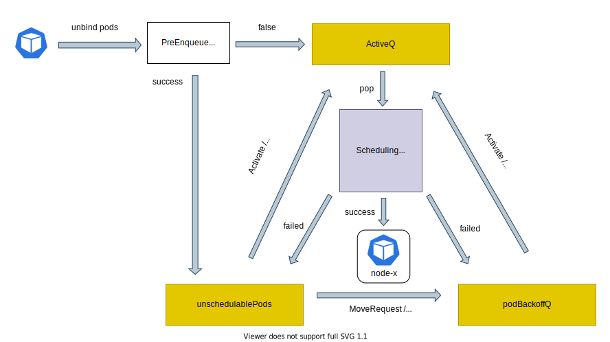
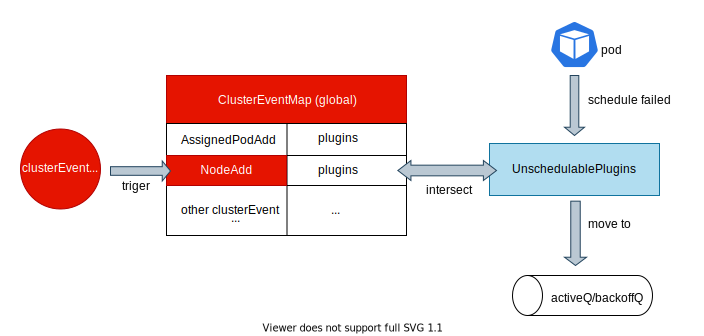
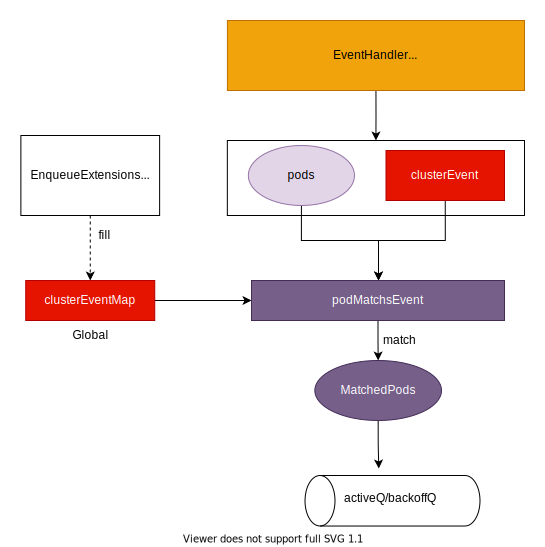

本文基于 kubernetes v1.28.1，写于: 成都，气温：适中 🐈

# kube-scheduler Queue

在 k8s scheduler-framework 中封装了 scheduler-Queue，用来为下一轮调度选择最适合的 pod。今天让我们一起从零设计的角度来探索下这部分的细节实现，以更好的掌握调度内部逻辑。

# 目录
 1. [我们来设计 scheduler-Queue](#sec1)
 2. [kube-scheduler Queue 的实现](#sec2)
 3. [一些有趣的 QA](#sec3)

# <a name='sec1'></a>我们来设计 scheduler-Queue
让我们首先思考一下 scheduler-queue 的目标：为下一轮调度选择「最适合」的 pod，那么如何定义最适合呢？

🥥 我认为「最适合」的 pod 需要满足：
1. 能调度成功（能满足调度该 pod 所需的所有约束）
2. 优先级最高

上述两点一定需要先满足 1，再从满足 1 的 pod 集合中选择满足 2 的 一个 pod。因此如果某一个 pod 的优先级是最高的，但是其在当下可能满足不了所需的所有调度约束，那么该 pod 一定不是「最适合」的 pod。

让我们再剖析一下上述的两个条件：
## 对于「能调度成功」
一个 pod 要能调度成功，需要满足所有的调度约束，一些常见的调度约束：
- 资源约束：cpu，memory，pv
- 亲和性约束：node affinity， pod affinity
- 污点和容忍度
- 高可用约束：跨可用区，跨物理机等
- ...

从实现的角度上来说，判定一个 pod 能否调度成功，只有让这个 pod 真实参与一轮调度之后才能准确的知道。但是在这里我们期望从所有未 bind 的 pod 中判定哪些能够调度成功，哪些不能调度成功，这显然是一件很难很难，并且很不确定的一件事，那么如何做呢？

⭐️ 一个好的消息是，我们可以从 pod 的历史调度信息（参与过调度，并且不幸调度失败的 pod）中获得一些有用的信息，来辅助我们判定这个 pod 在当下的下一轮调度能否调度成功。一个直观的感觉一定是 backoff，当前上一轮 podA 调度失败之后，那么 podA 一定需要 backoff 一段时间再来参与调度（这在一方面也能够避免别的 pod 饥饿）。

但是，单纯的 backoff 往往是不够的，还是会带来很多无意义的调度。比如：
- podA 需要 node 上带有 label “topology.kubernetes.io/region: cd”，表示 podA 期望落到在 cd 地域的 node 上，但是如果集群内并没有 cd 地域的 node，此时无论重试多少次都不可能调度成功。
- podB 需要 10C CPU，但是此时集群内的 node 没有剩余 10C 的 node，所以在集群没有发生「变化」的前提下，无论 podB 参与多少轮调度都不可能成功

对于上述的两个例子，一旦集群发生一些「变化」，就有可能让它们调度成功，如：
- podA，如果有全新的 node 加入集群，并且可能带有 label “topology.kubernetes.io/region: cd”
- podB，如果有全新的 node 加入集群，或者有存量的 pod 被删除（释放了所占用的资源）

因此当上述的一些「集群变化」发生，再让 podA, podB 参与下一轮的调度是有意义的。

当然，对于首次来参与调度的 pod，我们难以获得任何历史调度信息来判定其能否调度成功，因此直接让其参与首轮的调度是必须的。（：*这里我也在想，如果对于同一批规格约束的 pod，如果已经存在它们内的 pod 调度失败，是否能够共享这个调度失败的信息给这个群体内别的未参加调度的 pod，从而避免一些无意义的调度？*

🔻 对于「能调度成功」的结论：
- 首轮调度的 pod 直接参与调度
- 对于调度失败的 pod 一定需要 backoff，对于某些情况，需要让这个 pod 不参与调度直到集群发生一些变化

## 对于「优先级最高」
如何定义一个 pod 的优先级是一个需要思考的问题，因为这是一个很「个性化」的决定，不同的使用者/不同的使用场景都有不同的决定，因此这个决定权是一定需要放开给开发者/使用者的，那么如何做比较优雅呢？

基于对 kube-scheduler framework 的了解，我们知道通过插件 QueueSort 接口暴露的下述 Less 方法来让使用者自定义优先级
```go
// 返回值为true: 表示 podA 的优先级高于 podB。false 反之。
Less(podA *QueuedPodInfo, podB *QueuedPodInfo) bool
```

那么基于上述的设计，会存在两个情况需要考虑：
1. 如果用户并没有实现 QueueSort 接口，也就是没有自定义需求时需要怎么办？
2. 如果用户实现了好几个 QueueSort 接口，并且返回的优先级的结果是矛盾的，此时要怎么办？

对于上述的两个情况：
- 第 1 个问题比较好解，实现一个默认的 QueueSort，并且需要内置在调度 framework 的框架内，如果用户没有自定义就用默认的。
- 第 2 个问题也比较好解，只能「有且仅有一个」QueueSort 插件能够生效，也就是说不允许多个 QueueSort 插件同时生效的情况。（：*这在配置 scheduler profile 时，从配置的预检上就会拒绝！*

🔻 对于「优先级最高」的结论：
- 通过 QueueSort 插件，将优先级决策权给使用者
- 需要提供默认的优先级排序
- 有且仅有一个 QueuSort 插件能生效

接下来，让我们看下  kube-scheduler Queue 是如何实现的

# <a name='sec2'></a> kube-scheduler Queue 的实现
*🚩 在说明实现之前，推荐先查看一下社区在 2021 年总结的文章 [Scheduling queue in kube-scheduler](https://github.com/kubernetes/community/blob/f03b6d5692bd979f07dd472e7b6836b2dad0fd9b/contributors/devel/sig-scheduling/scheduler_queues.md)*

在 scheduler-Queue 内存在三个 queue：
- activeQ: 用来存储「已经准备好进入调度循环」的 pod
- podBackoffQ：用来存储调度失败，但是「可能有机会」被调度成功，并且正在 backingoff 的 pod
- unschedulablePods：用来存储调度失败，但是「不太有机会」调度成功的 pod

pod 在这三个 queue 之间的流转如下图所示，其中同一个 pod 在同一时间只会出现在这三个 queue 中的其中一个。




首先对于 unbind 的 pod，如果新增的 `PreEnqueue` 插件没有拦截它，就会将该 pod 加入到 ActiveQ 中。反之如果 pod 被 PreEnqueue 插件拦截（只要执行任一 PreEnqueue 插件失败，就被判定为拦截），就会被加入到 UnschedulablePods 中。下述我们对三个 queue 之间的转化进行说明：

## ActiveQ
以一个 heap 的结构实现，其内部 pod 之间的优先级能够通过插件 QueueSort 来自定义，在每一轮新的调度循环，都会从 ActiveQ 中取首 pod 来参加。同时在没有用户自定义优先级时，使用 intree 默认的 PrioritySort 插件，如下所示：
```go
// PrioritySort 插件优先级：
// 1. `.Spec.Priority` 「越大」优先级越高
// 2. Priority 相等的情况下，pod 此次进入 queue 的时间「越早」优先级越高

func (pl *PrioritySort) Less(pInfo1, pInfo2 *framework.QueuedPodInfo) bool {
	p1 := corev1helpers.PodPriority(pInfo1.Pod)
	p2 := corev1helpers.PodPriority(pInfo2.Pod)
	return (p1 > p2) || (p1 == p2 && pInfo1.Timestamp.Before(pInfo2.Timestamp))
}
```

参与调度循环的 pod，如果调度：
- 成功：此时 pod 应该不会出现在三个 queue 中
- 失败：需要 `requeue`，此时本轮调度的 schedulingCycle 与 moveRequestCycle 相比：
  - 小于等于：加入 `podBackoffQ`，这表明在该 pod 调度过程中，有能帮助其可能调度成功的 event 到来了，因此直接将其放入 podBackoffQ 来争取快速回到 ActiveQ 中是一个不错的选择。
  - 大于：加入 `unschedulablePods`，这表明还没有潜在能帮助其调度成功的 event 到来，因此在 unschedulablePods 中等待 event 到来。

> 小讲堂: 
> - schedulingCycle：标识本轮调度，在每一轮新的调度循环开启时，都会 +1。具体实现放在 Scheduler-Queue 的 pop() 方法中。 
> - moveRequestCycle: 记录收到 MoveRequest 时的 schedulingCycle，用来将正在参与调度的 in-flight pod 在调度失败，并且能在下一次可能调度成功的 pod 快速放
到 backoffQ 中(在其调度期间收到了能够帮助其可能调度成功的 event)。具体实现在 Scheduler-Queue 的内部方法 movePodsToActiveOrBackoffQueue 中。

## PodBackoffQ
以一个 heap 的 结构实现，通过结束 backoff 的时间排序，「越早」结束 backoff 的 pod 排序越靠前。其中的 pod 通过以下两种方式进入 ActiveQ：
1. flushBackoffQCompleted: 每 1s 会从 PodBackoffQ 中将已经结束 backoff 的 pod 移动至 ActiveQ
2. Activate: 通过在在调度框架内部的插件执行过程中，向 cycleState 中 key 为 `kubernetes.io/pods-to-activate` 的 PodsToActivate.Map 中写明期望直接去到 ActiveQ 的 pod 信息。这类 pod 会在 scheduling cycle 和 binding cycle 的结束阶段统一移动到 ActiveQ 中

```go
// PodsToActivateKey is a reserved state key for stashing pods.
// If the stashed pods are present in unschedulablePods or backoffQ，they will be
// activated (i.e., moved to activeQ) in two phases:
// - end of a scheduling cycle if it succeeds (will be cleared from `PodsToActivate` if activated)
// - end of a binding cycle if it succeeds
var PodsToActivateKey StateKey = "kubernetes.io/pods-to-activate"
```

```go
// PodsToActivate stores pods to be activated.
type PodsToActivate struct {
	sync.Mutex
	// Map is keyed with namespaced pod name, and valued with the pod.
	Map map[string]*v1.Pod
}
```

另外，可以通过 KubeSchedulerConfiguration 自定义 backoff 的时间，具体如下：
```go
	// PodInitialBackoffSeconds is the initial backoff for unschedulable pods.
	// If specified, it must be greater than 0. If this value is null, the default value (1s)
	// will be used.
	PodInitialBackoffSeconds int64

	// PodMaxBackoffSeconds is the max backoff for unschedulable pods.
	// If specified, it must be greater than or equal to podInitialBackoffSeconds. If this value is null,
	// the default value (10s) will be used.
	PodMaxBackoffSeconds int64
```

## UnschedulablePods
以一个 map 的结构实现，其中存储调度失败，并且目前「不太有机会」调度成功的 pod 的相关信息，这类 pod 会在 UnschedulablePods 待到下述某一条件发生时，从其中移出：
1. 超时：等待时间超过 5min (每 30s 轮训检查一次)
2. MoveRequest：有相关能帮助其可能调度成功的 event 到来

### 超时
超时是为了:
- 避免 pod 发生饥饿，让 unshedulable pod 至少能够定期去尝试一下
- 也可以理解为是第二点 MoveRequest 的兜底策略（可能由于某些巧合 or bug 导致 pod 迟迟没有被移出 UnschedulablePods，即使集群已经发生了变化）

```go
func (p *PriorityQueue) Run() {
	go wait.Until(p.flushBackoffQCompleted, 1.0*time.Second, p.stop)
	go wait.Until(p.flushUnschedulablePodsLeftover, 30*time.Second, p.stop)
}
```
具体的实现如上述代码所示，通过在调度器启动的过程中，派发出对应的协程来每 30s 执行一次方法`flushUnschedulablePodsLeftover`，其中将等待时间超过 `podMaxInUnschedulablePodsDuration` 的 pod 移出 UnschedulablePods。默认的超时时间为 5min，可以通过下述的调度参数 `pod-max-in-unschedulable-pods-duration` 来自定义。*（ps：这个配置未来会被废弃）*
```go
fs.DurationVar(&o.PodMaxInUnschedulablePodsDuration, "pod-max-in-unschedulable-pods-duration", 5*time.Minute, "DEPRECATED: the maximum time a pod can stay in unschedulablePods. If a pod stays in unschedulablePods for longer than this value, the pod will be moved from unschedulablePods to backoffQ or activeQ.")
```

其实，也可以理解为超时本身就是一种 event `UnschedulableTimeout`

### MoveRequest
这是调度中将 pod 从 unschedulablePods 移出的关键逻辑，一旦某些 event 能够帮助其中的 pod 可能调度成功，就会将该 pod 移出，来尝试参与新一轮的调度。比如：
- podA 需要 10Gi Memory，但是此时集群内的 node 没有剩余 10Gi 的 node，因此不出意外 podA 在本轮调度完成之后会被加入到 unschedulablePods 中
- 此后，如果有 node 的新增事件 NodeAdd 发生，因为新增的 node 能够帮助 podA 可能调度成功，因此在收到 NodeAdd 事件之后，podA 会被移出

上述的 case 是我们应对资源不足的场景下的一种判定条件，那么我们可能有以下的问题需要解决：
1. 这类 event 都有哪些呢？
2. 如何将这些 event 与我们调度失败的 pod 相互关联起来？

#### 🔸 event 有哪些

在说明 event 有哪些之前，需要先知道这些 event 在 kube-scheduler 是怎么定义的，如下所示：
```go
type ClusterEvent struct {
   // 涉及到的资源的 Group Version Kind
	Resource   GVK
   // 此次 event 的类型
	ActionType ActionType
   // 此次 event 的简称
	Label      string
}
```

```go
type ActionType int64
// Constants for ActionTypes.
const (
	Add    ActionType = 1 << iota // 1
	Delete                        // 10
	// UpdateNodeXYZ is only applicable for Node events.
	UpdateNodeAllocatable // 100
	UpdateNodeLabel       // 1000
	UpdateNodeTaint       // 10000
	UpdateNodeCondition   // 100000

	All ActionType = 1<<iota - 1 // 111111

	// Use the general Update type if you don't either know or care the specific sub-Update type to use.
	Update = UpdateNodeAllocatable | UpdateNodeLabel | UpdateNodeTaint | UpdateNodeCondition // 111100
)
```
> 小讲堂
>
>上述对于 ActionType 的 const 是精心设计的，细心的你应该已经看出，两两之间采用 `&` != 0 的判断，能够表达：
>- 相同 ActionType 一定匹配（eg: Add & Add = 1 & 1 = 1 `!=` 0）
>- All 能够与所有的其他 ActionType 匹配（eg: All & Delete = 111111 & 10 = 10 `!=` 0 ） 
>- Update 能够与所有的 Update 类型 ActionType 匹配 （eg: Update & UpdateNodeAllocatable = 111100 & 100 = 100 `!=` 0）
>- 其余不同 ActionType 之间一定不匹配 （eg: Add & Delete = 1 & 10 = 0 `==` 0）
>
>因此只要两个 ActionType 之间的 & != 0，就可以知道这两个 ActionType 是能够匹配的。反之，如果为 0，那就一定不匹配。

下面我们一起看下所有调度中定义的 ClusterEvent，涉及到 Pod, Node, Pvc, Pv, Sc ...：
```go
var (
	// AssignedPodAdd is the event when a pod is added that causes pods with matching affinity terms
	// to be more schedulable.
	AssignedPodAdd = framework.ClusterEvent{Resource: framework.Pod, ActionType: framework.Add, Label: "AssignedPodAdd"}
	// NodeAdd is the event when a new node is added to the cluster.
	NodeAdd = framework.ClusterEvent{Resource: framework.Node, ActionType: framework.Add, Label: "NodeAdd"}
	// AssignedPodUpdate is the event when a pod is updated that causes pods with matching affinity
	// terms to be more schedulable.
	AssignedPodUpdate = framework.ClusterEvent{Resource: framework.Pod, ActionType: framework.Update, Label: "AssignedPodUpdate"}
	// AssignedPodDelete is the event when a pod is deleted that causes pods with matching affinity
	// terms to be more schedulable.
	AssignedPodDelete = framework.ClusterEvent{Resource: framework.Pod, ActionType: framework.Delete, Label: "AssignedPodDelete"}
	// NodeSpecUnschedulableChange is the event when unschedulable node spec is changed.
	NodeSpecUnschedulableChange = framework.ClusterEvent{Resource: framework.Node, ActionType: framework.UpdateNodeTaint, Label: "NodeSpecUnschedulableChange"}
	// NodeAllocatableChange is the event when node allocatable is changed.
	NodeAllocatableChange = framework.ClusterEvent{Resource: framework.Node, ActionType: framework.UpdateNodeAllocatable, Label: "NodeAllocatableChange"}
	// NodeLabelChange is the event when node label is changed.
	NodeLabelChange = framework.ClusterEvent{Resource: framework.Node, ActionType: framework.UpdateNodeLabel, Label: "NodeLabelChange"}
	// NodeTaintChange is the event when node taint is changed.
	NodeTaintChange = framework.ClusterEvent{Resource: framework.Node, ActionType: framework.UpdateNodeTaint, Label: "NodeTaintChange"}
	// NodeConditionChange is the event when node condition is changed.
	NodeConditionChange = framework.ClusterEvent{Resource: framework.Node, ActionType: framework.UpdateNodeCondition, Label: "NodeConditionChange"}
	// PvAdd is the event when a persistent volume is added in the cluster.
	PvAdd = framework.ClusterEvent{Resource: framework.PersistentVolume, ActionType: framework.Add, Label: "PvAdd"}
	// PvUpdate is the event when a persistent volume is updated in the cluster.
	PvUpdate = framework.ClusterEvent{Resource: framework.PersistentVolume, ActionType: framework.Update, Label: "PvUpdate"}
	// PvcAdd is the event when a persistent volume claim is added in the cluster.
	PvcAdd = framework.ClusterEvent{Resource: framework.PersistentVolumeClaim, ActionType: framework.Add, Label: "PvcAdd"}
	// PvcUpdate is the event when a persistent volume claim is updated in the cluster.
	PvcUpdate = framework.ClusterEvent{Resource: framework.PersistentVolumeClaim, ActionType: framework.Update, Label: "PvcUpdate"}
	// StorageClassAdd is the event when a StorageClass is added in the cluster.
	StorageClassAdd = framework.ClusterEvent{Resource: framework.StorageClass, ActionType: framework.Add, Label: "StorageClassAdd"}
	// StorageClassUpdate is the event when a StorageClass is updated in the cluster.
	StorageClassUpdate = framework.ClusterEvent{Resource: framework.StorageClass, ActionType: framework.Update, Label: "StorageClassUpdate"}
	// CSINodeAdd is the event when a CSI node is added in the cluster.
	CSINodeAdd = framework.ClusterEvent{Resource: framework.CSINode, ActionType: framework.Add, Label: "CSINodeAdd"}
	// CSINodeUpdate is the event when a CSI node is updated in the cluster.
	CSINodeUpdate = framework.ClusterEvent{Resource: framework.CSINode, ActionType: framework.Update, Label: "CSINodeUpdate"}
	// CSIDriverAdd is the event when a CSI driver is added in the cluster.
	CSIDriverAdd = framework.ClusterEvent{Resource: framework.CSIDriver, ActionType: framework.Add, Label: "CSIDriverAdd"}
	// CSIDriverUpdate is the event when a CSI driver is updated in the cluster.
	CSIDriverUpdate = framework.ClusterEvent{Resource: framework.CSIDriver, ActionType: framework.Update, Label: "CSIDriverUpdate"}
	// CSIStorageCapacityAdd is the event when a CSI storage capacity is added in the cluster.
	CSIStorageCapacityAdd = framework.ClusterEvent{Resource: framework.CSIStorageCapacity, ActionType: framework.Add, Label: "CSIStorageCapacityAdd"}
	// CSIStorageCapacityUpdate is the event when a CSI storage capacity is updated in the cluster.
	CSIStorageCapacityUpdate = framework.ClusterEvent{Resource: framework.CSIStorageCapacity, ActionType: framework.Update, Label: "CSIStorageCapacityUpdate"}
	// WildCardEvent semantically matches all resources on all actions.
	WildCardEvent = framework.ClusterEvent{Resource: framework.WildCard, ActionType: framework.All, Label: "WildCardEvent"}
	// UnschedulableTimeout is the event when a pod stays in unschedulable for longer than timeout.
	UnschedulableTimeout = framework.ClusterEvent{Resource: framework.WildCard, ActionType: framework.All, Label: "UnschedulableTimeout"}
)
```

其中有两个是稍微有一些特殊的：
- `WildCardEvent`: 这是所有 clusterEvent 的集合，也就是它能够代表任何一种 clusterEvent
- `UnschedulableTimeout`: 这是定期（每30s）触发在 UnschedulablePods 超时检测的 clusterEvent

####  🔸 event 与调度失败的 pod 相互关联
对于调度失败的 pod 来说，它只知道自己是在哪一个调度阶段，哪一些调度插件（plugin）失败的。对于 clusterEvent 来说，它只知道自己对应的资源 GVK 和 ActionType。两者之间没有直接的关系，因此一定存在一个绑定两者关系的对象，就是 `ClusterEventMap`，其是一个 map，以 clusterEvent 为 key，以 pluginNames 集合为 value，具体定义如下所示：
```
type PriorityQueue struct {
   ...
   clusterEventMap map[framework.ClusterEvent]sets.Set[string]
   ...
}
```
ClusterEventMap 的每一个 KV 组合想表达的意思是：这一个 clusterEvent（key）能帮助因为这类 plugins（value）中的任一一个 plugin 而失败的 pod 可能调度成功 



上图展示了，对于某一个调度失败的 pod， 当一个 clusterEvent 来临时，如何判定该 pod 是否该移除 UnschedulablePods。首先在 ClusterEventMap 中已经注册好 clusterEvent 和 plugins 之间的关系，当一个 clusterEvent 来临时，从 ClusterEventMap 中查找对应的 plugins，再与该 pod 的 UnschedulablePlugins 做交集，如果不为空，就表示这个 clusterEvent 能够帮助 pod 可能调度成功，此时应该将 pod 移出 unschedulablePods


在这里一定会有几个问题，就是：
- `ClusterEventMap` 是怎么初始化的？是怎么维护的？
- clusterEvent 是怎么发起的？



🔹 **`ClusterEventMap` 的初始化** 

如上图中所示，对于 ClusterEventMap 会由所有 inTree-plugins 和 outOfTree-plugins 实现 EnqueueExtensions 这个接口，在接口的实现中返回期望的 clusterEvent 集合。表示如果出现该clusterEvent 集合中的任一 clusterEvent 就能够帮助因为这个插件而调度失败的 pod 可能调度成功。
```go
// EnqueueExtensions is an optional interface that plugins can implement to efficiently
// move unschedulable Pods in internal scheduling queues. Plugins
// that fail pod scheduling (e.g., Filter plugins) are expected to implement this interface.
type EnqueueExtensions interface {
	// EventsToRegister returns a series of possible events that may cause a Pod
	// failed by this plugin schedulable.
	// The events will be registered when instantiating the internal scheduling queue,
	// and leveraged to build event handlers dynamically.
	// Note: the returned list needs to be static (not depend on configuration parameters);
	// otherwise it would lead to undefined behavior.
	EventsToRegister() []ClusterEvent
}
```

inTree-plugin Fit 例子
```go
// EventsToRegister returns the possible events that may make a Pod
// failed by this plugin schedulable.
func (f *Fit) EventsToRegister() []framework.ClusterEvent {
	podActionType := framework.Delete
	if f.enableInPlacePodVerticalScaling {
		// If InPlacePodVerticalScaling (KEP 1287) is enabled, then PodUpdate event should be registered
		// for this plugin since a Pod update may free up resources that make other Pods schedulable.
		podActionType |= framework.Update
	}
	return []framework.ClusterEvent{
		{Resource: framework.Pod, ActionType: podActionType},
		{Resource: framework.Node, ActionType: framework.Add | framework.Update},
	}
}
```

tips： 如果插件没有实现接口 EnqueueExtensions，会默认向 ClusterEventMap 注册如下所示的所有 event
```go
var allClusterEvents = []framework.ClusterEvent{
	{Resource: framework.Pod, ActionType: framework.All},
	{Resource: framework.Node, ActionType: framework.All},
	{Resource: framework.CSINode, ActionType: framework.All},
	{Resource: framework.PersistentVolume, ActionType: framework.All},
	{Resource: framework.PersistentVolumeClaim, ActionType: framework.All},
	{Resource: framework.StorageClass, ActionType: framework.All},
}
```

*说明：clusterEventMap 是全局的，也就是一个 scheduler-Queue 只有一个*

🔹 **发起 clusterEvent**

clusterEvent 的发起，可以分为两个场景：
1. bindingCycle 失败 （assume 的资源被释放）
2. eventHandler（watch informer 资源变化）

对于第一种 bindingCycle 失败，可以等价为是 pod 的删除事件（AssignedPodDelete），因为释放了在调度内存中 assume 的资源。

# <a name='sec2'></a> 一些有趣的 QA
### Q：一旦调度失败，是放入 backOffQ 还是 unschedulablePods？
准确的理解，一旦本轮调度失败会将 pod 放入到 unschedulablePods 中，但是对于一些必要的场景，开了个后门，让 pod 能够快速回到 backoffQ 中，避免在 unschedulablePods 中停留过久。

举个例子：podA 「正在」参与本轮调度，它期望调度至 region 为 cd 的 node 之上，但是此时集群内并没有任何 region 为 cd 的 node，所以本轮调度的结果必然是 Failed。在正常情况下，podA 会在本轮调度结束之后，加入到 unschedulablePods 中，并等待集群有合适的变化触发。但是如果在 podA 调度过程中，有 region 为 cd 的 nodeA 加入了集群（也就说，podA 能够调度至 nodeA），此时将 podA 再放入 unschedulablePods 就不合适了，因为 podA 需要的集群变化已经出现了，不应该让 podA 在等待一次新的集群变化，而遗漏这个已有的集群变化。

### Q：podBackoffQ 与 unschedulablePods 的区别是什么？
podBackoffQ 里面存的 pod 是已经「可能有机会」调度成功的 pod，只是因为自身 backoff 的时间没有到达，所以在 podBackoffQ 中倒计时等待，一旦时间到达，就会直接加入到 activeQ 中。

但是 unschedulablePods 里面存储的是「不太有机会」调度成功的 pod，其中的 pod 只有等待合适的事件触发，才会移到 podBackoffQ 或者 activeQ 中。（：*当然如果一直没有合适的事件，最长 5min 之后，也会移动到 activeQ 中尝试调度*

### Q：如果没有合适的事件触发，pod 会被遗忘在 unschedulablePods 中吗？
结论： 不会的。即使没有合适的事件触发，pod 在最长 5min 之后也会从 unschedulablePods 中移出直接加入到 activeQ 中。（：*这里因为最大的 backoff 时间为 10s，因此会直接加入到 activeQ 中*

### Q：pod 会同时出现在 podBackoffQ， unschedulablePods 或 activeQ 吗？
结论：不会。同一个 pod 同一时间只会出现在 podBackoffQ， unschedulablePods 或 activeQ 的其中一个 queue 中

### Q：正在参加本轮调度的 pod（结果调度失败），在这轮调度过程中能够帮助其调度成功的 event 来了，此时调度失败之后这个 pod 会进入到 unscheduledPods？
不会。在这种情况下，会直接加入 podBackoffQ，具体实现请朝上检索 moveRequestCycle。

### Q：会不会有同一个 pod 被重复调度的情况发生？

就目前的实现来说，存在一种可能，就是 in-flight 的 pod 被 update，从而被重新添加。当然，这个问题在 scheduler-Queue 中维护了 in-flight pods 信息之后就迎刃而解。具体的讨论可以查看
[Issue #118226](https://github.com/kubernetes/kubernetes/issues/118226)

### Q：会不会有因为 CPU 资源不足导致 unschedulable 的 podA 被 podB affinity update 的 event 放回 backoffQ/activeQ ?

不会！因为 CPU 资源不足是通过 inTree-plugin Fit 来检测的，当 podA 在这个 plugin 中失败时，只有 PodDelete, podUpdate(原地变配)，NodeAdd，NodeUpdate 这四类 clusterEvent 才会将放回 backoffQ/activeQ。当然，我这里做的假设是让 pod 失败的 unschedulablePlugins 只有 Fit。

### Q：queue 内部会不会去重？
当然，对于 ActiveQ 和 BackoffQ，使用 heap 实现，对于同一个 Obj 只有唯一的一个 key。对于 unschedulablePods，使用 map 实现，对于同一个 Obj 也有且仅有一个唯一的 key。
