TOC
- [1. 概述](#1-概述)
- [2. K8s 网络访问方式](#2-K8s-网络访问方式)
- [3. 容器网络机制](#3-容器网络机制)
  - [3.1 同一个 Node 内访问](#31-同一个-Node-内访问)
  - [3.2 跨 Node 间访问](#32-跨-Node-间访问)
- [4. Service 与 Pod 关系](#4-Service-与-Pod-关系)
- [5. Service 网络类型](#5-Service-网络类型)
  - [5.1 ClusterIP](#51-ClusterIP)
  - [5.2 NodePort](#52-NodePort)
  - [5.3 LoadBalancer](#53-LoadBalancer)
  - [5.4 ExternalName](#54-ExternalName)
- [6. DNS 解析机制](#6-DNS-解析机制)
  - [6.1 CoreDNS 工作机制](#61-CoreDNS-工作机制)
  - [6.2 DNS Policy](#62-DNS-Policy)
- [7. Kube-proxy 多种模式](#7-Kube-proxy-多种模式)
  - [7.1 userspace](#71-userspace)
  - [7.2 iptables](#72-iptables)
  - [7.3 ipvs](#73-ipvs)
  - [7.4 nftables](#74-nftables)
  - [7.5 kernelspace](#75-kernelspace)
- [8. 保留源 IP](#8-保留源-IP)
- [9. Ingress](#9-Ingress)
- [10. 小结](#10-小结)

> 本文基于 K8s v1.29，不同版本 Service API 略有不同。

## 1. 概述
Service 作为 K8s 中的一等公民，其承载了核心容器网络的访问管理能力，包括：
- 暴露/访问一组 Pod 的能力
- Pod 访问集群内、集群外服务
- 集群外客户端访问集群内 Pod 的服务

无论是作为应用的开发者还是使用者，一般都需要先经过 Service 才会访问到真正的目标 Pod。因此熟悉 Service 网络管理机制将会使我们更加深入理解 K8s 的容器编排原理，以期更好的服务各类业务。

要理解 K8s 的中的网络机制，可以从回答以下问题开始：

- K8s 中容器网络模型是怎样的？
- Service/Pod/Endpoints 三者之间是怎样关联的？
- Service 有哪些类型？它们之间的区别是什么？
- K8s 中 DNS 域名解析是怎样实现的？
- kube-proxy 有哪些模式？各自区别是怎样的？
- 如何实现客户端访问保留源 IP？
- 如何自定义域名、路径访问后端服务？

本文将从 K8s 中容器网络、Service/Pod 关联、Service 类型、DNS 解析、kube-proxy 模式、保留源 IP、Ingress 等方面，说明 Service 的网络机制。

## 2. K8s 网络访问方式
根据访问者所处角度，本文将 K8s 网络访问方式分为四种：
- 同一个 Node 内 Pod 访问
- 跨 Node 间 Pod 访问
- Pod 访问集群外服务
- 集群外访问集群内 Pod

分别用下图 ①②③④ 所示：
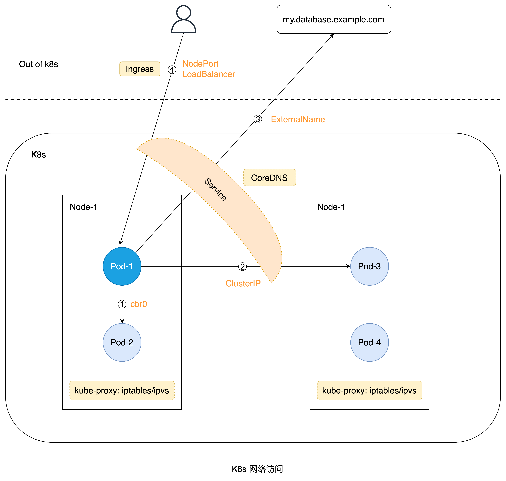

以上多种访问方式会在下文中讲解到，理解本文内容后将会对此有更加清晰地理解和认识。

## 3. 容器网络机制
K8s 将一组逻辑上紧密相关的容器，统一抽象为 Pod 概念，以共享 Pod Sandbox 的基础信息，如 Namespace 命名空间、IP 分配、Volume 存储（如 hostPath/emptyDir/PVC）等，因此讨论容器的网络访问机制，实际上可以用 Pod 访问机制代替。

> Pod 内容器：
> - 共享 Network Namespace (default)
> - 共享 Pid Namespace (optional)
> - 不共享 Mnt Namespace (default)

根据 Pod 在集群内的分布情况，可将 Pod 的访问方式主要分为两种：
- 同一个 Node 内 Pod 访问
- 跨 Node 间 Pod 访问

### 3.1 同一个 Node 内访问
同一个 Node 内访问，表示两个或多个 Pod 落在同一个 Node 宿主机上，这种 Pod 彼此间访问将不会跨 Node，通过本机网络即可完成通信。

具体来说，Node 上的运行时如 Docker/containerd 会在启动后创建默认的网桥 cbr0 (custom bridge)，以连接当前 Node 上管理的所有容器 (containers)。当 Pod 创建后，会在 Pod Sandbox 初始化基础网络时，调用 CNI bridge 插件创建 veth-pair（两张虚拟网卡），一张默认命名 eth0 (如果 hostNetwork = false，则后续调用 CNI ipam 插件分配 IP)。另一张放在 Host 的 Root Network Namespace 内，然后连接到 cbr0。当 Pod 在同一个 Node 内通信访问的时候，直接通过 cbr0 即可完成网桥转发通信。

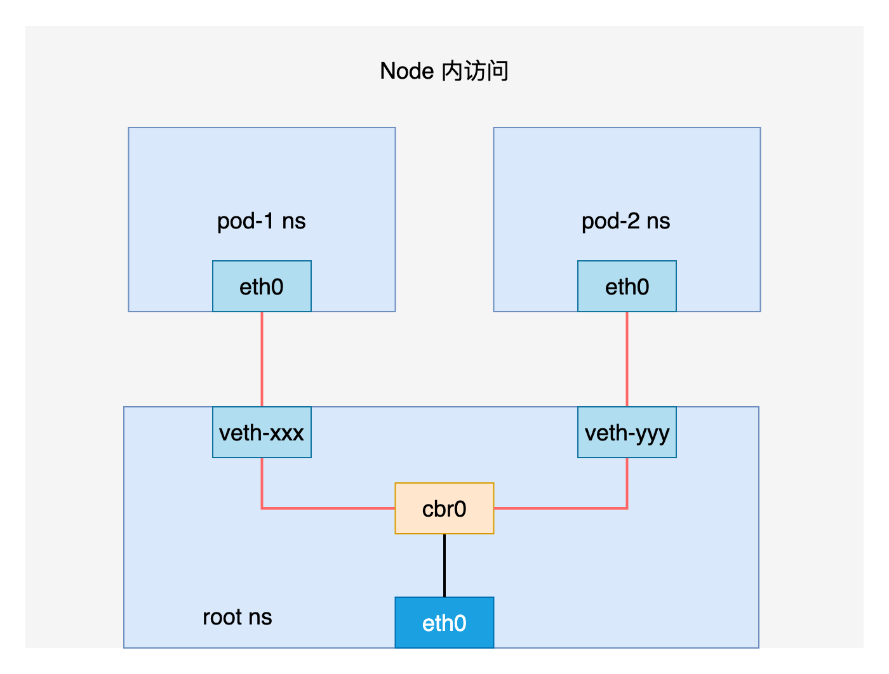

小结如下：
- 首先运行时如 Docker/containerd 创建 cbr0；
- Pod Sandbox 初始化调用 CNI bridge 插件创建 veth-pair（两张虚拟网卡）；
- 一张放在 Pod Sandbox 所在的 Network Namespace 内（CRI containerd 默认传的参数为 eth0）；
- 另一张放在 Host 的 Root Network Namespace 内，然后连接到 cbr0；
- Pod 在同一个 Node 内访问直接通过 cbr0 网桥转发；

> 在 Docker 中默认网桥名称为 docker0，在 K8s 中默认网桥名称为 cbr0 或 cni0。

另外，为了提高 Pod 网络通信效率，云厂商如 [AWS](https://aws.amazon.com/cn/blogs/containers/amazon-vpc-cni-increases-pods-per-node-limits/)、[TencentCloud](https://cloud.tencent.com/document/product/457/50355) 提出了 VPC-CNI 的网络方案，去掉了 cbr0 网桥设备，直接将 Pod IP 与 Node IP 打平在同一个 VPC，实现了更高的容器网络性能。

### 3.2 跨 Node 间访问
跨 Node 间访问，Pod 访问流量通过 veth-pair 打到 cbr0，之后转发到宿主机 eth0，之后通过 Node 之间的路由表 Route Table 进行转发。到达目标 Node 后进行相同的过程，最终转发到目标 Pod 上。

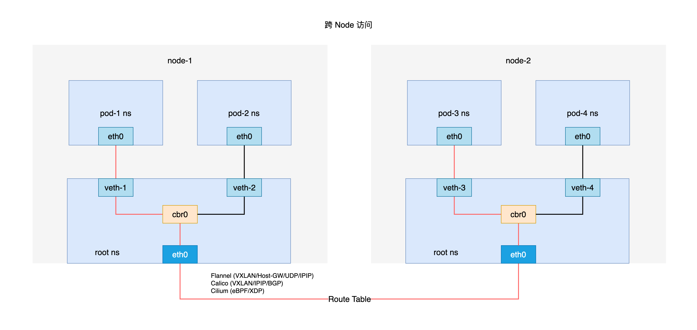

小结如下：
- Pod-1 eth0 -> veth-1 -> Node-1 cbr0；
- Node-1 cbr0 -> Node-1 eth0；
- Node-1 eth0 -> route table -> Node-2 eth0；
- Node-2 eth0 -> Node-2 cbr0 -> veth-3 -> Pod-3 eth0；

上述容器网络模型为 K8s 中常见网络模型的一般抽象，具体实现可参考社区 [CNI 实现](https://github.com/containernetworking/cni)，如 Flannel, Calico, Weave, Cilium 等。

## 4. Service 与 Pod 关系
在 K8s 中，Pod 与 Pod 之间访问，最终都是要找到目标 Pod 的 IP 地址。但 Pod 会因为多种原因如机器异常、封锁 (cordon)、驱逐 (drain)、资源不足等情况，发生 Pod 重建，重建后则会重新分配 IP（固定 IP 除外），因此 Pod 之间访问需要 DNS 域名方式解决 Pod IP 变更问题。DNS 具体实现机制请参考下文。

另外，为了提高服务的高可用性 (HA)，一般都需要部署多副本，也就是对应多个 Pod，因此需要在多个 RS (Real Server，真实的后端服务器) Pods 之间提供负载均衡 (Load Balance) 访问模式，在 K8s 中则通过 Service 方式实现。

核心实现逻辑为：Service 通过指定选择器 (selector) 去选择与目标 Pod 匹配的标签 (labels)，找到目标 Pod 后，建立对应的 Endpoints 对象。当感知到 Service/Endpoints/Pod 对象变化时，创建或更新 Service 对应的 Endpoints，使得 Service selector 与 Pod labels 始终达到匹配的状态。

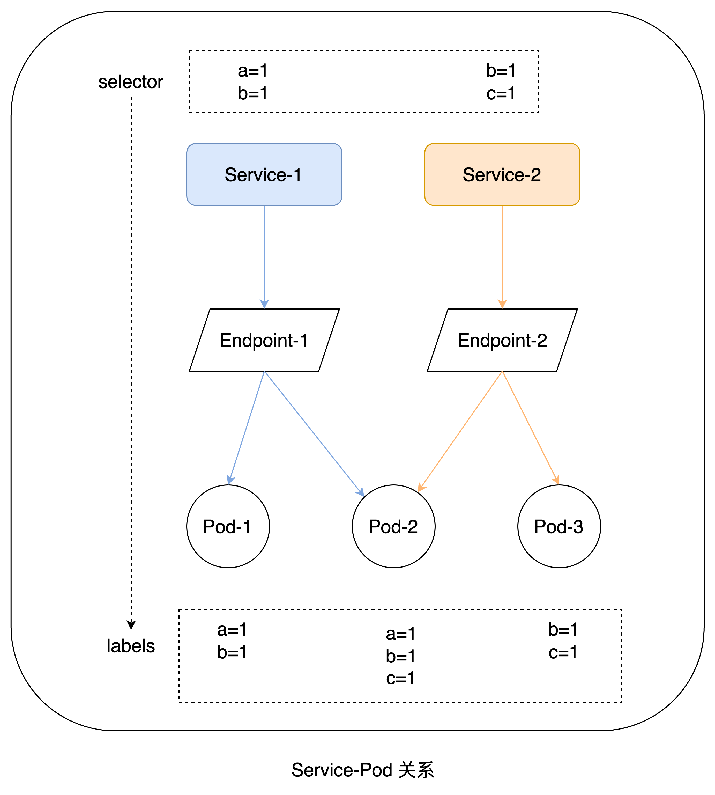

> Q：为什么要设计 Endpoints (EP) 对象？
> 
> A：为了实现 Service 能负载均衡后端多个 Pods，需要将 Pod IP 列表放到一个均衡池子里，因此需要一个对象来承载：
> - 需要使用 EP 的 Client (kube-proxy) 如果不使用 EP 就需要去使用 Pod，但 Pod 本身结构的复杂会消耗更多的 CPU 和 Memory，Pod 包含的很多字段信息是客户端并不关心的，更小的对象可以更好的控制权限；
> - Pod 从刚被创建到 Ready 中间有太多状态了，对网络来说并不关心，EP 对于网络来说使用起来更方便；
> - 当 EP 对应的 IP 不是 Pod IP 的时候，也可以将流量转发到目标 IP 上，提供了一种更加灵活的流量控制方式；
> 
> Q：EndpointSlice 又是什么？
> 
> A：当一个 Service 对应的后端 Pods 太多时（几百或几千个），对应的 Endpoints 对象里面的 IP 条目将会很多，Endpoints 对象很大会影响性能，极端情况下会导致大对象无法更新。因此在 K8s v1.21 新增了 EndpointSlice。默认情况下，一旦到达 100 个 Endpoints，该 EndpointSlice 将被视为“已满”，届时将创建其他 EndpointSlices 来存储任何其他 Endpoints。
> 
> 可以使用 kube-controller-manager 的 --max-endpoints-per-slice 标志设置此值，最大值为 1000。

在 K8s 中的源码如下：

EndpointController 通过 Inform 机制 (ListAndWatch)，分别监听 Service/Endpoints/Pod 相关的事件变化，触发对应的 Service 调谐 (reconcile)。
```go
// kubernetes/pkg/controller/endpoint/endpoints_controller.go
func NewEndpointController(ctx context.Context, podInformer coreinformers.PodInformer, serviceInformer coreinformers.ServiceInformer,
	endpointsInformer coreinformers.EndpointsInformer, client clientset.Interface, endpointUpdatesBatchPeriod time.Duration) *Controller {
	...
	// 通过 Inform 机制（ListAndWatch），分别监听 Service/Endpoints/Pod 相关的事件变化
	serviceInformer.Informer().AddEventHandler(cache.ResourceEventHandlerFuncs{
		AddFunc: e.onServiceUpdate,
		UpdateFunc: func(old, cur interface{}) {
			e.onServiceUpdate(cur)
		},
		DeleteFunc: e.onServiceDelete,
	})

	podInformer.Informer().AddEventHandler(cache.ResourceEventHandlerFuncs{
		AddFunc:    e.addPod,
		UpdateFunc: e.updatePod,
		DeleteFunc: e.deletePod,
	})

	endpointsInformer.Informer().AddEventHandler(cache.ResourceEventHandlerFuncs{
		DeleteFunc: e.onEndpointsDelete,
	})
	...
	return e
}
```

> Q：为什么 EP 只需要关心 Delete 事件？
> 
> A：理解是为了让用户能够自己指定 service 对应的 EP 对象（无 selector 的 Service 可手动创建同名的 EP 关联），或者更新一些新的目标 IP 条目；
> 
> 当删除 EP 的时候，需要看下这个 Service 是不是需要 EP，若有 selector 就需要自动补齐 EP。

通过 syncService 方法实现 Service 调谐：创建或更新 Service 对应的 Endpoints。
```go
// kubernetes/pkg/controller/endpoint/endpoints_controller.go
func (e *Controller) syncService(ctx context.Context, key string) error {

	...

	// 上面的代码：准备要创建或更新的 Endpoints 对象
	if createEndpoints {
		// No previous endpoints, create them
		_, err = e.client.CoreV1().Endpoints(service.Namespace).Create(ctx, newEndpoints, metav1.CreateOptions{})
	} else {
		// Pre-existing
		_, err = e.client.CoreV1().Endpoints(service.Namespace).Update(ctx, newEndpoints, metav1.UpdateOptions{})
	}

	...

	return nil
}
```

## 5. Service 网络类型
在 K8s 中，为了满足服务对内、对外多种访问方式，Service 设计了四种类型，分别是：
- ClusterIP [default]
- NodePort
- LoadBalancer
- ExternalName

它们之间的主要差异如图所示：

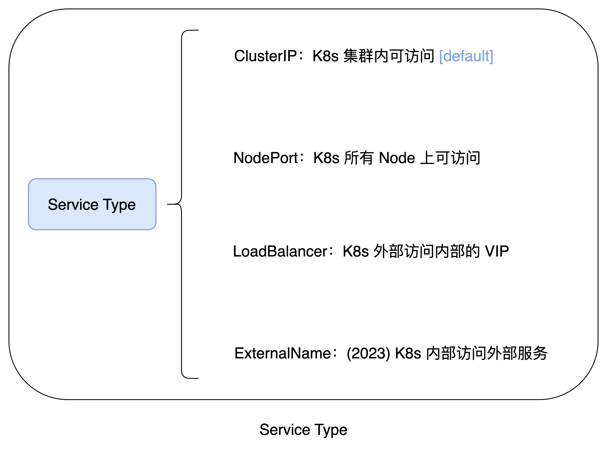

### 5.1 ClusterIP
ClusterIP 表示在 K8s 集群内部通过 service.spec.clusterIP 进行访问，之后经过 kube-proxy 负载均衡到目标 Pod。

无头服务 (Headless Service)：
当指定 Service 的 ClusterIP = None 时，则创建的 Service 不会生成 ClusterIP，这样 Service 域名在解析的时候，将直接解析到对应的后端 Pod (一个或多个)，某些业务如果不想走 Service 默认的负载均衡，则可采用此种方式 直连 Pod。

publishNotReadyAddresses：
表示是否将没有 ready 的 Pods 关联到 Service，默认为 false。核心逻辑是 Endpoints-Controller 会将 Probe 失败的 Pod 对应的 Endpoints entry 创建，进而影响到 CoreDNS 对 A 记录的维护工作。

> publishNotReadyAddresses 这种特性多在有状态应用的场景下使用：
> - Init-Containers 在运行的时候预期通过稳定的 DNS A 记录进行通信 
> - Main-Containers (app + sidecars) 在 bootstrap 阶段能够进行适度的 retry

```yaml
apiVersion: v1
kind: Service
metadata:
  name: headless-service
spec:
  selector:
    app: nginx
  ports:
    - protocol: TCP
      port: 80
      targetPort: 80
  type: ClusterIP # 默认类型，可省略
  clusterIP: None # 指定 ClusterIP = None
  publishNotReadyAddresses: true # 是否关联未 ready pods
```

> 当没有指定 service.type 时，默认类型为 ClusterIP。

### 5.2 NodePort
当业务需要从 K8s 集群外访问内部服务时，通过 NodePort 方式可以先将访问流量转发到对应的 Node IP，然后再通过 service.spec.ports[].nodePort 端口，通过 kube-proxy 负载均衡到目标 Pod。

```yaml
apiVersion: v1
kind: Service
metadata:
  name: nodeport-service
spec:
  selector:
    app: nginx
  ports:
    - nodePort: 30800
      port: 8080
      protocol: TCP
      targetPort: 80
  type: NodePort
```

这里可以看到有多个 port，区别如下：
- nodePort：NodePort/LoadBalancer 类型的 Service 在 Node 节点上动态（默认）或指定创建的端口，负责将节点上的流量转发到容器。
- port：Service 自身关联的端口，通过 Service 的 ClusterIP:port 进行集群内的流量转发。
- targetPort：目标 Pod 暴露的端口，承载 Service 转发过来的流量；未指定时与 port 相同。
- containerPort：Pod 内具体 Container 暴露的端口，表示进程真实监听的端口。

> Service NodePort 默认端口范围：30000-32767，共 2768 个端口。
> 
> 可通过 kube-apiserver 组件的 `--service-node-port-range` 参数进行配置。

### 5.3 LoadBalancer
上面的 NodePort 方式访问内部服务，需要依赖具体的 Node 高可用，如果节点挂了则会影响业务访问，LoadBalancer 可以解决此问题。

```yaml
apiVersion: v1
kind: Service
metadata:
  name: my-service
spec:
  selector:
    app.kubernetes.io/name: MyApp
  ports:
    - protocol: TCP
      nodePort: 30931
      port: 80
      targetPort: 9376
  clusterIP: 10.0.171.239
  type: LoadBalancer
status:
  loadBalancer:
    ingress:
    - ip: 192.0.2.127
```

具体来说，LoadBalancer 类型的 Service 创建后，由具体是云厂商或用户实现 externalIP (service.status.loadBalancer) 的分配，业务直接通过访问 externalIP，然后负载均衡到目标 Pod。

### 5.4 ExternalName
当业务需要从 K8s 内部访问外部服务的时候，可以通过 ExternalName 的方式实现。
Demo 如下：

```yaml
apiVersion: v1
kind: Service
metadata:
  name: my-service
  namespace: prod
spec:
  type: ExternalName
  externalName: my.database.example.com
```

> ExternalName Service：无 selector、无 endpoints。

具体来说，service.spec.externalName 字段值会被解析为 DNS 对应的 CNAME 记录，之后就可以访问到外部对应的服务了。

## 6. DNS 解析机制
### 6.1 CoreDNS 工作机制
在 K8s 中访问 Service 一般通过域名方式如 my-svc.my-namespace.svc.cluster.local，从域名结构可以看出对应 Service 的 namespace + name，通过这样的域名方式可以大大简化集群内部 Service-Pod 之间的访问配置，并且域名屏蔽了后端 Pod IP 的变更，是 K8s 内部高可用的一个典型实现。

那上述域名具体是怎么解析的呢？

答案是 kube-dns 组件负责 K8s 中域名的解析。

具体来说，K8s 中经历了从早期 kube-dns 到 CoreDNS 的版本演进，从 K8s 1.12 版本开始，kube-dns 被 CoreDNS 替代成为了默认的 DNS 解决方案。

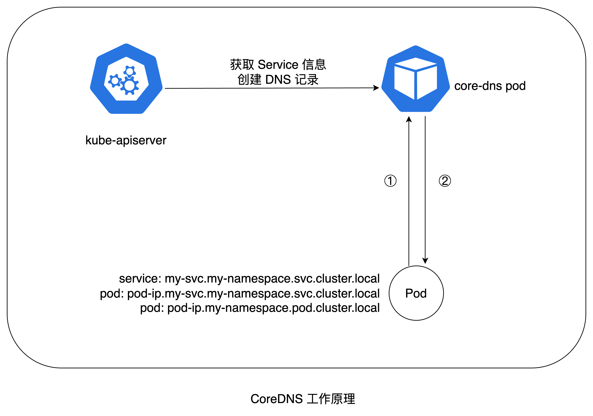

CoreDNS 工作机制：
CoreDNS 通过以 Pod 方式运行在集群中，当其 Pod 启动时将通过 Informer 机制从 kube-apiserver 拉取全部的 Service 信息，然后创建对应的 DNS 记录。当需要访问对应的 Service 域名时，第一步通过 CoreDNS 解析拿到对应的 Service ClusterIP，之后通过上述 Service 负载均衡机制访问目标 Pod。

```bash
bash-5.1# nslookup my-svc.my-namespace.svc.cluster.local
Server:         10.4.7.51
Address:        10.4.7.51:53


Name:   my-svc.my-namespace.svc.cluster.local
Address: 10.4.7.201 # 对应 my-svc Service 的 ClusterIP
```

> 可通过 kubelet 上的 `--cluster-dns=CoreDNS-IP` 和 `--cluster-domain=cluster.local` 配置集群的 DNS 根域名和 IP。
> 
> CoreDNS-IP 可通过 Service kube-dns (为了兼容老版本，所以名字还是叫 kube-dns) 的 ClusterIP 字段获取。

### 6.2 DNS Policy
在 K8s 中，为了满足 Pod 对内、对外多种访问方式，设计了四种 DNS Policy 类型，分别是：
- ClusterFirst [default]
- ClusterFirstWithHostNet
- Default
- None

它们之间的主要差异如图所示：

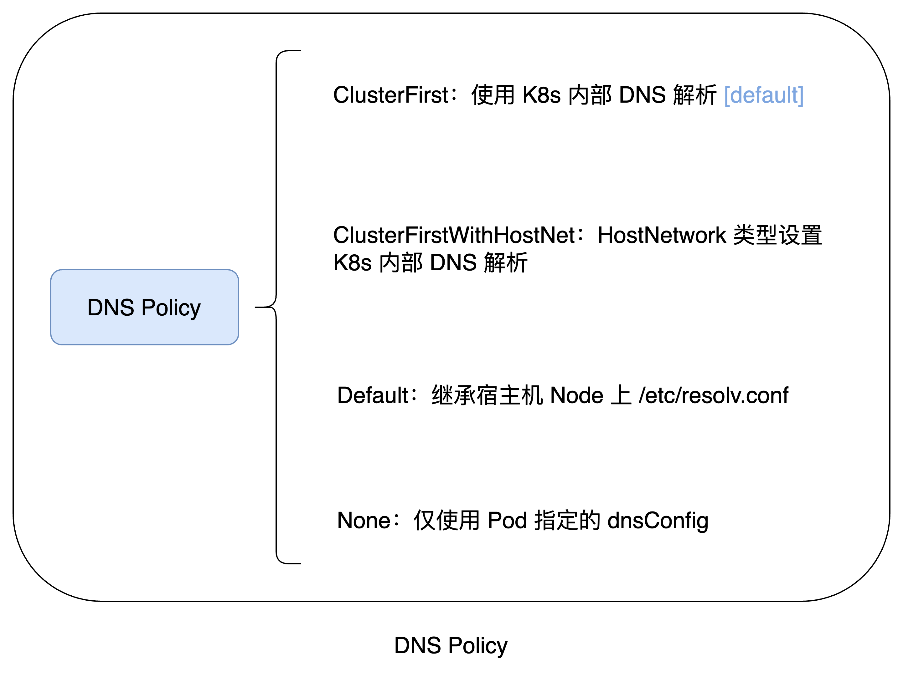


## 7. Kube-proxy 多种模式
经过上面 Service 介绍，我们知道 Service 最终是需要负载均衡到后端的目标 Pods，在 K8s 中具体是怎么实现的呢？

答案是 kube-proxy 组件负责 K8s 中 Service 的负载均衡实现。

具体来说，随着 K8s 版本不断演进，kube-proxy 分别支持了多种工作模式：
- userspace
- iptables [default]
- ipvs
- nftables
- kernelspace

有多种方式可查看 kube-proxy 模式：
- 方式一：ps 查看 kube-proxy 进程的 --proxy-mode 参数
```shell
ps -ef | grep proxy
root       30676   29773  0  2023 ?        05:35:49 kube-proxy-bin --kubeconfig=/var/lib/kube-proxy/config --proxy-mode=ipvs --ipvs-scheduler=rr ...
```
- 方式二：通过 cm 查看配置
```shell
kubectl get cm -n kube-system kube-proxy -oyaml | grep -i mode
    mode: iptables
```
- 方式三：通过 curl kube-proxy 端口查看
```shell
curl localhost:10249/proxyMode
iptables
```

### 7.1 userspace
在 K8s v1.2 版本之前的默认模式，这种模式下 Service 的请求会先从用户空间进入内核 iptables，然后再回到用户空间，由 kube-proxy 完成后端 Endpoints 的选择和代理工作。

这样流量从用户空间进出内核带来的性能损耗是不可接受的，因此从 v1.2 版本之后默认改为 iptables 模式。

### 7.2 iptables
K8s 中当前默认的 kube-proxy 模式，核心逻辑是使用 iptables 中 PREROUTING 链 nat 表，实现 Service => Endpoints (Pod IP) 的负载均衡。

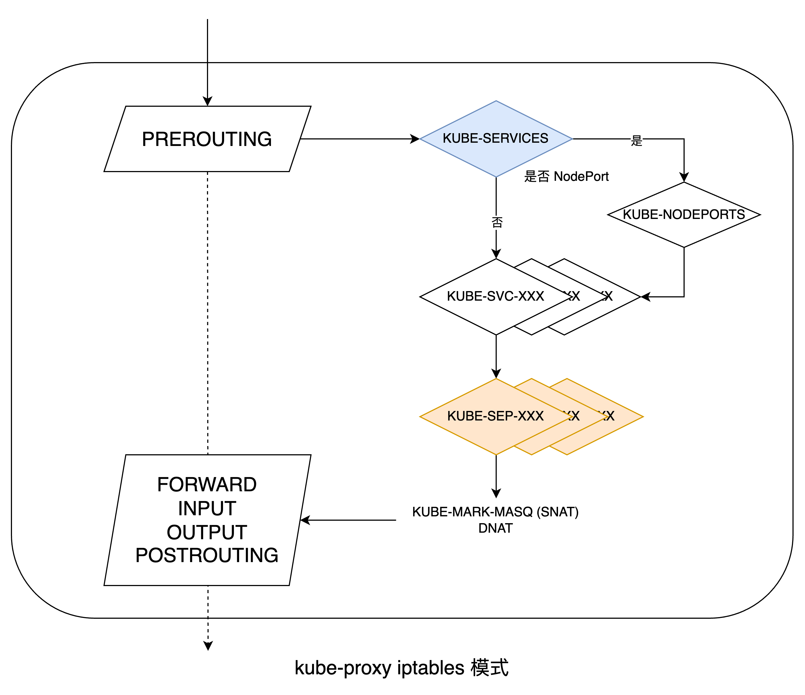

具体来说，访问 Service 的流量到达 Node 后，首先在 iptables PREROUTING 链中 KUBE-SERVICES 子链进行过滤。示例如下：
```shell
iptables -t nat -nvL PREROUTING

Chain PREROUTING (policy ACCEPT 0 packets, 0 bytes)
 pkts bytes target     prot opt in     out     source               destination         
 312M   16G KUBE-SERVICES  all  --  *      *       0.0.0.0/0            0.0.0.0/0            /* kubernetes service portals */
 117M 5839M CNI-HOSTPORT-DNAT  all  --  *      *       0.0.0.0/0            0.0.0.0/0            ADDRTYPE match dst-type LOCAL
```

接着，KUBE-SERVICES 链中会将所有 Service 建立对应的 KUBE-SVC-XXX 子链规则，若 Service 类型是 NodePort，则命中最下面的 KUBE-NODEPORTS 子链。示例如下：
```shell
iptables -t nat -nvL KUBE-SERVICES
Chain KUBE-SERVICES (2 references)
 pkts bytes target     prot opt in     out     source               destination         
    0     0 KUBE-SVC-RY7QXPUTX5YFBMZE  tcp  --  *      *       0.0.0.0/0            11.166.11.141        /* default/demo cluster IP */ tcp dpt:80
    0     0 KUBE-SVC-ADYGLFGQTCWPF2GM  tcp  --  *      *       0.0.0.0/0            11.166.26.45         /* default/demo-nodeport cluster IP */ tcp dpt:8081
    0     0 KUBE-SVC-NPX46M4PTMTKRN6Y  tcp  --  *      *       0.0.0.0/0            11.166.0.1           /* default/kubernetes:https cluster IP */ tcp dpt:443
 4029  329K KUBE-SVC-TCOU7JCQXEZGVUNU  udp  --  *      *       0.0.0.0/0            11.166.127.254       /* kube-system/kube-dns:dns cluster IP */ udp dpt:53
    ...
    0     0 KUBE-NODEPORTS  all  --  *      *       0.0.0.0/0            0.0.0.0/0            /* kubernetes service nodeports; NOTE: this must be the last rule in this chain */ ADDRTYPE match dst-type LOCAL
```

> KUBE-SVC-XXX 或其他 KUBE-XXX 相关的 Chain，后面的 XXX 是统一将部分字段（如 servicePortName + protocol）经过 Sum256 + encode 后取其前 16 位得到。  

接着，某个 Service 对应的 KUBE-SVC-XXX 子链的目的地 (target) 将指向 KUBE-SEP-XXX，表示 Service 对应的 Endpoints，一条 KUBE-SEP-XXX 子链代表一条后端 Endpoint IP。

下面的示例 KUBE-SVC-XXX 链包含三条 KUBE-SEP-XXX 子链，表示这个 Service 对应有三个 Endpoint IP，也就是对应三个后端 Pods。

```shell
iptables -t nat -nvL KUBE-SVC-RY7QXPUTX5YFBMZE
Chain KUBE-SVC-RY7QXPUTX5YFBMZE (1 references)
 pkts bytes target     prot opt in     out     source               destination         
    0     0 KUBE-SEP-BHJRQ3WTIY7ZLGKU  all  --  *      *       0.0.0.0/0            0.0.0.0/0            /* default/demo */ statistic mode random probability 0.33333333349
    0     0 KUBE-SEP-6A63LY7MM76RHUDL  all  --  *      *       0.0.0.0/0            0.0.0.0/0            /* default/demo */ statistic mode random probability 0.50000000000
    0     0 KUBE-SEP-RWT4WRVSMJ5NGBM3  all  --  *      *       0.0.0.0/0            0.0.0.0/0            /* default/demo */
```

> 【说明】K8s 中 iptables 通过 statistic mode random 设置多个后端 RS 被负载均衡的概率，上面示例展示了三个 Pod 各自均分 1/3 流量的规则，具体如下：
> 
> 第一条 probability 0.33333333349，表示第一个 Endpoint (Pod IP) 有 1/3 的概率被负载均衡到；
> 
> 第二条 probability 0.50000000000 表示剩下的 2/3 中再按 1/2 分配就是 0.5 概率；
> 
> 第三条没写概率，则表示剩下的 1/3 都落到其上面。

继续查看某个 KUBE-SEP-XXX 子链的规则如下：

```shell
iptables -t nat -nvL KUBE-SEP-BHJRQ3WTIY7ZLGKU
Chain KUBE-SEP-BHJRQ3WTIY7ZLGKU (1 references)
 pkts bytes target     prot opt in     out     source               destination         
    0     0 KUBE-MARK-MASQ  all  --  *      *       30.186.29.18         0.0.0.0/0            /* default/demo */
    0     0 DNAT       tcp  --  *      *       0.0.0.0/0            0.0.0.0/0            /* default/demo */ tcp to:30.186.29.18:18080
```

表示通过均分概率命中某个 KUBE-SEP-XXX 子链后，可以看到其目的地有两个：
- KUBE-MARK-MASQ：流量从目标 Pod 出去的 SNAT 转换，表示将 Pod IP -> Node IP。
- DNAT：流量进入目标 Pod 的 DNAT 转换，表示将 Node IP -> Pod IP。

> Q：MASQUERADE 与 SNAT 的区别是？
> 
> A：KUBE-MARK-MASQ 是 K8s 中使用 iptables MASQUERADE 动作的一种方式，先进行标记 MARK (0x4000)，然后在 POSTROUTING 链根据 MARK 进行真正的 MASQUERADE。
> 
> 可以简单理解为 MASQUERADE 是 SNAT 的一个特例，表示 从 Pod 访问出去的时候伪装 Pod 源地址。
> 
> MASQUERADE 与 SNAT 的区别：SNAT 需要指定转换的网卡 IP，而 MASQUERADE 可以自动获取到发送数据的网卡 IP，不需要指定 IP，特别适合 IP 动态分配或会发生变化的场景。

### 7.3 ipvs
ipvs (IP Virtual Server) 是 LVS (Linux Virtual Server) 内核模块的一个子模块，建立于 Netfilter 之上的高效四层负载均衡器，支持 TCP 和 UDP 协议，成为 kube-proxy 使用的理想选择。在这种模式下，kube-proxy 将规则插入到 ipvs 而非 iptables。

ipvs 具有优化的查找算法（哈希），复杂度为 O(1)。这意味着无论插入多少规则，它几乎都提供一致的性能。ipvs 支持多种负载均衡策略，如轮询 (rr)、加权轮询 (wrr)、最少连接 (lc)、源地址哈希 (sh)、目的地址哈希 (dh)等，K8s 中默认使用了 rr 策略。

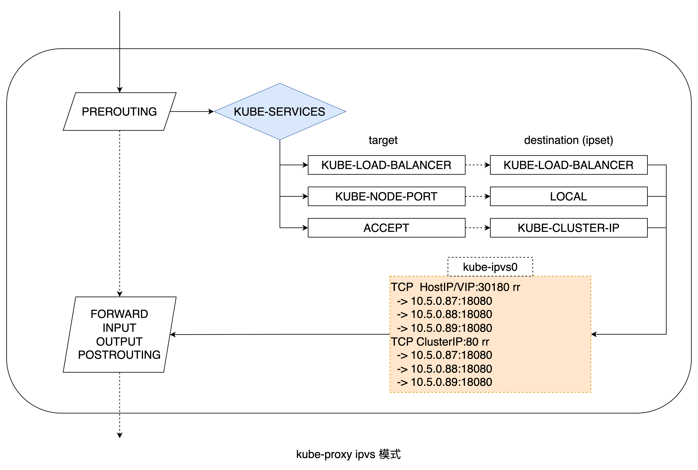

尽管它有优势，但是 ipvs 可能不在所有 Linux 系统中都存在。与几乎每个 Linux 操作系统都有的 iptables 相比，ipvs 可能不是所有 Linux 系统的核心功能。如果集群中 Service 数量不太多，iptables 应该就够用了。

ipvs 通过如下示例来说明，首先查看当前 svc：
```shell
k get svc                      
NAME                            TYPE           CLUSTER-IP     EXTERNAL-IP   PORT(S)             AGE
demo                        ClusterIP      10.255.1.28    <none>        80/TCP              209d
demo-loadbalancer           LoadBalancer   10.255.0.97    10.5.0.99     80:30015/TCP        209d
demo-nodeport               NodePort       10.255.1.101   <none>        80:30180/TCP        209d
...
```

在 Node 上，可以看到多了一个虚拟网络设备 kube-ipvs0，类型为 dummy。

> Q：什么是 dummy 类型设备？
> 
> A：dummy 网卡 (dummy network interface)：用于在断网的环境下，假装网络可以通，仍然可以通过类似 192.168.1.1 这样的IP 访问服务。
> 
> 与环回 (loopback) 接口一样，它是一个纯虚拟接口，允许将数据包路由到指定的 IP 地址。与环回不同，IP 地址可以是任意的，并且不限于 127.0.0.0/8 范围。

```shell
ip -d link show kube-ipvs0

3: kube-ipvs0: <BROADCAST,NOARP> mtu 1500 qdisc noop state DOWN mode DEFAULT group default 
    link/ether xxx brd ff:ff:ff:ff:ff:ff promiscuity 0 minmtu 0 maxmtu 0 
    dummy addrgenmode eui64 numtxqueues 1 numrxqueues 1 gso_max_size 65536 gso_max_segs 65535
```

接着，可以看到所有 Service 的 ClusterIP 都设置到了 kube-ipvs0 设备上面，这样访问集群中任意 Service 直接通过此 kube-ipvs0 设备转发即可。
```shell
ip a
    ...
3: kube-ipvs0: <BROADCAST,NOARP> mtu 1500 qdisc noop state DOWN group default 
    link/ether xxx brd ff:ff:ff:ff:ff:ff
    inet 10.255.1.28/32 scope global kube-ipvs0
       valid_lft forever preferred_lft forever
    inet 10.255.0.97/32 scope global kube-ipvs0
       valid_lft forever preferred_lft forever
    inet 10.255.1.101/32 scope global kube-ipvs0
       valid_lft forever preferred_lft forever
    ...
```

那么，流量到了上面的 kube-ipvs0 的某个 Service ClusterIP 后，又是怎么负载均衡转发后端具体某个 Pod 的呢？

可以通过 ipvsadm 客户端工具查看，示例如下：

> ipvsadm 安装：yum install ipvsadm -y

```shell
# 查看上面 Service demo-nodeport (端口 30180)
ipvsadm -ln | grep 30180 -A 5

TCP  HostIP/VIP:30180 rr
  -> 10.5.0.87:18080              Masq    1      0          0         
  -> 10.5.0.88:18080              Masq    1      0          0         
  -> 10.5.0.89:18080              Masq    1      0          0         
TCP  ClusterIP:80 rr
  -> 10.5.0.87:18080
```

【注意】ipvs 模式下，还是会依赖 iptables 做流量过滤以及 MASQUERADE (SNAT)：
PREROUTING -> KUBE-SERVICES，只不过这些规则是全局共享的，不会随着 Service 或 Pod 数量增加而增加。

```shell
# 全局的 PREROUTING 链
iptables -t nat -nvL PREROUTING

Chain PREROUTING (policy ACCEPT 0 packets, 0 bytes)
 pkts bytes target     prot opt in     out     source               destination         
 500M   27G KUBE-SERVICES  all  --  *      *       0.0.0.0/0            0.0.0.0/0            /* kubernetes service portals */

# 全局的 KUBE-SERVICES 链
iptables -t nat -nvL KUBE-SERVICES

Chain KUBE-SERVICES (2 references)
 pkts bytes target     prot opt in     out     source               destination         
    0     0 KUBE-LOAD-BALANCER  all  --  *      *       0.0.0.0/0            0.0.0.0/0            /* Kubernetes service lb portal */ match-set KUBE-LOAD-BALANCER dst,dst
    0     0 KUBE-MARK-MASQ  all  --  *      *       0.0.0.0/0            0.0.0.0/0            /* Kubernetes service cluster ip + port for masquerade purpose */ match-set KUBE-CLUSTER-IP src,dst
  402 21720 KUBE-NODE-PORT  all  --  *      *       0.0.0.0/0            0.0.0.0/0            ADDRTYPE match dst-type LOCAL
    0     0 ACCEPT     all  --  *      *       0.0.0.0/0            0.0.0.0/0            match-set KUBE-CLUSTER-IP dst,dst
    0     0 ACCEPT     all  --  *      *       0.0.0.0/0            0.0.0.0/0            match-set KUBE-LOAD-BALANCER dst,dst
```

### 7.4 nftables
nftables 是在 K8s v1.29 [alpha] 支持的 kube-proxy 最新模式，其目的是用来最终替代 iptables 模式。

Linux 上默认的 kube-proxy 实现目前基于 iptables。 多年来，iptables 一直是 Linux 内核中首选的数据包过滤和处理系统（从 2001 年的 2.4 内核开始），但 iptables 存在无法修复的性能问题，随着规则集大小的增加，性能损耗不断增加。 

iptables 的问题导致了后继者 nftables（基于 Netfilter）的开发，nftables 于 2014 年首次在 3.13 内核中提供，并且从那时起它的功能和可用性日益增强，可以作为 iptables 的替代品。 iptables 的开发大部分已经停止，新功能和性能改进主要进入 nftables。

> Red Hat 已宣布 iptables 在 RHEL 9 中已弃用，并且可能在几年后的 RHEL 10 中完全删除。 其他发行版在同一方向上迈出了较小的步伐，例如 Debian 从 Debian 11 (Bullseye) 中的“必需”软件包集中删除了 iptables。

### 7.5 kernelspace
kernelspace 是当前 Windows 系统中支持的一种模式，类似早期的 userspace 模式，但工作在内核空间。

kube-proxy 在 Windows VFP (Virtual Filtering Platform 虚拟过滤平台，类似于 Linux iptables 或 nftables 等工具) 中配置数据包过滤规则。 这些规则处理节点级虚拟网络内的封装数据包，并重写数据包，以便目标 IP 地址正确，从而将数据包路由到正确的目的地。

> kernelspace 模式仅适用于 Windows 节点。

## 8. 保留源 IP
在 K8s 中的有状态服务如数据库，授权方式一般都会限制客户端来源 IP，因此在 Service 转发流量过程中需要保留源 IP。

Service 类型 NodePort/LoadBalancer 在进行流量负载均衡时，当发现目标 Pod 不在本节点时，kube-proxy 默认 (service.spec.externalTrafficPolicy = Cluster) 会进行 SNAT 访问到目标 Node，再访问到目标 Pod，此时 Pod 看到的源 IP 其实是节点 IP (下图 Node-1)，获取不到真实的客户端源 IP。

Service 通过设置 service.spec.externalTrafficPolicy = Local 来实现源 IP 保留，之后 kube-proxy 对应的 iptables/ipvs 规则只会生成在目标 Pod 所在 Node，这样客户端访问到 Node 后直接就转发到本节点 Pod，不需要跨节点因此没有 SNAT，因此可以保留源 IP。

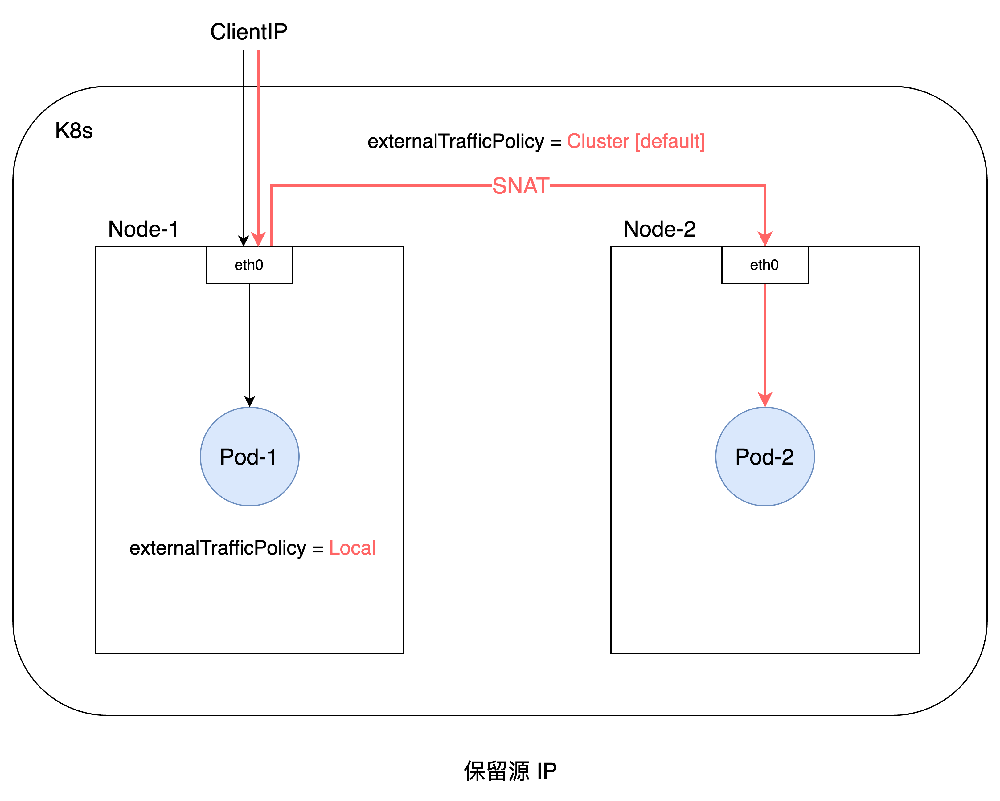

如果访问的 Node 上没有目标 Pod，则访问包直接被丢弃。此时，则需要在客户端访问侧做负载均衡，将访问流量打到含有目标 Pod 的 Node 上。

如下示例，KUBE-MARK-DROP 则表示本节点不包含目标 Pod，访问直接被 DROP。
```shell
iptables -t nat -nvL KUBE-XLB-AANU2CJXJILSCCKL
Chain KUBE-XLB-AANU2CJXJILSCCKL (1 references)
 pkts bytes target     prot opt in     out     source               destination         
    0     0 KUBE-MARK-MASQ  all  --  *      *       0.0.0.0/0            0.0.0.0/0            /* masquerade LOCAL traffic for default/demo-local: LB IP */ ADDRTYPE match src-type LOCAL
    0     0 KUBE-SVC-AANU2CJXJILSCCKL  all  --  *      *       0.0.0.0/0            0.0.0.0/0            /* route LOCAL traffic for default/demo-local: LB IP to service chain */ ADDRTYPE match src-type LOCAL
    0     0 KUBE-MARK-DROP  all  --  *      *       0.0.0.0/0            0.0.0.0/0            /* default/demo-local: has no local endpoints */
```

> KUBE-XLB-XXX 表示从 K8s 集群外部 (external) 访问内部服务的规则，在 K8s v1.24 更改为 KUBE-EXT-XXX，更为清晰表达 external 之意。

另外，Service 还可以通过 spec.internalTrafficPolicy 字段来设置内部访问策略：
- Cluster：默认值，表示从内部 Pod 访问 Service，将通过 kube-proxy 负载均衡到所有目标 Pod(s)。
- Local：表示从内部 Pod 访问 Service，将通过 kube-proxy 只负载均衡到与访问 Pod 相同的节点上的目标 Pod(s)，流量不会转发到其他节点上的 Pod(s)。

## 9. Ingress
上述介绍的 NodePort/LoadBalancer 类型的 Service 都可以实现外部访问集群内部服务，但这两种方式有一些不足：
- 端口占用：NodePort Service 需要在 Node 节点上占用端口，默认 30000-32767 不能满足太多的 Service 数量，且容易出现端口占用冲突；
- VIP 数量：LoadBalancer Service 需要为每个 Service 分配一个 externalIP (VIP)，资源比较浪费且依赖底层 VIP 实现；
- 域名访问：一般情况下，客户端访问后端服务，一般都是通过 HTTP/HTTPS 域名的方式，而不是直接 NodeIP:port 或 VIP:port；

针对上述痛点问题，K8s 设计了 Ingress 资源对象（显示定义各种域名、路径访问规则），通过 Ingress Controller 如 Nginx Controller 实现 Ingress 对象具体规则的转换，可根据不同域名、同域名、不同路径等多种组合方式，分发到不同的 Service (ClusterIP 类型)，最终转发到目标 Pod。

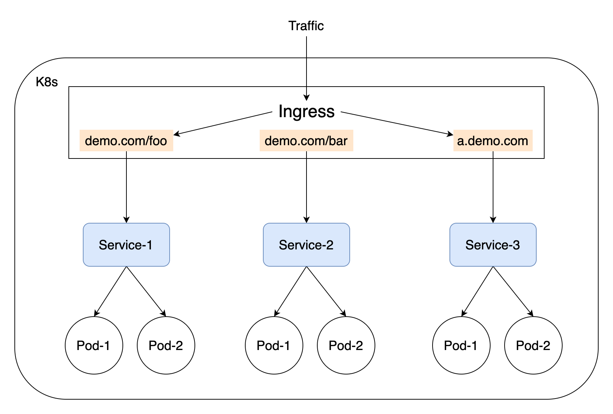

另外，为了支持更多的协议（如 TCP/UDP、GRPC、TLS）和更加灵活、丰富的网络管理能力，当前社区已经停止 Ingress 新特性开发，转向 [Gateway API](https://kubernetes.io/docs/concepts/services-networking/gateway/) 代替 Ingress。Gateway API 通过可扩展的、面向角色的、协议感知的配置机制来提供网络服务。

## 10. 小结
本文通过介绍 K8s 中容器网络、Service/Pod 关联、Service 类型、DNS 解析、kube-proxy 模式、保留源 IP、Ingress 等方面，说明了 Service 的网络机制。小结如下：

- 容器网络：分为同一个 Node 内访问、跨 Node 间访问，通过 cbr0/cni0 与 veth-pair 连接实现；
- Service/Pod 关联：通过选择器 (selector) 与目标 Pod 的标签 (labels) 匹配关联，由 Endpoints 对象承载；
- Service 类型：支持 ClusterIP/NodePort/LoadBalancer/ExternalName 四种类型，提供内部、外部多种访问能力；
- DNS 解析：通过 CoreDNS 动态管理 (create/update/delete) 集群中 Service/Pod 的域名解析；
- kube-proxy 模式：支持 iptables/ipvs/nftables/kernelspace 等多种代理模式，可按需选择；
- 保留源 IP：通过设置 externalTrafficPolicy = Local 来实现源 IP 保留，满足特定业务需求；
- Ingress：通过 Ingress Controller 实现 Ingress 规则的转换，提供不同域名、不同路径等多种网络管理能力；


*PS: 更多内容请关注 [k8s-club](https://github.com/k8s-club/k8s-club)*


### 参考资料
- [K8s Service 介绍](https://kubernetes.io/docs/concepts/services-networking/service/)
- [K8s 源码](https://github.com/kubernetes/kubernetes)
- [K8s 容器网络](https://cloud.tencent.com/developer/article/1540581)
- [K8s DNS 解析](https://kubernetes.io/docs/concepts/services-networking/dns-pod-service/)
- [kube-proxy 模式](https://kubernetes.io/docs/reference/networking/virtual-ips/)
- [CNI 规范](https://github.com/containernetworking/cni)
- [KUBE-XLB 改为 EXT](https://github.com/kubernetes/kubernetes/pull/109060)
- [保留源 IP](https://kubernetes.io/docs/tutorials/services/source-ip/)
- [K8s Ingress](https://kubernetes.io/docs/concepts/services-networking/ingress/)
- [kube-proxy nftables KEP](https://github.com/kubernetes/enhancements/blob/master/keps/sig-network/3866-nftables-proxy/README.md)
