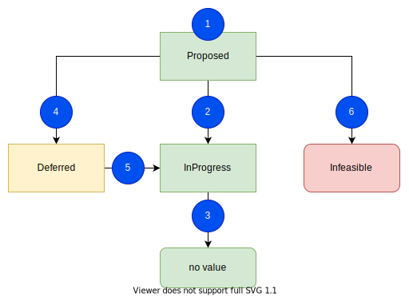
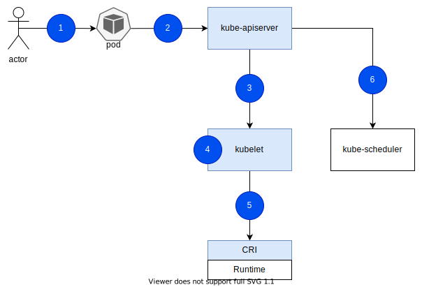
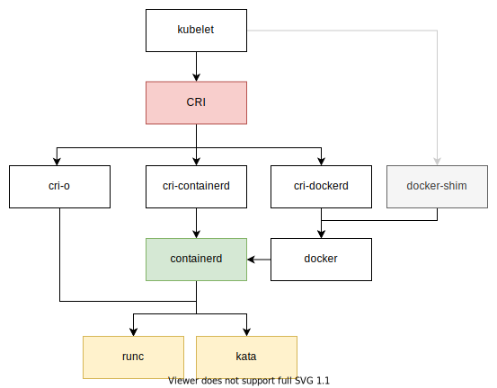

# K8s 原地变配 Inplace Vertical Scaling
对于原地变配而言，一个最直观的问题就是「原地变配真的有这么难吗」？

从操作系统的实现来说，借助 cgroup 的应用，对容器的资源限制其实很简单，也就是修改涉及文件的限制值。基于 cgroup v1，具体来说，对于 cpu 资源，通过 `cpu.cfs_quota_us` 设置相对 `cpu.cfs_period_us` 的 limit，以及设置 `cpu.shares` 保证资源紧张下能够使用相应的 CPU 资源。对于 memory 资源，设置 `memory.limit_in_bytes` 来限制。

那么对于 k8s 中 pod 的原地变配会有什么难点呢？

我列举当下我想到的点：
- 一个 pod 有多个 container，那么对于多个 container 同时发生变配时需要怎么处理？如果其中一个 container 变配失败了呢？
- 如果变配直接在 node（kubelet） 上实现，那么会和调度器 race 吗？出现新调度到节点上的 pod 实际并没有资源给它时，这个 pod 后续会被怎么处理？
- kubelet 与 管控面发生变更，对于存量集群如何平滑升级？会有兼容性问题嘛？
- 如果与底层 Runtime 交互的 CRI 发生变更，那么存量集群的 Runtime 升级如何平滑稳定？

下述我们首先阐述一些 API 的修改，之后介绍整个原地变配流程，并尝试回答一些问题。

> 本文基于 k8s v1.29。 

location : 成都， 天气 : ☁️， Let's Go～

## Pod API 修改
kubernets 版本 v1.25+
### Spec
1. Pod.Spec.Containers[i].Resources （存量字段），变为 mutable，表示一个 desired 的资源量，真实使用量见 status...Resources
2. pod.Spec.Containers[i].ResizePolicy （新字段，type []ContainerResizePolicy）, 表示这个 container 内不同的 Resource 使用哪一种 RestartPolicy，其中：
  - ResourceName 只支持 `cpu`, `memory`
  - RestartPolicy 只支持 `NotRequired`（默认值。不重启 if possible） 与 `RestartContainer`（重启）

> Note: 如果 pod.Spec.RestartPolicy 为 Never，那么 pod.spec...ResizePolicy 必须为 NotRequired。

> Note: 这里配置 ResizePolicy 是在 container 层级，不是 pod 层级。题外话，在 [KEP - Future Enhancements](https://github.com/kubernetes/enhancements/tree/master/keps/sig-node/1287-in-place-update-pod-resources#future-enhancements) 中也提到了期望设置一个 pod 层级的默认 ResizePolicy。

### Status
1. Pod.Status.ContainerStatuses[i].AllocatedResources(新字段 type v1.ResourceList) 表示 kubelet 已经 admit 这个 container 的 request 资源
2. Pod.Status.ContainerStatuses[i].Resources(新字段， type v1.ResourceRequirements) 表示这个 container 真实使用(已经设置到 os cgroup)的资源大小
3. Pod.Status.Resize（新字段，type v1.PodResizeStatus）表示 resize 的当前状态。 支持:
- `Proposed` - Resize 的请求已经提交，但是还没有被处理（接受/拒绝）
- `InProgress` - Resize 的请求已经被接受，正在处理中...
- `Deferred` - Resize 的请求在理论上是可以的，但是现有的资源暂时不满足，未来还会再尝试。
- `Infeasible` - Resize 的请求理论上不行，拒绝这个请求。
- (no value) - 没有正在被提起的 Resize 请求

### Pod Example
```
apiVersion: v1
kind: Pod
metadata:
  name: inplacedemo
  namespace: default
spec:
  containers:
    name: inplacedemo
+   resizePolicy:
+   - resourceName: memory
+     restartPolicy: RestartContainer
+   - resourceName: cpu
+     restartPolicy: NotRequired
U   resources:
U     limits:
U       cpu: "3"
U       memory: 1Gi
U     requests:
U       cpu: "2"
U       memory: 1Gi
    terminationMessagePath: /dev/termination-log
    terminationMessagePolicy: File
  ...
status:
  containerStatuses:
+ - allocatedResources:
+     cpu: "2"
+     memory: 1Gi
    containerID: docker://xxx
    image: alpine:latest
    imageID: docker-pullable://xxx
    ...
    name: inplacedemo
    ready: true
+   resources:
+     limits:
+       cpu: "2"
+       memory: 1Gi
+     requests:
+       cpu: "1"
+       memory: 1Gi
    restartCount: 1
    started: true
    state:
      running:
        startedAt: "2024-03-19T03:00:54Z"
+ resize: InProgress
  qosClass: Burstable
  ...
```

### 对 Pod Api 修改的 QA

* RestartPolicy 设置为 NotRequired 一定能够保证 container 不会重启吗？
>  这块我看完代码下来是认为能够保证的，只要 runtime 支持所有的 CRI 接口，并且实现正确。但是下述的注解说了不一定保证不重启，需要结合场景再深入研究。
>
> 'NotRequired' means Kubernetes will try to resize the container without restarting it, if possible. Kubernetes may however choose to restart the container if it is unable to actuate resize without a restart. For e.g. the runtime doesn't support restart-free resizing. 


* 如果不同资源设置的 restartPolicy 不一致，并且这些资源被同一时间一起更新了，那么应该选择哪种策略呢？
>  只要在此次变配的资源中，至少任一个资源配置为 RestartContainer，那么 container 需要重启。具体来说变配的资源需要为 cpuReq，cpuLimit，memoryLimit。尤其需要注意仅仅只是 memoryReq 的变化，即使 memory 类型的 restartPolicy 为 RestartContainer 也不需要重启，因为本质上来说， memoryReq 没有反应到 OS 中。

* container 的 ResizePolicy 中为什么需要分资源类型来设置不同的 RestartPolicy，直接在 container 维度设置一个不行吗？
>  设置 restartPolicy 需要分开 cpu/memory 来设置，是因为 cpu 的变动一般不需要重启 container，但是 memory 的变动可能会需要重启 container。因此此处分开 cpu/memory 来设置，来适应更多的场景。直接设置到 container 维度的也能够用，但是不够灵活，会导致并不需要重启 container 的资源变更也因为 container 维度的配置而重启。

* 对于存量 pod，不设置任何的 resizePolicy, 此时修改 container 的 resource 请求会发生什么？
>  对于存量的 pod，一旦更新至 v1.27+ 版本来使用 InpalceVerticalScaling 的能力，会 default 所有的资源类型的 RestartPolicy 都为 NotRequired。需要注意的是，这些默认值不会写入 etcd，也就是说假如集群中 apiServer 侧的默认值发生了变更，这些涉及的对象默认值都会发生变化。

* pod.Spec.Containers[i].ResizePolicy 这个能够给存量的设置吗？这个字段是 immutable 的吗？
> 存量的不能设置，默认为 NotRequired，该字段是 immutable 的。

* 在 status...AllocatedResources 和 status...Resources 有什么区别？
>  对于 status...AllocatedResources 表示的是已经通过 kubelet admit 的资源大小，注意它只存储的是 Request 资源，不关心 Limit 资源。而 status...Resources 表示的是已经生效的真实资源大小，包括 Request 和 Limit。

* 为什么 AllocatedResources 的资源类型为 v1.ResourceList，其中只存储 request 呢？
>  我理解是因为 kubelet 只拿 request 来做资源计算 admit 的过程，所以在 AllocatedResource 中只记录 request


## 整体的变配流程
### Resize 状态转换

1. 在 spec...Resource 发生变化，并且 spec...Resource.Request 与 status.AllocatedResource 存在差异，设置为 `Proposed`
2. node 上有足够的资源满足 spec...Resource.Request 做原地变配，设置为 `InProgress`
3. 在原地变配做完，写到 OS 之后，清空 status.Resize
4. 「此时」node 上没有足够的资源，设置为 `Deferred`，等待再次尝试
5. 「此时」node 上的资源足够，可能现有的 pod 经过调整（降配/删除）释放了资源来帮助当前的 pod 变配成功
6. node 上永远不会有足够的资源，即使所有其上的 pod 都被删除，也就是 pod 请求的资源超过了 node 能够提供的全部资源，设置为 `Infeasible`

### 流程概述

1. spec...Resources 发生更新
2. apiServer 将 status.Resize 置为 `Proposed` 
3. kubelet watch 到 pod 的 Update 事件，开始 syncpod[4-5]。
4. 首先查看当前 pod 的 spec...Resources.Request（新的资源请求大小）：
- 如果其超过了 node.Allocatable 的大小（cpu & emory）那么将 status.Resize 置为 `Infeasible`，表示不论什么情况下，当前节点都不能满足该资源请求
- 如果其与当前 node 上 Available(可使用的剩余资源) 的资源大小相比：
  - 大于，将 status.Resize 置为 `Deferred`，表示当下没有足够的资源留给变配，待未来继续尝试
  - 小于，将 status.AllocatedResource 置为和 spec...Resources.Request 一致，并将 status.Resize 置为 `InProgress`，表示有足够的资源。
5. 调用 CRI 接口 UpdateContainerResources 来更新资源限制，在所有的 container 的变配都完成（需要查看）之后，更新 status...Resources，并清理 status.Resize。
6. Scheduler watch 到 pod 的 Update 事件，并更新调度 cache，使用 Inplace 的 pod 资源大小，具体来说，计算规则如下：
```go
if pod.Status.Resize == v1.PodResizeStatusInfeasible {
  containerReqs = cs.AllocatedResources.DeepCopy()
} else {
  containerReqs = max(container.Resources.Requests, cs.AllocatedResources)
}
```

> 注意： 这里计算 node.Availeble 资源大小时，对于该节点上的 pod 使用的资源量，使用 `status...AllocatedResource` 来计算。另外：
> - 使用 `spec...Resources` 不合适，因为该值表示的 desired 值，desired 值甚至可以大于节点的 allocatable 值。
> - 使用 `status...Resources` 也不合适，因为该值表示的 current 值，也就是真正运行的值，从 kubelet admit Inplace 的 podA，到 pod A资源变配在 OS 真正生效还需要经过一些步骤（可能出错），在这些过程中如果又有新的 podB 变配来临，此时计算 podA 的资源占用时使用 current 值就不准确了。

> 注意： 这里对于「降低 memory limit」 的请求，需要首先查看当前 memory 的使用量（cgroup memory.usage_in_bytes）是否小于当前新请求的 memory limit，如果：
> - 小于：调用 CRI 接口设置新的 memory limit (memory.limit_in_bytes)
> - 大于等于：backoff 当前的设置 memory limit 的动作，此时 status...AllocatedResource 与 spec...Resources 一致，但是 status.Resources 还是之前的值。

对于 apiServer <-> kubelet <-> runtime 之间的交互，官方更详细的例子如下：
```
   +-----------+                   +-----------+                  +-----------+
   |           |                   |           |                  |           |
   | apiServer |                   |  kubelet  |                  |  runtime  |
   |           |                   |           |                  |           |
   +-----+-----+                   +-----+-----+                  +-----+-----+
         |                               |                              |
         |       watch (pod update)      |                              |
         |------------------------------>|                              |
         |     [Containers.Resources]    |                              |
         |                               |                              |
         |                            (admit)                           |
         |                               |                              |
         |                               |  UpdateContainerResources()  |
         |                               |----------------------------->|
         |                               |                         (set limits)
         |                               |<- - - - - - - - - - - - - - -|
         |                               |                              |
         |                               |      ContainerStatus()       |
         |                               |----------------------------->|
         |                               |                              |
         |                               |     [ContainerResources]     |
         |                               |<- - - - - - - - - - - - - - -|
         |                               |                              |
         |      update (pod status)      |                              |
         |<------------------------------|                              |
         | [ContainerStatuses.Resources] |                              |
         |                               |                              |

```

PS: [一个在社区的 Enhancement 中很棒的例子](https://github.com/kubernetes/enhancements/tree/master/keps/sig-node/1287-in-place-update-pod-resources#flow-control)

下述是对于 Runtime 的一个详细图示，便于理解 Runtime 的各个层级。



### 一些 QA
* 原地变配支持的 k8s 版本是？
>  v1.27+ 开始支持 alpha 版本 （api 定义的修改在 v1.25 已经 merged）

* 一个 pod 有多个 container，那么多个 container 同时发生变配时需要怎么处理？
> 对于 pod 内多个 container 发生了资源变配请求的场景，如果整个 pod 维度的资源请求量是：
>- 增加的，那么先修改 pod 的 cgroup，再修改其下的 continers 的 cgroup。
>- 是减少的，那么先修改 containers 的资源量，再修改 pod 的 cgroup。
>
>注意这里对于 cpu/memory 是分开操作的，所以对于其中某一类的资源，在内部多个 containers 的执行顺序是先执行资源降低，再执行资源增加。

* pod 内多个 container 发生了资源变配请求的场景，如果其中一个 container 变配失败了呢？
>  那么当前的这个 pod 这一轮的原地变配流程到此终止，backoff 至下一次 reconcile（bakcoff 时间 10s 起步）。说明：在新一轮的 reconcile 中会重新执行所有需要变配 container 的变配流程，不关心上一次执行的结果。

* 只要 spec...Resources 字段发生了变化，那么 Pod.Status.Resize 会被自动设置为 Proposed, 这个动作发生在哪里？
>  这个设置为 Proposed 的动作发生在 apiServer，并且只要有一个 container 的 spec...Resources.Requests 和 status.AllocatedResources 不一致，apiServer 就会设置 status.Resize 置为 `Proposed`。需要注意如果只有 spec...Resources.Limit 发生变化，是不会设置为 Proposed 的。

* 为什么 apiServer 设置 Proposed 值时只考虑 spec...Resources.Request 的变化，而不考虑 spec...Resource.Limit 呢？
>  我理解是出于资源使用考虑，因为在设计中所有的资源占用都是以 request 为准，而 limit 不参与任何的资源使用计算，只是对于该 container 的资源限制。

* Deferred 的情况是如何在未来尝试的？什么样的频率？
>  可以明确的是 Deferred 状态是一定会重试的，但是没看到显示的错误返回来 backoff 的（需要进一步研究一下），但是 kubelet 的 podWorkers 的 reconcile 中存在 resync 的逻辑，默认 1 minutes (jitter 0.5) resync 一次。 

* kubelet 开启 InplaceVerticalScaling 这个 feature gate 会重启 container 吗？
>  不会(基于 k8s V1.27)。

* 原地变配什么情况下拒绝(Infeasible)？Infeasible 的时候，pod 的 status 中是怎么展示的？
>  pod request 资源超过了节点的最大的 allocatable 资源。此时 status...AllocatedResource 和 status...Resources 都不会变化，只有 status.Resize 变为 Infeasible。

* 原地变配过程中，pod 的 Condition 是怎么变化的？
>  如果在原地变配过程中应用程序能够正常运行的情况下，那么在整个过程中 pod 的任何 Condition 都不会发生变化。

* 调度器是怎么感知资源的原地变化的？会不会有资源不一致的问题？
>  通过 watch pod 的 update 事件来更新 cache 内 pod 使用的资源。这样就导致了会出现调度器缓存中节点上的资源余量和 node 上真实的资源余量「不一致」的问题，如果出现不一致，以 node（kubelet）为准

* container 的 request 资源是一定能够提供给对应 container 的吗，如何保证的？
> 对于 cpu 资源来说，通过 cgroup 的 cpu.shares 来保证 cpu 资源紧张的情况下能够获取到至少相应大小的 CPU 资源。但是对于 memory 资源没有保证，也就是可能申请了 request 2Gi memory，但是真实使用不到 2Gi memory 就没有资源了。
>
> ### NEWS:
> 对于 Memory 的资源限制而言，在 cgroup v1 的时候支持的不太好，于 k8s 的交互而言，存在两个问题：
> 1. memory 的 Spec.Resources.Request 不会生效到 OS 层级，它只作为调度的依赖。这就会导致其可能连 request 大小的 memory 资源都用不到。
> 2. 只有将 memory 的 spec...Resource.Limit 写入到 memory.limit_in_bytes，进程可能会突发快速用到 memory limit 之后触发 OOM killed。在数据库场景，可能一个大查询来了，一下子就能把内存吃满，这会触发 OOM killed 导致查询中断是难以接受的。
>
> 以上两个问题到了 cgroup v2 的时候，有了不错的改善，于 k8s 交互而言：
> 1. 首先将 Spec.Resources.Request 写入 memory.min，保证该进程至少有 requested 大的内存
> 2. 将 Spec.Resources.Limit 写入 memory.max ，表示进程能使用最大资源量，等同于 cgroup v1 中的 memory.limit_in_bytes，触达这个限制就会 OOM killed
> 3. 设置 memory.high 来控制进程不要一下子爆发使用到最大 limit 值，该值会介于 memory.min 和 memory.max 之间，一旦内存使用超过 high, OS 会限制其内存分配，并着重回收其内存使用。具体该数值的计算如下：\
> `memory.high=floor[(requests.memory + memory throttling factor * (limits.memory or node allocatable memory - requests.memory))/pageSize] * pageSize`  \
> 其中的 memory throttling factor （`MemoryThrottlingFactor`） 是支持在 kubelet 中配置的(默认为 0.9)。
>
> 更多详细内容见 [KEP-2570: Support Memory QoS with cgroups v2](https://github.com/kubernetes/enhancements/tree/master/keps/sig-node/2570-memory-qos) 以及 [Blog](https://kubernetes.io/blog/2021/11/26/qos-memory-resources/), k8s 版本要求 v1.22+。

## Risks
1. 兼容问题：所有的查询 pod 资源使用量的地方都需要注意，spec 中只是描述了 desired 值，只有在 status 中才描述了真实 admit 和使用的资源量。
2. 对于缩小 memory 资源，可能不会生效，因为对应的 page 正在被使用中「OS层级」，也就是 cgroup memory.usage_in_bytes 大于 spec...Resources.Request 的值。
3. 节点上 pod 原地变配会和调度器 race，也就是 node 节点上 inplace pod 升级的过程中，调度器也会并行的往这个节点调度新的 pod，此时会会出现调度器认为资源足够，但是 node 上真实资源不足的情况。此时以 kubelet 会拒绝新调度上来的pod。

# Reference
- [ISSUE: In-Place Update of Pod Resources](https://github.com/kubernetes/enhancements/issues/1287)
- [KEP: In-place Update of Pod Resources](https://github.com/kubernetes/enhancements/tree/master/keps/sig-node/1287-in-place-update-pod-resources)
- [Pod 原地垂直伸缩 - 一个四年的KEP和两年的PR](https://mp.weixin.qq.com/s/1WTH4te8i2iiWB-jTz9QBw)
- [Blog: Kubernetes 1.27: In-place Resource Resize for Kubernetes Pods (alpha)](https://kubernetes.io/zh-cn/blog/2023/05/12/in-place-pod-resize-alpha/)
- [实践: Trying out the new In-Place Pod Resource Resizing!](https://medium.com/@karla.saur/trying-out-the-new-in-place-pod-resource-resizing-68a0b3c42b72)
