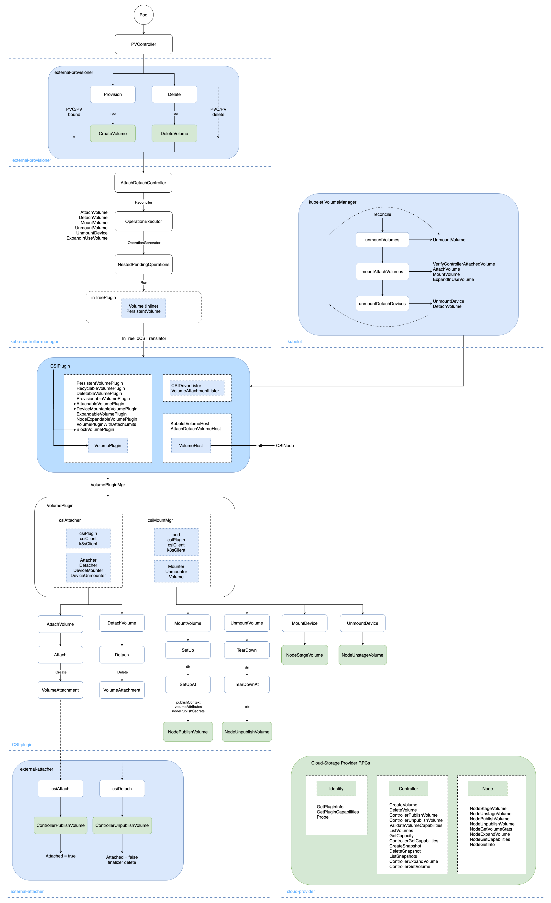
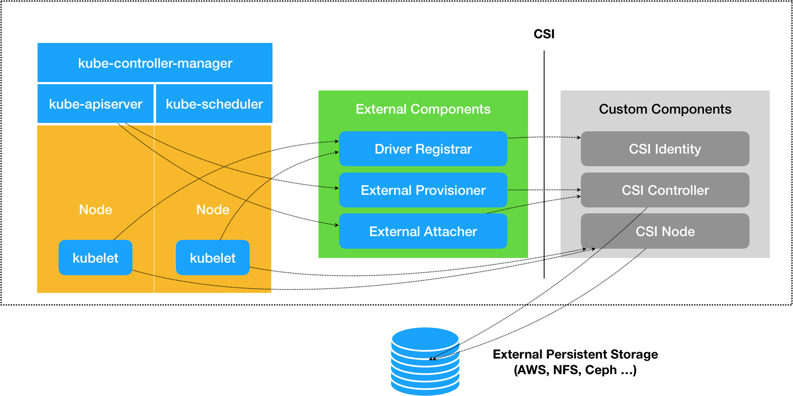
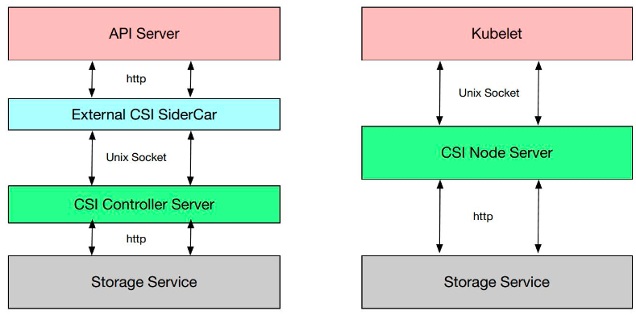
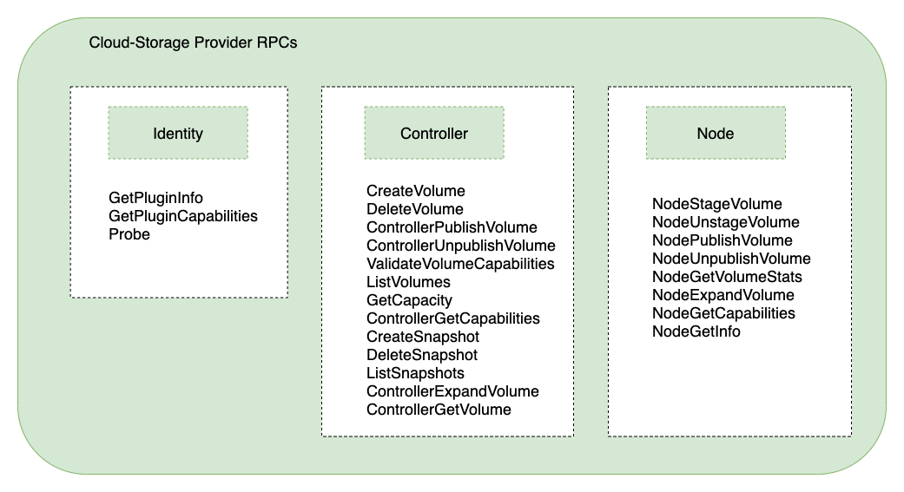
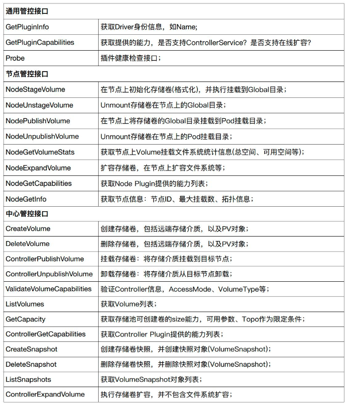
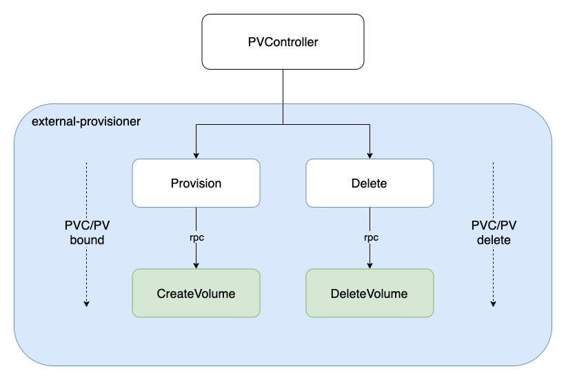
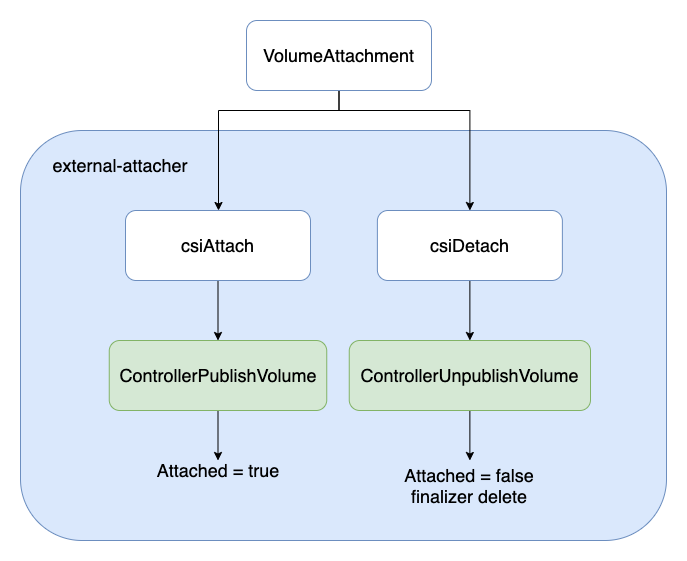
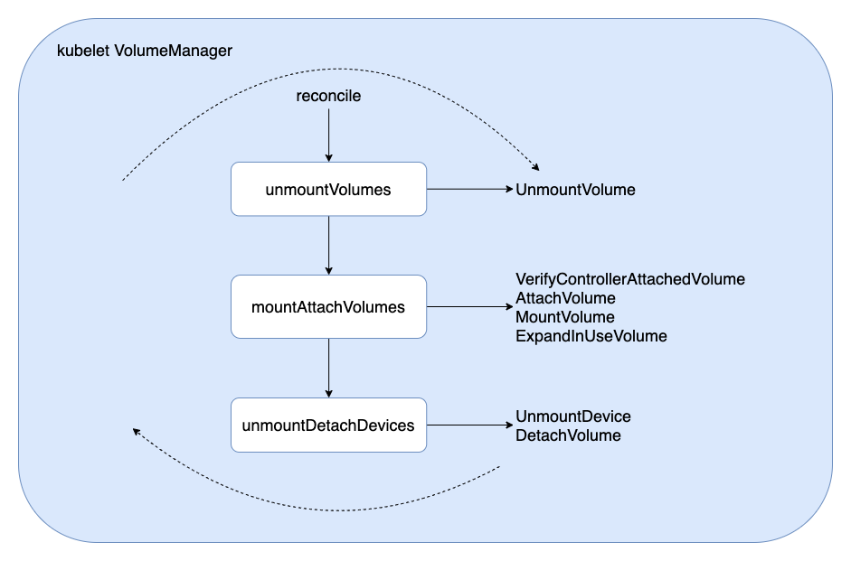

## 1. 概述
进入 K8s 的世界，会发现有很多方便扩展的 Interface，包括 CSI, CNI, CRI 等，将这些接口抽象出来，是为了更好的提供开放、扩展、规范等能力。

K8s 持久化存储经历了从 in-tree Volume 到 CSI Plugin(out-of-tree) 的迁移，一方面是为了将 K8s 核心主干代码与 Volume 相关代码解耦，便于更好的维护；另一方面则是为了方便各大云厂商实现统一的接口，提供个性化的云存储能力，以期达到云存储生态圈的开放共赢。

本文将从持久卷 PV 的 创建(Create)、附着(Attach)、分离(Detach)、挂载(Mount)、卸载(Unmount)、删除(Delete) 等核心生命周期进行机制解析。

### 相关术语

| Term              | Definition                                       |
|-------------------|--------------------------------------------------|
| CSI | Container Storage Interface. |
| CNI | Container Network Interface. |
| CSI | Container Runtime Interface. |
| PV | Persistent Volume. |
| PVC | Persistent Volume Claim. |
| Volume            | A unit of storage that will be made available inside of a CO-managed container, via the CSI.                          |
| Block Volume      | A volume that will appear as a block device inside the container.                                                     |
| Mounted Volume    | A volume that will be mounted using the specified file system and appear as a directory inside the container.         |
| CO                | Container Orchestration system, communicates with Plugins using CSI service RPCs.                                     |
| SP                | Storage Provider, the vendor of a CSI plugin implementation.                                                          |
| RPC               | [Remote Procedure Call](https://en.wikipedia.org/wiki/Remote_procedure_call).                                         |
| Node              | A host where the user workload will be running, uniquely identifiable from the perspective of a Plugin by a node ID. |
| Plugin            | Aka “plugin implementation”, a gRPC endpoint that implements the CSI Services.                                        |
| Plugin Supervisor | Process that governs the lifecycle of a Plugin, MAY be the CO.                                                        |
| Workload          | The atomic unit of "work" scheduled by a CO. This MAY be a container or a collection of containers.                   |

> 本文及后续相关文章都基于 K8s v1.22



## 2. 从 CSI 说起
CSI(Container Storage Interface) 是由来自 Kubernetes、Mesos、Docker 等社区 member 联合制定的一个行业标准接口规范([https://github.com/container-storage-interface/spec](https://github.com/container-storage-interface/spec))，旨在将任意存储系统暴露给容器化应用程序。

CSI 规范定义了存储提供商实现 CSI 兼容的 Volume Plugin 的最小操作集和部署建议。CSI 规范的主要焦点是声明 Volume Plugin 必须实现的接口。

先看一下 Volume 的生命周期：
```
   CreateVolume +------------+ DeleteVolume
 +------------->|  CREATED   +--------------+
 |              +---+----^---+              |
 |       Controller |    | Controller       v
+++         Publish |    | Unpublish       +++
|X|          Volume |    | Volume          | |
+-+             +---v----+---+             +-+
                | NODE_READY |
                +---+----^---+
               Node |    | Node
              Stage |    | Unstage
             Volume |    | Volume
                +---v----+---+
                |  VOL_READY |
                +---+----^---+
               Node |    | Node
            Publish |    | Unpublish
             Volume |    | Volume
                +---v----+---+
                | PUBLISHED  |
                +------------+

The lifecycle of a dynamically provisioned volume, from
creation to destruction, when the Node Plugin advertises the
STAGE_UNSTAGE_VOLUME capability.
```
从 Volume 生命周期可以看到，一块持久卷要达到 Pod 可使用状态，需要经历以下阶段：
> CreateVolume -> ControllerPublishVolume -> NodeStageVolume -> NodePublishVolume

而当删除 Volume 的时候，会经过如下反向阶段：
> NodeUnpublishVolume -> NodeUnstageVolume -> ControllerUnpublishVolume -> DeleteVolume

上面流程的每个步骤，其实就对应了 CSI 提供的标准接口，云存储厂商只需要按标准接口实现自己的云存储插件，即可与 K8s 底层编排系统无缝衔接起来，提供多样化的云存储、备份、快照(snapshot)等能力。

## 3. 多组件协同
为实现具有高扩展性、out-of-tree 的持久卷管理能力，在 K8s CSI 实现中，相关协同的组件有：



### 3.1 组件介绍
- kube-controller-manager：K8s 资源控制器，主要通过 PVController, AttachDetach 实现持久卷的绑定(Bound)/解绑(Unbound)、附着(Attach)/分离(Detach)；
- CSI-plugin：K8s 独立拆分出来，实现 CSI 标准规范接口的逻辑控制与调用，是整个 CSI 控制逻辑的核心枢纽；
- node-driver-registrar：是一个由**官方 K8s sig 小组维护的辅助容器(sidecar)**，它使用 kubelet 插件注册机制向 kubelet 注册插件，需要请求 CSI 插件的 Identity 服务来获取插件信息；
- external-provisioner：是一个由**官方 K8s sig 小组维护的辅助容器(sidecar)**，主要功能是实现持久卷的创建(Create)、删除(Delete)；
- external-attacher：是一个由**官方 K8s sig 小组维护的辅助容器(sidecar)**，主要功能是实现持久卷的附着(Attach)、分离(Detach)；
- external-snapshotter：是一个由**官方 K8s sig 小组维护的辅助容器(sidecar)**，主要功能是实现持久卷的快照(VolumeSnapshot)、备份恢复等能力；
- external-resizer：是一个由**官方 K8s sig 小组维护的辅助容器(sidecar)**，主要功能是实现持久卷的弹性扩缩容，需要云厂商插件提供相应的能力；
- kubelet：K8s 中运行在每个 Node 上的控制枢纽，主要功能是调谐节点上 Pod 与 Volume 的附着、挂载、监控探测上报等；
- cloud-storage-provider：由各大云存储厂商基于 CSI 标准接口实现的插件，包括 Identity 身份服务、Controller 控制器服务、Node 节点服务；

### 3.2 组件通信
由于 CSI plugin 的代码在 K8s 中被认为是不可信的，因此 CSI Controller Server 和 External CSI SideCar、CSI Node Server 和 Kubelet 通过 Unix Socket 来通信，与云存储厂商提供的 Storage Service 通过 gRPC(HTTP/2) 通信：



## 4. RPC 调用
从 CSI 标准规范可以看到，云存储厂商想要无缝接入 K8s 容器编排系统，需要按规范实现相关接口，相关接口主要为：


- Identity 身份服务：Node Plugin 和 Controller Plugin 都必须实现这些 RPC 集，协调 K8s 与 CSI 的版本信息，负责对外暴露这个插件的信息。
- Controller 控制器服务：Controller Plugin 必须实现这些 RPC 集，创建以及管理 Volume，对应 K8s 中 attach/detach volume 操作。
- Node 节点服务：Node Plugin 必须实现这些 RPC 集，将 Volume 存储卷挂载到指定目录中，对应 K8s 中的 mount/unmount volume 操作。

相关 RPC 接口功能如下：




## 5. 创建/删除 PV
K8s 中持久卷 PV 的创建(Create)与删除(Delete)，由 external-provisioner 组件实现，相关工程代码在：
[https://github.com/kubernetes-csi/external-provisioner](https://github.com/kubernetes-csi/external-provisioner)

首先，通过标准的 cmd 方式获取命令行参数，执行 newController -> Run() 逻辑，相关代码如下：
```go
// external-provisioner/cmd/csi-provisioner/csi-provisioner.go
main() {
...
	// 初始化控制器，实现 Volume 创建/删除接口
	csiProvisioner := ctrl.NewCSIProvisioner(
		clientset,
		*operationTimeout,
		identity,
		*volumeNamePrefix,
		*volumeNameUUIDLength,
		grpcClient,
		snapClient,
		provisionerName,
		pluginCapabilities,
		controllerCapabilities,
		...
	)
	...
	// 真正的 ProvisionController，包装了上面的 CSIProvisioner
	provisionController = controller.NewProvisionController(
		clientset,
		provisionerName,
		csiProvisioner,
		provisionerOptions...,
	)
	...
	run := func(ctx context.Context) {
		...
        // Run 运行起来
		provisionController.Run(ctx)
	}
}
```

接着，调用 PV 创建/删除流程：
> PV 创建：runClaimWorker -> syncClaimHandler -> syncClaim -> provisionClaimOperation -> Provision -> CreateVolume
> PV 删除：runVolumeWorker -> syncVolumeHandler -> syncVolume -> deleteVolumeOperation -> Delete -> DeleteVolume




由 sigs.k8s.io/sig-storage-lib-external-provisioner 抽象了相关接口：
```go
// 通过 vendor 方式引入 sigs.k8s.io/sig-storage-lib-external-provisioner
// external-provisioner/vendor/sigs.k8s.io/sig-storage-lib-external-provisioner/v7/controller/volume.go
type Provisioner interface {
	// 调用 PRC CreateVolume 接口实现 PV 创建
	Provision(context.Context, ProvisionOptions) (*v1.PersistentVolume, ProvisioningState, error)
	// 调用 PRC DeleteVolume 接口实现 PV 删除
	Delete(context.Context, *v1.PersistentVolume) error
}
```

## 6. Controller 调谐
> K8s 中与 PV 相关的控制器有 PVController、AttachDetachController。

### 6.1 PVController
PVController 通过在 PVC 添加相关 Annotation(如 pv.kubernetes.io/provisioned-by)，由 external-provisioner 组件负责完成对应 PV 的创建/删除，然后 PVController 监测到 PV 创建成功的状态，完成与 PVC 的绑定(Bound)，调谐(reconcile)任务完成。然后交给 AttachDetachController 控制器进行下一步逻辑处理。

值得一提的是，PVController 内部通过使用 local cache，高效实现了 PVC 与 PV 的状态更新与绑定事件处理，相当于在 K8s informer 机制之外，又自己维护了一个 local store 进行 Add/Update/Delete 事件处理。

首先，通过标准的 newController -> Run() 逻辑：
```go
// kubernetes/pkg/controller/volume/persistentvolume/pv_controller_base.go
func NewController(p ControllerParameters) (*PersistentVolumeController, error) {
	...
	// 初始化 PVController
	controller := &PersistentVolumeController{
		volumes:                       newPersistentVolumeOrderedIndex(),
		claims:                        cache.NewStore(cache.DeletionHandlingMetaNamespaceKeyFunc),
		kubeClient:                    p.KubeClient,
		eventRecorder:                 eventRecorder,
		runningOperations:             goroutinemap.NewGoRoutineMap(true /* exponentialBackOffOnError */),
		cloud:                         p.Cloud,
		enableDynamicProvisioning:     p.EnableDynamicProvisioning,
		clusterName:                   p.ClusterName,
		createProvisionedPVRetryCount: createProvisionedPVRetryCount,
		createProvisionedPVInterval:   createProvisionedPVInterval,
		claimQueue:                    workqueue.NewNamed("claims"),
		volumeQueue:                   workqueue.NewNamed("volumes"),
		resyncPeriod:                  p.SyncPeriod,
		operationTimestamps:           metrics.NewOperationStartTimeCache(),
	}
	...
	// PV 增删改事件监听
	p.VolumeInformer.Informer().AddEventHandler(
		cache.ResourceEventHandlerFuncs{
			AddFunc:    func(obj interface{}) { controller.enqueueWork(controller.volumeQueue, obj) },
			UpdateFunc: func(oldObj, newObj interface{}) { controller.enqueueWork(controller.volumeQueue, newObj) },
			DeleteFunc: func(obj interface{}) { controller.enqueueWork(controller.volumeQueue, obj) },
		},
	)
	...
	// PVC 增删改事件监听
	p.ClaimInformer.Informer().AddEventHandler(
		cache.ResourceEventHandlerFuncs{
			AddFunc:    func(obj interface{}) { controller.enqueueWork(controller.claimQueue, obj) },
			UpdateFunc: func(oldObj, newObj interface{}) { controller.enqueueWork(controller.claimQueue, newObj) },
			DeleteFunc: func(obj interface{}) { controller.enqueueWork(controller.claimQueue, obj) },
		},
	)
	...
	return controller, nil
}
```
接着，调用 PVC/PV 绑定/解绑逻辑： 
> PVC/PV 绑定：claimWorker -> updateClaim -> syncClaim -> syncBoundClaim -> bind
> PVC/PV 解绑：volumeWorker -> updateVolume -> syncVolume -> unbindVolume


### 6.2 AttachDetachController
AttachDetachController 将已经绑定(Bound) 成功的 PVC/PV，内部经过 InTreeToCSITranslator 转换器，实现由 in-tree 方式管理的 Volume 向 out-of-tree 方式管理的 CSI 插件模式转换。

接着，由 CSIPlugin 内部逻辑实现 `VolumeAttachment` 资源类型的创建/删除，调谐(reconcile) 任务完成。然后交给 external-attacher 组件进行下一步逻辑处理。

相关核心代码在 reconciler.Run() 中实现如下：
```go
// kubernetes/pkg/controller/volume/attachdetach/reconciler/reconciler.go
func (rc *reconciler) reconcile() {

	// 先进行 DetachVolume，确保因 Pod 重新调度到其他节点的 Volume 提前分离(Detach)
	for _, attachedVolume := range rc.actualStateOfWorld.GetAttachedVolumes() {
        // 如果不在期望状态的 Volume，则调用 DetachVolume 删除 VolumeAttachment 资源对象
		if !rc.desiredStateOfWorld.VolumeExists(
			attachedVolume.VolumeName, attachedVolume.NodeName) {
			...
			err = rc.attacherDetacher.DetachVolume(attachedVolume.AttachedVolume, verifySafeToDetach, rc.actualStateOfWorld)
			...
		}
	}
	// 调用 AttachVolume 创建 VolumeAttachment 资源对象
	rc.attachDesiredVolumes()
	...
}
```

## 7. 附着/分离 Volume
K8s 中持久卷 PV 的附着(Attach)与分离(Detach)，由 external-attacher 组件实现，相关工程代码在：
[https://github.com/kubernetes-csi/external-attacher](https://github.com/kubernetes-csi/external-attacher)

external-attacher 组件观察到由上一步 AttachDetachController 创建的 VolumeAttachment 对象，如果其 .spec.Attacher 中的 Driver name 指定的是自己同一 Pod 内的 CSI Plugin，则调用 CSI Plugin 的ControllerPublish 接口进行 Volume Attach。

首先，通过标准的 cmd 方式获取命令行参数，执行 newController -> Run() 逻辑，相关代码如下：
```go
// external-attacher/cmd/csi-attacher/main.go
func main() {
    ...
    ctrl := controller.NewCSIAttachController(
		clientset,
		csiAttacher,
		handler,
		factory.Storage().V1().VolumeAttachments(),
		factory.Core().V1().PersistentVolumes(),
		workqueue.NewItemExponentialFailureRateLimiter(*retryIntervalStart, *retryIntervalMax),
		workqueue.NewItemExponentialFailureRateLimiter(*retryIntervalStart, *retryIntervalMax),
		supportsListVolumesPublishedNodes,
		*reconcileSync,
	)

	run := func(ctx context.Context) {
		stopCh := ctx.Done()
		factory.Start(stopCh)
		ctrl.Run(int(*workerThreads), stopCh)
	}
    ...
}
```
接着，调用 Volume 附着/分离逻辑：
> Volume 附着(Attach)：syncVA -> SyncNewOrUpdatedVolumeAttachment -> syncAttach -> csiAttach -> Attach -> ControllerPublishVolume
> Volume 分离(Detach)：syncVA -> SyncNewOrUpdatedVolumeAttachment -> syncDetach -> csiDetach -> Detach -> ControllerUnpublishVolume




## 8. kubelet 挂载/卸载 Volume
> K8s 中持久卷 PV 的挂载(Mount)与卸载(Unmount)，由 kubelet 组件实现。

kubelet 通过 VolumeManager 启动 reconcile loop，当观察到有新的使用 PersistentVolumeSource 为CSI 的 PV 的 Pod 调度到本节点上，于是调用 reconcile 函数进行 Attach/Detach/Mount/Unmount 相关逻辑处理。
```go
// kubernetes/pkg/kubelet/volumemanager/reconciler/reconciler.go
func (rc *reconciler) reconcile() {
	// 先进行 UnmountVolume，确保因 Pod 删除被重新 Attach 到其他 Pod 的 Volume 提前卸载(Unmount)
	rc.unmountVolumes()

	// 接着通过判断 controllerAttachDetachEnabled || PluginIsAttachable 及当前 Volume 状态
	// 进行 AttachVolume / MountVolume / ExpandInUseVolume
	rc.mountAttachVolumes()

	// 卸载(Unmount) 或分离(Detach) 不再需要(Pod 删除)的 Volume
	rc.unmountDetachDevices()
}
```
相关调用逻辑如下：
> Volume 挂载(Mount)：reconcile -> mountAttachVolumes -> MountVolume -> SetUp -> SetUpAt -> NodePublishVolume
> Volume 卸载(Unmount)：reconcile -> unmountVolumes -> UnmountVolume -> TearDown -> TearDownAt -> NodeUnpublishVolume



## 9. 小结
本文通过分析 K8s 中持久卷 PV 的 创建(Create)、附着(Attach)、分离(Detach)、挂载(Mount)、卸载(Unmount)、删除(Delete) 等核心生命周期流程，对 CSI 实现机制进行了解析，通过源码、图文方式说明了相关流程逻辑，以期更好的理解 K8s CSI 运行流程。

可以看到，K8s 以 CSI Plugin(out-of-tree) 插件方式开放存储能力，一方面是为了将 K8s 核心主干代码与 Volume 相关代码解耦，便于更好的维护；另一方面在遵从 CSI 规范接口下，便于各大云厂商根据业务需求实现相关的接口，提供个性化的云存储能力，以期达到云存储生态圈的开放共赢。


*PS: 更多内容请关注 [k8s-club](https://github.com/k8s-club/k8s-club)*


### 参考资料
1. [CSI 规范](https://github.com/container-storage-interface/spec)
2. [Kubernetes 源码](https://github.com/kubernetes/kubernetes)
3. [kubernetes-csi 源码](https://github.com/kubernetes-csi)
4. [kubernetes-sig-storage 源码](https://github.com/kubernetes-sigs/sig-storage-lib-external-provisioner)
5. [K8s CSI 概念](https://blog.csdn.net/zhonglinzhang/article/details/89532389)
6. [K8s CSI 介绍](https://www.cnblogs.com/yangyuliufeng/p/14360558.html)
