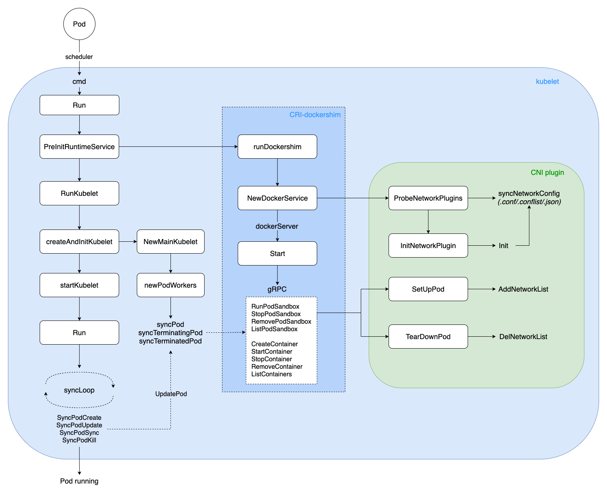
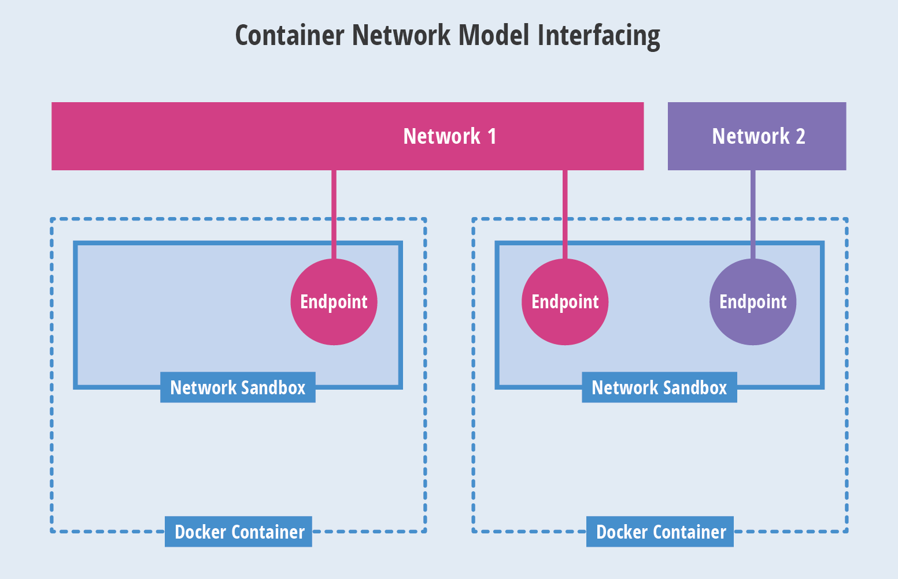
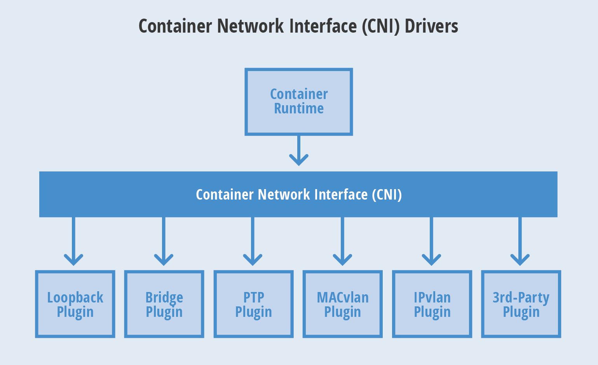
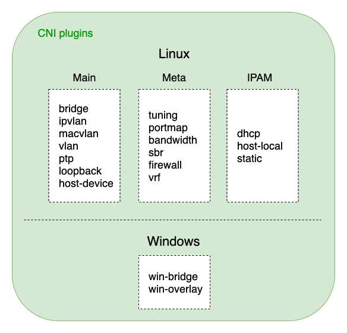
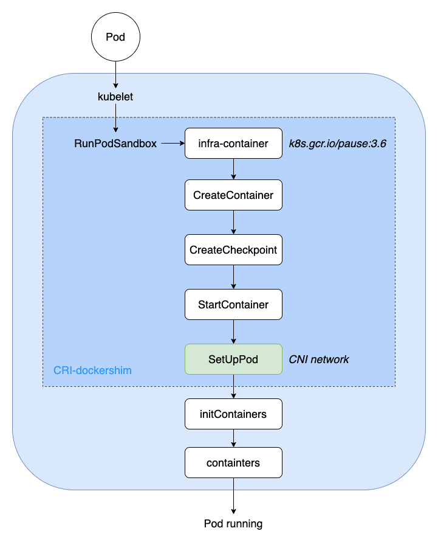
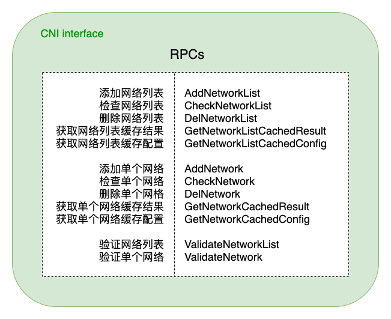

## 1. 概述
进入 K8s 的世界，会发现有很多方便扩展的 Interface，包括 CNI, CSI, CRI 等，将这些接口抽象出来，是为了更好的提供开放、扩展、规范等能力。

K8s 网络模型采用 CNI(Container Network Interface, 容器网络接口) 协议，只要提供一个标准的接口，就能为同样满足该协议的所有容器平台提供网络功能。

CNI 是 CoreOS 提出的一种容器网络规范，目前已被 Apache Mesos、Cloud Foundry、Kubernetes、Kurma、rkt 等众多开源项目所采用，同时也是一个 CNCF(Cloud Native Computing Foundation) 项目。可以预见，CNI 将会成为未来容器网络的标准。

本文将从 kubelet 启动、Pod 创建/删除、Docker 创建/删除 Container、CNI RPC 调用、容器网络配置等核心流程，对 CNI 实现机制进行了解析。

流程概览如下：



> 本文及后续相关文章都基于 K8s v1.22

## 2. 从网络模型说起
容器的网络技术日新月异，经过多年发展，业界逐渐聚焦到 Docker 的 CNM(Container Network Model, 容器网络模型) 和 CoreOS 的 CNI(Container Network Interface, 容器网络接口)。

### 2.1 CNM 模型
CNM 是一个被 Docker 提出的规范。现在已经被 Cisco Contiv, Kuryr, Open Virtual Networking (OVN), Project Calico, VMware 和 Weave 这些公司和项目所采纳。

Libnetwork 是 CNM 的原生实现。它为 Docker daemon 和网络驱动程序之间提供了接口。网络控制器负责将驱动和一个网络进行对接。每个驱动程序负责管理它所拥有的网络以及为该网络提供的各种服务，例如 IPAM 等等。由多个驱动支撑的多个网络可以同时并存。原生驱动包括 none, bridge, overlay 以及 MACvlan。

但是，container runtime 会在不同情况下使用到不同的插件，这带来了复杂性。另外，CNM 需要使用分布式存储系统来保存网络配置信息，例如 etcd。



- Network Sandbox：容器内部的网络栈，包括网络接口、路由表、DNS 等配置的管理。Sandbox 可用 Linux 网络命名空间、FreeBSD Jail 等机制进行实现。一个 Sandbox 可以包含多个 Endpoint。
- Endpoint：用于将容器内的 Sandbox 与外部网络相连的网络接口。可以使用 veth pair、Open vSwitch 的内部 port 等技术进行实现。一个 Endpoint 仅能够加入一个 Network。
- Network：可以直接互连的 Endpoint 的集合。可以通过 Linux bridge、VLAN 等技术进行实现。一个 Network 包含多个 Endpoint。

### 2.2 CNI 模型
CNI 是由 CoreOS 提出的一个容器网络规范。已采纳改规范的包括 Apache Mesos, Cloud Foundry, Kubernetes, Kurma 和 rkt。另外 Contiv Networking, Project Calico 和 Weave 这些项目也为 CNI 提供插件。

CNI 对外暴露了从一个网络里面添加和剔除容器的接口。CNI 使用一个 json 配置文件保存网络配置信息。和 CNM 不一样，CNI 不需要一个额外的分布式存储引擎。

一个容器可以被加入到被不同插件所驱动的多个网络之中。一个网络有自己对应的插件和唯一的名称。CNI 插件需要提供两个命令：ADD 用来将网络接口加入到指定网络，DEL 用来将其移除。这两个接口分别在容器被创建和销毁的时候被调用。



CNI 支持与第三方 IPAM 的集成，可以用于任何容器 runtime。CNM 从设计上就仅仅支持 Docker。由于 CNI 简单的设计，许多人认为编写 CNI 插件会比编写 CNM 插件来得简单。

## 3. CNI 插件
CNI 插件是二进制可执行文件，会被 kubelet 调用。启动 kubelet --network-plugin=cni, --cni-conf-dir 指定 networkconfig 配置，默认路径是：/etc/cni/net.d。另外，--cni-bin-dir 指定 plugin 可执行文件路径，默认路径是：/opt/cni/bin。

看一个 CNI Demo：
在默认网络配置目录，配置两个 xxx.conf：一个 type: "bridge" 网桥，另一个 type: "loopback" 回环网卡。
```sh
$ mkdir -p /etc/cni/net.d
$ cat >/etc/cni/net.d/10-mynet.conf <<EOF
{
	"cniVersion": "0.2.0", // CNI Spec 版本
	"name": "mynet", // 自定义名称
	"type": "bridge", // 插件类型 bridge
	"bridge": "cni0", // 网桥名称
	"isGateway": true, // 是否作为网关
	"ipMasq": true, // 是否设置 IP 伪装
	"ipam": {
		"type": "host-local", // IPAM 类型 host-local
		"subnet": "10.22.0.0/16", // 子网段
		"routes": [
			{ "dst": "0.0.0.0/0" } // 目标路由段
		]
	}
}
EOF
$ cat >/etc/cni/net.d/99-loopback.conf <<EOF
{
	"cniVersion": "0.2.0", // CNI Spec 版本
	"name": "lo", // 自定义名称
	"type": "loopback" // 插件类型 loopback
}
EOF
```

CNI 插件可分为三类：
- Main 插件：用来创建具体网络设备的二进制文件。比如，bridge、ipvlan、loopback、macvlan、ptp(point-to-point, Veth Pair 设备)，以及 vlan。如开源的 Flannel、Weave 等项目，都属于 bridge 类型的 CNI 插件，在具体的实现中，它们往往会调用 bridge 这个二进制文件。

- Meta 插件：由 CNI 社区维护的内置 CNI 插件，不能作为独立的插件使用，需要调用其他插件。tuning，是一个通过 sysctl 调整网络设备参数的二进制文件；portmap，是一个通过 iptables 配置端口映射的二进制文件；bandwidth，是一个使用 Token Bucket Filter (TBF) 来进行限流的二进制文件。
- IPAM 插件：IP Address Management，它是负责分配 IP 地址的二进制文件。比如，dhcp，这个文件会向 DHCP 服务器发起请求；host-local，则会使用预先配置的 IP 地址段来进行分配。



## 4. kubelet 启动
kubelet 在 Node 节点上负责 Pod 的创建、销毁、监控上报等核心流程，通过 Cobra 命令行解析参数启动二进制可执行文件。

启动入口如下：
```go
// kubernetes/cmd/kubelet/kubelet.go
func main() {
	command := app.NewKubeletCommand()

	// kubelet uses a config file and does its own special
	// parsing of flags and that config file. It initializes
	// logging after it is done with that. Therefore it does
	// not use cli.Run like other, simpler commands.
	code := run(command)
	os.Exit(code)
}
```
接着，一路往下进行初始化：
> cmd -> Run -> PreInitRuntimeService -> RunKubelet -> createAndInitKubelet -> startKubelet -> Run

其中 PreInitRuntimeService 会进一步初始化 dockershim，一方面探测环境中的网络配置文件(默认路径为：/etc/cni/net.d/*.conf/.conflist/.json)，进行 CNI 网络配置；另一方面启动 gRPC docker server 监听 client 请求，进行具体的操作如 PodSandbox、Container 创建与删除。

当监听到 Pod 事件时，进行对应 Pod 的创建或删除，流程如下：
> Run -> syncLoop -> SyncPodCreate/Kill -> UpdatePod -> syncPod/syncTerminatingPod -> dockershim gRPC -> Pod running/teminated

## 5. Pod 创建/删除
K8s 中 Pod 的调谐采用 channel 生产者-消费者模型实现，具体通过 PLEG(Pod Lifecycle Event Generator) 进行 Pod 生命周期事件管理。
```
// kubernetes/pkg/kubelet/pleg/pleg.go
// 通过 PLEG 进行 Pod 生命周期事件管理
type PodLifecycleEventGenerator interface {
	Start() // 通过 relist 获取所有 Pods 并计算事件类型
	Watch() chan *PodLifecycleEvent // 监听 eventChannel，传递给下游消费者
	Healthy() (bool, error)
}
```

Pod 事件生产者 - 相关代码：
```
// kubernetes/pkg/kubelet/pleg/generic.go
// 生产者：获取所有 Pods 列表，计算出对应的事件类型，进行 Sync
func (g *GenericPLEG) relist() {
	klog.V(5).InfoS("GenericPLEG: Relisting")
	...
	// 获取当前所有 Pods 列表
	podList, err := g.runtime.GetPods(true)
	if err != nil {
		klog.ErrorS(err, "GenericPLEG: Unable to retrieve pods")
		return
	}
	
	for pid := range g.podRecords {
		allContainers := getContainersFromPods(oldPod, pod)
		for _, container := range allContainers {

			// 计算事件类型：running/exited/unknown/non-existent
			events := computeEvents(oldPod, pod, &container.ID)
			for _, e := range events {
				updateEvents(eventsByPodID, e)
			}
		}
	}

	// 遍历所有事件
	for pid, events := range eventsByPodID {
		for i := range events {
			// Filter out events that are not reliable and no other components use yet.
			if events[i].Type == ContainerChanged {
				continue
			}
			select {
			case g.eventChannel <- events[i]: // 生产者：发送到事件 channel，对应监听的 goroutine 会消费
			default:
				metrics.PLEGDiscardEvents.Inc()
				klog.ErrorS(nil, "Event channel is full, discard this relist() cycle event")
			}
		}
	}
	...
}
```

Pod 事件消费者 - 相关代码：
```
// kubernetes/pkg/kubelet/kubelet.go
// 消费者：根据 channel 获取的各类事件，进行 Pod Sync
func (kl *Kubelet) syncLoopIteration(configCh <-chan kubetypes.PodUpdate, handler SyncHandler,
	syncCh <-chan time.Time, housekeepingCh <-chan time.Time, plegCh <-chan *pleg.PodLifecycleEvent) bool {
	select {
	...
	// 消费者：监听 plegCh 的事件
	case e := <-plegCh:
		if e.Type == pleg.ContainerStarted {
			// 更新容器的最后启动时间
			kl.lastContainerStartedTime.Add(e.ID, time.Now())
		}
		if isSyncPodWorthy(e) {
			if pod, ok := kl.podManager.GetPodByUID(e.ID); ok {
				klog.V(2).InfoS("SyncLoop (PLEG): event for pod", "pod", klog.KObj(pod), "event", e)

				// 进行相关 Pod 事件的 Sync
				handler.HandlePodSyncs([]*v1.Pod{pod})
			} else {
				// If the pod no longer exists, ignore the event.
				klog.V(4).InfoS("SyncLoop (PLEG): pod does not exist, ignore irrelevant event", "event", e)
			}
		}

		// 容器销毁事件处理：清除 Pod 内相关 Container
		if e.Type == pleg.ContainerDied {
			if containerID, ok := e.Data.(string); ok {
				kl.cleanUpContainersInPod(e.ID, containerID)
			}
		}
		...
	}
	return true
}
```

## 6. Docker 忙起来
经过上一步 Pod 事件的生产与消费传递，PodWorkers 会将事件转化为 gRPC client 请求，然后调用 dockershim gRPC server，进行 PodSandbox、infra-container(也叫 pause 容器) 的创建。

接着，会调用 CNI 接口 SetUpPod 进行相关网络配置与启动，此时建立起来的容器网络，就可以直接用于之后创建的业务容器如 initContainers、containers 进行共享网络。

相关代码如下：
```
// kubernetes/pkg/kubelet/dockershim/docker_sandbox.go
// 启动运行 Pod Sandbox
func (ds *dockerService) RunPodSandbox(ctx context.Context, r *runtimeapi.RunPodSandboxRequest) (*runtimeapi.RunPodSandboxResponse, error) {
	config := r.GetConfig()

	// Step 1: 拉取基础镜像(infra-container: k8s.gcr.io/pause:3.6)
	image := defaultSandboxImage
	if err := ensureSandboxImageExists(ds.client, image); err != nil {
		return nil, err
	}

	// Step 2: 创建 Sandbox 容器
	createConfig, err := ds.makeSandboxDockerConfig(config, image)
	if err != nil {
		return nil, fmt.Errorf("failed to make sandbox docker config for pod %q: %v", config.Metadata.Name, err)
	}
	createResp, err := ds.client.CreateContainer(*createConfig)
	if err != nil {
		createResp, err = recoverFromCreationConflictIfNeeded(ds.client, *createConfig, err)
	}

	// Step 3: 创建 Sandbox 检查点(用于记录当前执行到哪一步了)
	if err = ds.checkpointManager.CreateCheckpoint(createResp.ID, constructPodSandboxCheckpoint(config)); err != nil {
		return nil, err
	}

	// Step 4: 启动 Sandbox 容器
	err = ds.client.StartContainer(createResp.ID)
	if err != nil {
		return nil, fmt.Errorf("failed to start sandbox container for pod %q: %v", config.Metadata.Name, err)
	}

	// Step 5: 对 Sandbox 容器进行网络配置
	err = ds.network.SetUpPod(config.GetMetadata().Namespace, config.GetMetadata().Name, cID, config.Annotations, networkOptions)
	if err != nil {
		// 如果网络配置失败，则回滚：删除建立起来的 Pod 网络
		err = ds.network.TearDownPod(config.GetMetadata().Namespace, config.GetMetadata().Name, cID)
		if err != nil {
			errList = append(errList, fmt.Errorf("failed to clean up sandbox container %q network for pod %q: %v", createResp.ID, config.Metadata.Name, err))
		}
		
		// 停止容器运行
		err = ds.client.StopContainer(createResp.ID, defaultSandboxGracePeriod)
		...
	}

	return resp, nil
}
```

流程图小结如下：



> 根据社区讨论 [Dockershim Deprecation FAQ](https://kubernetes.io/blog/2020/12/02/dockershim-faq)，dockershim 相关代码将会在 2021 底左右移出 K8s 主干代码，之后将统一使用 CRI(Container Runtime Interface, 容器运行时接口) 进行容器生命周期管理。

## 7. CNI RPC 接口
CNI 标准规范接口，包含了添加、检查、验证、删除网络等接口，并提供了按列表或单个进行网络配置的两组接口，方便用户灵活使用。

CNI 从容器管理系统(dockershim) 处获取运行时信息(Container Runtime)，包括 network namespace 的路径，容器 ID 以及 network interface name，再从容器网络的配置文件中加载网络配置信息，再将这些信息传递给对应的插件，由插件进行具体的网络配置工作，并将配置的结果再返回到容器管理系统中。



用户若要编写自己的 CNI 插件，则可专注于实现图中这些 RPC 接口即可，然后可以与官方维护的三类基础插件自由组合，形成多种多样的容器网络解决方案。

## 8. 小结
本文通过分析 K8s 中 kubelet 启动、Pod 创建/删除、Docker 创建/删除 Container、CNI RPC 调用、容器网络配置等核心流程，对 CNI 实现机制进行了解析，通过源码、图文方式说明了相关流程逻辑，以期更好的理解 K8s CNI 运行流程。

K8s 网络模型采用 CNI(Container Network Interface, 容器网络接口) 协议，只要提供一个标准的接口，就能为同样满足该协议的所有容器平台提供网络功能。CNI 目前已被众多开源项目所采用，同时也是一个 CNCF(Cloud Native Computing Foundation) 项目。可以预见，CNI 将会成为未来容器网络的标准。


*PS: 更多内容请关注 [k8s-club](https://github.com/k8s-club/k8s-club)*


### 参考资料
1. [CNI 规范](https://github.com/containernetworking/cni/blob/master/SPEC.md)
2. [Kubernetes 源码](https://github.com/kubernetes/kubernetes)
3. [CNI 插件介绍](https://www.cni.dev/plugins/current/)
4. [CNI 插件源码](https://github.com/containernetworking/plugins)
5. [CNI and CNM model](https://thenewstack.io/container-networking-landscape-cni-coreos-cnm-docker/)
