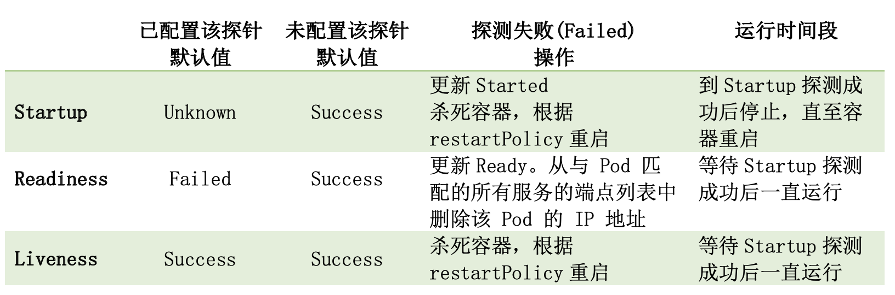

# K8s kubelet - probeManager 探针
本文介绍k8s内部的探针策略。文章组织结构如下：
* [探针的作用与意义](#探针的作用与意义) 
* [探针一些重要的点](#探针一些重要的点)
* [如何配置与使用探针](#如何配置与使用探针)
* [三类探针说明](#三类探针说明)
* [源码剖析](#源码剖析)

基于kubernetes V1.22 ，写于 2021/11/16 成都～

## 探针的作用与意义
探针，顾名思义就能够探测一个对象的运行情况，简单来说这里的情况分为三种：成功、失败、未知。
* 成功（success）：表示对象按照用户预期在运行
* 失败（failed）：表示对象没有达到/按照用户预期运行
* 未知（unknown）：探针在探测过程中失败，未探测到结果
* *warning：探针按照预期执行（成功），但是存在一些警告，这是成功的一种方式*

上述中的【对象】：在本文的讲述中就是一个容器(container)，【用户预期】：定制的探测方式、内容和预期。

### 为什么需要探针？
* 避免慢启动容器被错杀 
* 捕捉服务死锁
* 可用性检测
* 存活性检测
* ...

> 一个实际的例子：\
我们期望运行一个数据库 mysql 的 Deployments(replicas=1)，并在 mysql 可提供服务的第一时间检测到，从而方便我们后续使用。
此时，简单的想法是直接检测对应 container 是否为 running，从而得到对应服务是否可用的结果。 \
在对服务的准确性和可靠性要求没有那么高的场景下，这或许是可行的。
但是严格来说，container 处于 running 状态，并不一定表明 mysql 服务是可用的。因为容器环境准备好之后，到 mysql 服务起来，再到真正能够提供服务之间还有一定的时间间隔。
并且我们不能保证在这个时间，服务能够顺利平稳的起来。比如：最简单的数据库用户名或密码出错、权限不够等等，导致服务启动失败。
因此我们需要借助探针来感知 mysql 服务是否真正起来了，并且在 mysql 提供服务的过程中，去定期探测服务是否可用，从而保证服务的高可用。

## 探针一些重要的点
k8s内部的探针probe：
* 支持三类探针：startupProbe、readinessProbe、livenessProbe
* 支持三种探测方式：Http、Tcp、Exec
* 探针的配置在 `pod.Spec.Containers` 中，具体探测的目标为pod内众多的 `container`。通过container的健康状况反应pod的健康状况。
* 探针通过三元组 <pod、container、type> 来区别探针。也就是说对于一个pod内的一个container，同类型的探针有且仅有一个
* k8s中具体执行/管理探针的 manager 位于 kubelet（probeManager）。kubelet在每一个node上都有一个
* 探针对集群来说是可选配置，可以不配置探针
* 在配置了Startup探针之后，只有startup探针Success之后，其余类型的探针才会开始工作
* 在容器Started之后，Readiness、Liveness探针会一直工作，但是Startup会停止直至重启。
* Liveness探针为Success并不一定表示服务可用，但是Failed一定表示服务不可用
* Readiness探针为failed并不一定表示服务不可用，但是Success一定表示服务可用
* Startup探针会去更新`ContainerStatus`中的`Started`字段，若没有配置Starup探针，那么`Started`字段默认为true。Started探针默认探测结果为Unknown，如果探测到Failed，会杀死容器，根据restartPolicy来重启容器。
* Readiness探针会去更新`ContainerStatus`中的`Ready`字段，没有配置Readiness探针默认`Ready`字段为true。Readiness探针默认探测结果为Failed。
* Liveness探针默认探测结果为Success，一旦检测到Failed，会杀死容器，并根据restartPolicy来重启容器。

## 如何配置与使用探针
细节参见官网 [Configure Liveness, Readiness and Startup Probes](https://kubernetes.io/docs/tasks/configure-pod-container/configure-liveness-readiness-startup-probes/
)

一些配置参数的解释：
* `PeriodSeconds`: 多久进行一次探测，默认为10s，最小为1s，单位为秒(s)
* `InitialDelaySeconds`: 在contaienr创建好之后进行初次探测需要延迟的时间
* `TimeoutSeconds`: timeout的时间，默认为1s，最小为1s，单位为秒(s)
* `SuccessThreshold`: 最小的连续成功阈值，只有连续成功阈值次之后，探测结果才为成功，默认为1，最小为1。对于liveness和startup只能设置为1
* `FailureThreshold`: 最小的连续失败阈值，只有连续失败阈值次之后，探测结果才为失败，默认为3次，最小为1。
* `TerminationGracePeriodSeconds`: 在探测失败之后，留多少时间给pod来gracefully shutdown，单位为秒(s)，最小为0，表示立即shutdown，一点都不优雅-_-。说明：pod的`spec.terminationGracePeriodSeconds`也是这个意义，但是探针的这个属性比pod的优先级要**高**，也就是说只有探针没有配置该值时，才会使用pod设置的值。说明：这个参数在之前的版本中没有喔～

## 三类探针说明


k8s支持startupProbe、readinessProbe、livenessProbe三类探针，这三类探针的配置内容基本完全一致。那为什么需要三类探针呢（弄成一个不行吗）？

结论： 不行，为了应用不同的场景和需求，以后后续的处理逻辑。是需要三类探针的。

首先三类探针的初始默认值，就可以看出细微的区别：
- startupProbe： Unknown
- readinessProbe：Failed
- livenessProbe: Success

下面结合场景与k8s doc介绍，分别说明三类探针的使用：
* ReadinessProbe \
有时候，应用程序会暂时性的不能提供通信服务。 例如，应用程序在启动时可能需要加载很大的数据或配置文件，或是启动后要依赖等待外部服务。 在这种情况下，既不想杀死应用程序，也不想给它发送请求。 Kubernetes 提供了就绪探测器来发现并缓解这些情况。 容器所在 Pod 上报还未就绪的信息，并且不接受通过 Kubernetes Service 的流量。*( k8s doc )*
> Readiness，可用性检测探针，默认为Failed，说明初始时默认服务不可用。\
场景：期望在1个LB（LoadBalance）下挂3个无状态服务节点，但是，我们希望只有在节点可以提供服务之后才开始接收请求处理。避免出现LB将请求打到未准备好的服务之上，从而出现500服务不可用的报错。此时我们可以配置Readiness探针，只有在readiness探测到成功之后，才将服务挂到LB之上。同时一旦已经挂载的服务出现Readiness探测失败时，也能够将高服务踢出LB(比如某一时间读取外部的大容量数据，从而导致节点没空处理别的请求)，从而保证整个服务一直都是稳定高可用的。\
说明：Readiness在容器启动之后，会全流程运行，同时探测失败之后，不会对容器做出重启的操作。
* LivenessProbe \
许多长时间运行的应用程序最终会过渡到断开的状态，除非重新启动，否则无法恢复。 Kubernetes 提供了存活探测器来发现并补救这种情况。*( k8s doc )*
> LivenessProbe，存活性检测探针，默认为Success，说明默认服务存活。\
场景：应用程序死锁。某个一直在提供服务的节点，因为某次请求进入了死锁，此时如果配置了Readiness探针会将该服务踢出LB，但是该服务永远不会回来了，此时就需要配置Liveness探针，将该容器杀死并重启，并根据restartPolicy来重启。
* StartupProbe \
有时候，会有一些现有的应用程序在启动时需要较多的初始化时间。 要不影响对引起探测死锁的快速响应，这种情况下，设置存活探测参数是要技巧的。 技巧就是使用一个命令来设置启动探测，针对HTTP 或者 TCP 检测，可以通过设置 failureThreshold * periodSeconds 参数来保证有足够长的时间应对糟糕情况下的启动时间.*( k8s doc )*
> Startup，从名称上就能感知是容器启动的时候使用的。默认为Unknown，表明初始不知道服务有没有起来。\
场景：慢启动容器。某应用程序启动时间比较长，在5min内起来都是正常情况，但是超过5分钟就认为该服务失败了。此时，如果只配置了Readiness和Liveness探针，就有可能导致服务正在启动中，但是被Liveness判定为Faialed，从而错杀，导致反复重启。这种情况下可以使用startup探针，设置`periodSecond`为5，`failureThreshold`为60,那么该服务最多有5*60=300s，也即时5min的时间来执行启动过程。\
说明：Startup探针在容器启动完成（containerStatus.Started）之后就会停止探测行为，直到出现重启（restart）情况。如果探测失败，会杀死容器，并根据restartPolicy来重启。

## 源码剖析
探针的执行由`kubelet`来管理。在k8s中，kubelet位于每一个节点之上，它们与apiServer、scheduler进行交互从而管理当前节点上的pod。所以理所当然，会由kubelet来负责当前节点上的pod的探活。

kubelet的定义如下：（只展示了与探针相关的主要内容）
```go
// kubernetes/pkg/kubelet/kubelet.go
// Kubelet is the main kubelet implementation.
type Kubelet struct {
	...
	// podManager is a facade that abstracts away the various sources of pods
	// this Kubelet services.
	podManager kubepod.Manager

	// Handles container probing.
	probeManager prober.Manager
	// Manages container health check results.
	livenessManager  proberesults.Manager
	readinessManager proberesults.Manager
	startupManager   proberesults.Manager

	// Syncs pods statuses with apiserver; also used as a cache of statuses.
	statusManager status.Manager
	...
}
```

`podManager`负责缓存和管理来自file、http、apiServer的pod信息，提供了丰富的查询接口，并维护static pods和mirror pods之间的映射。
对于mirror pod的由来，可见如下解释：
>Pods from non-apiserver sources are called static pods, and API server is not aware of the existence of static pods. In order to monitor
the status of such pods, the kubelet creates a mirror pod for each static pod via the API server. \
A mirror pod has the same pod full name (name and namespace) as its static
counterpart (albeit different metadata such as UID, etc). By leveraging the
fact that the kubelet reports the pod status using the pod full name, the
status of the mirror pod always reflects the actual status of the static
pod. When a static pod gets deleted, the associated orphaned mirror pod
will also be removed.

`livenessManager、readinessManager、startupManager`为三类探针的探测结果cache，其定义和提供的方法如下：
```go
// kubernetes/pkg/kubelet/prober/results/results_manager.go
type manager struct {
	// guards the cache
	sync.RWMutex
	// map of container ID -> probe Result
	cache map[kubecontainer.ContainerID]Result
	// channel of updates
	updates chan Update
}

type Manager interface {
	Get(kubecontainer.ContainerID) (Result, bool)
	Set(kubecontainer.ContainerID, Result, *v1.Pod)
	Remove(kubecontainer.ContainerID)
	Updates() <-chan Update
}
```

接下来，详细介绍本文的重点**probeManger**。

## probeManger
`probeManager`负责管理探针工作。它通过`AddPod`方法为每一个配置了探针的container创建对应的探针worker，
worker会按照用户预期定期执行探测，并缓存探测结果到对应的result manager。

`RemovePod`将与该pod关联的所有worker全都stop并移出workers，同时从对应的result manager中删除缓存的结果。
`CleanupPods`会清除多余的workers，这些worker所探测的pod已经不在当前节点之上，可能是被主动删除、漂移等情况（也就是这些pod不在desiredPods中）。
`UpdatePodStatus`由kubelet在syncPod中调用，用来根据缓存的探测结果来更新container的Started、Ready字段。

probeManager内部使用`statusManager`，只是用来获取pod、container的status信息。但是`statusManager`拥有更多的能力，
能够将当前kubelet上最新的pod、container状态同步到apiServer上。`prober`用来真正执行一次探针探测，它目前提供exec、http、tcp
三种方式的探测，未来会支持gRPC方式。

```go
// kubernetes/pkg/kubelet/prober/prober_manager.go
type manager struct {
	// Map of active workers for probes
	workers map[probeKey]*worker
	// Lock for accessing & mutating workers
	workerLock sync.RWMutex

	// The statusManager cache provides pod IP and container IDs for probing.
	statusManager status.Manager

	readinessManager results.Manager
	livenessManager results.Manager
	startupManager results.Manager

	// prober executes the probe actions.
	prober *prober

	start time.Time
}

type Manager interface {
	// AddPod creates new probe workers for every container probe. This should be called for every
	// pod created.
	AddPod(pod *v1.Pod)

	// RemovePod handles cleaning up the removed pod state, including terminating probe workers and
	// deleting cached results.
	RemovePod(pod *v1.Pod)

	// CleanupPods handles cleaning up pods which should no longer be running.
	// It takes a map of "desired pods" which should not be cleaned up.
	CleanupPods(desiredPods map[types.UID]sets.Empty)

	// UpdatePodStatus modifies the given PodStatus with the appropriate Ready state for each
	// container based on container running status, cached probe results and worker states.
	UpdatePodStatus(types.UID, *v1.PodStatus)
}
```

其中`AddPod`和`RemovePod`最为重要，如下所示：
```go
// kubernetes/pkg/kubelet/prober/prober_manager.go 
func (m *manager) AddPod(pod *v1.Pod) {
	m.workerLock.Lock()
	defer m.workerLock.Unlock()

	key := probeKey{podUID: pod.UID}
	// 遍历所有的container
	for _, c := range pod.Spec.Containers {
		key.containerName = c.Name
		// run Startup类型的worker
		if c.StartupProbe != nil {
			key.probeType = startup
			if _, ok := m.workers[key]; ok {
				return
			}
			w := newWorker(m, startup, pod, c)
			m.workers[key] = w
			go w.run()
		}
		// run Readiness类型的worker
		if c.ReadinessProbe != nil {
			key.probeType = readiness
			if _, ok := m.workers[key]; ok {
				return
			}
			w := newWorker(m, readiness, pod, c)
			m.workers[key] = w
			go w.run()
		}
		// run Liveness类型的worker
		if c.LivenessProbe != nil {
			key.probeType = liveness
			if _, ok := m.workers[key]; ok {
				return
			}
			w := newWorker(m, liveness, pod, c)
			m.workers[key] = w
			go w.run()
		}
	}
}

func (m *manager) RemovePod(pod *v1.Pod) {
	m.workerLock.RLock()
	defer m.workerLock.RUnlock()
	// stop该podUID对应的所有worker
	key := probeKey{podUID: pod.UID}
	for _, c := range pod.Spec.Containers {
		key.containerName = c.Name
		for _, probeType := range [...]probeType{readiness, liveness, startup} {
			key.probeType = probeType
			if worker, ok := m.workers[key]; ok {
				worker.stop()
			}
		}
	}
}
```

下面我们进一步发掘`workers`和`probe`。

## workers
worker维护在`workers map[probeKey]*worker`中，通过`probeKey`来区别，probeKey指明了podUID、containerName、probeType三元组，
也就是说同一个pod的同一个container下同类型(startup、readiness、liveness)的探针有且仅有一个。`probeKey`的定义如下
```go
// kubernetes/pkg/kubelet/prober/prober_manager.go
// Key uniquely identifying container probes
type probeKey struct {
	podUID        types.UID
	containerName string
	probeType     probeType
}
```

在probeManager的AddPod方法中，会run对应的worker，具体的run方法如下：
```go
// kubernetes/pkg/kubelet/prober/worker.go
func (w *worker) run() {
	probeTickerPeriod := time.Duration(w.spec.PeriodSeconds) * time.Second
	
	// 随机等待一段时间，为了应对kubelet重启
	if probeTickerPeriod > time.Since(w.probeManager.start) {
		time.Sleep(time.Duration(rand.Float64() * float64(probeTickerPeriod)))
	}

	probeTicker := time.NewTicker(probeTickerPeriod)
	// worker stop之后的清理工作，包括：1）停止ticker，2）清理缓存结果，3）从worker删除自身
	defer func() {
		probeTicker.Stop()
		if !w.containerID.IsEmpty() {
			w.resultsManager.Remove(w.containerID)
		}

		w.probeManager.removeWorker(w.pod.UID, w.container.Name, w.probeType)
		...
	}()

// 定期执行doProbe，来进行探针探测
probeLoop:
	for w.doProbe() {
		// Wait for next probe tick.
		select {
		// 退出探针
		case <-w.stopCh:
			break probeLoop
		// 定期探测
		case <-probeTicker.C:
		// 手动触发
		case <-w.manualTriggerCh:
		}
	}
}
```
`doProbe`方法是整个探针工作中最最重要的地方，它会完成一次完整的探测，并缓存探测结果。具体内容如下所示：
```go
// kubernetes/pkg/kubelet/prober/worker.go
func (w *worker) doProbe() (keepGoing bool) {
	defer func() { recover() }() // Actually eat panics (HandleCrash takes care of logging)
	defer runtime.HandleCrash(func(_ interface{}) { keepGoing = true })
	// 获得pod的status信息
	status, ok := w.probeManager.statusManager.GetPodStatus(w.pod.UID)
	if !ok {
		// Either the pod has not been created yet, or it was already deleted.
		return true
	}

	// Worker应该终止，如果pod已经终止了
	if status.Phase == v1.PodFailed || status.Phase == v1.PodSucceeded {
		return false
	}
	// 获取containers的信息
	c, ok := podutil.GetContainerStatus(status.ContainerStatuses, w.container.Name)
	if !ok || len(c.ContainerID) == 0 {
		// Either the container has not been created yet, or it was deleted.
		return true // Wait for more information.
	}
	// 当worker首次运行（containerID为空）或container被重建
	if w.containerID.String() != c.ContainerID {
		if !w.containerID.IsEmpty() {
			w.resultsManager.Remove(w.containerID)
		}
		w.containerID = kubecontainer.ParseContainerID(c.ContainerID)
		w.resultsManager.Set(w.containerID, w.initialValue, w.pod)
		// 拿到了新的container，恢复probing.
		w.onHold = false
	}

	if w.onHold {
		// Worker is on hold until there is a new container.
		return true
	}
	// container没有处于running状态
	if c.State.Running == nil {
		if !w.containerID.IsEmpty() {
			w.resultsManager.Set(w.containerID, results.Failure, w.pod)
		}
		// Abort if the container will not be restarted.
		return c.State.Terminated == nil ||
			w.pod.Spec.RestartPolicy != v1.RestartPolicyNever
	}
	// Graceful shutdown of the pod.
	if w.pod.ObjectMeta.DeletionTimestamp != nil && (w.probeType == liveness || w.probeType == startup) {
		// Set a last result to ensure quiet shutdown.
		w.resultsManager.Set(w.containerID, results.Success, w.pod)
		// Stop probing at this point.
		return false
	}
	// Probe disabled for InitialDelaySeconds.
	if int32(time.Since(c.State.Running.StartedAt.Time).Seconds()) < w.spec.InitialDelaySeconds {
		return true
	}
	if c.Started != nil && *c.Started {
		// Stop probing for startup once container has started.
		// we keep it running to make sure it will work for restarted container.
		if w.probeType == startup {
			return true
		}
	} else {
		// Disable other probes until container has started.
		if w.probeType != startup {
			return true
		}
	}

	// 执行一次真正的探针探测，并得到返回结果
	result, err := w.probeManager.prober.probe(w.probeType, w.pod, status, w.container, w.containerID)
	if err != nil {
		// Prober error, throw away the result.
		return true
	}

	switch result {
	case results.Success:
		ProberResults.With(w.proberResultsSuccessfulMetricLabels).Inc()
	case results.Failure:
		ProberResults.With(w.proberResultsFailedMetricLabels).Inc()
	default:
		ProberResults.With(w.proberResultsUnknownMetricLabels).Inc()
	}
	// 记录失败/成功的次数
	if w.lastResult == result {
		w.resultRun++
	} else {
		w.lastResult = result
		w.resultRun = 1
	}
	// 如果失败/成功的次数小于设置的阈值就继续运行探针，直到达到阈值
	if (result == results.Failure && w.resultRun < int(w.spec.FailureThreshold)) ||
		(result == results.Success && w.resultRun < int(w.spec.SuccessThreshold)) {
		// Success or failure is below threshold - leave the probe state unchanged.
		return true
	}
	// 缓存探测结果，并选择发送update信号
	w.resultsManager.Set(w.containerID, result, w.pod)

	if (w.probeType == liveness || w.probeType == startup) && result == results.Failure {
		// The container fails a liveness/startup check, it will need to be restarted.
		// Stop probing until we see a new container ID. 
		w.onHold = true
		w.resultRun = 0
	}

	return true
}
```
resultManager的`Set`方法，首先通过setInternal更新cache的值，如果是第一次探测的结果，或者探测结果发生了变化就朝update通道发生更新信息。
这个update通道会由kubelet的主sync逻辑来监听。
```go
// kubernetes/pkg/kubelet/prober/results/results_manager.go
func (m *manager) Set(id kubecontainer.ContainerID, result Result, pod *v1.Pod) {
	if m.setInternal(id, result) {
		m.updates <- Update{id, result, pod.UID}
	}
}

// Internal helper for locked portion of set. Returns whether an update should be sent.
func (m *manager) setInternal(id kubecontainer.ContainerID, result Result) bool {
	m.Lock()
	defer m.Unlock()
	prev, exists := m.cache[id]
	if !exists || prev != result {
		m.cache[id] = result
		return true
	}
	return false
}
```

## prober
`prober`负责具体执行一次探针，这里`probe`方法在worker的`doProbe`中调用，根据传入的pod、cntainer、probeType，返回对应执行的result。
内部调用`runProbeWithRetries`来执行逻辑，该方法最多重试3次，并放回最后一次执行的结果。
```go
// kubernetes/pkg/kubelet/prober/prober.go
// probe probes the container.
func (pb *prober) probe(probeType probeType, pod *v1.Pod, status v1.PodStatus, container v1.Container, containerID kubecontainer.ContainerID) (results.Result, error) {
	...
	// const maxProbeRetries = 3， 默认重试次数为3
	result, output, err := pb.runProbeWithRetries(probeType, probeSpec, pod, status, container, containerID, maxProbeRetries)
	...
}

// runProbeWithRetries tries to probe the container in a finite loop, it returns the last result
// if it never succeeds.
func (pb *prober) runProbeWithRetries(probeType probeType, p *v1.Probe, pod *v1.Pod, status v1.PodStatus, container v1.Container, containerID kubecontainer.ContainerID, retries int) (probe.Result, string, error) {
	var err error
	var result probe.Result
	var output string
	for i := 0; i < retries; i++ {
		result, output, err = pb.runProbe(probeType, p, pod, status, container, containerID)
		if err == nil {
			return result, output, nil
		}
	}
	return result, output, err
}
```
`runProbe`方法是最终确切按照exec、http、tcp执行探针的地方，如下所示，接下来我们具体对每一种类型进行说明。
```go
// kubernetes/pkg/kubelet/prober/prober.go
func (pb *prober) runProbe(probeType probeType, p *v1.Probe, pod *v1.Pod, status v1.PodStatus, container v1.Container, containerID kubecontainer.ContainerID) (probe.Result, string, error) {
	timeout := time.Duration(p.TimeoutSeconds) * time.Second
	if p.Exec != nil {
		...
	}
	if p.HTTPGet != nil {
		...
	}
	if p.TCPSocket != nil {
		...
	}
	return probe.Unknown, "", fmt.Errorf("missing probe handler for %s:%s", format.Pod(pod), container.Name)
}
```
**exec方式** \
exec方式最终调用runtimeService的`ExecSync`方法，来执行命令，并返回处理结果。如果命令退出的状态码不为0，就会被封装为error返回，
所以在`exec.Probe`中，通过error类型来决定探针执行的result。
```go
// kubernetes/pkg/kubelet/prober/prober.go
if p.Exec != nil {
	command := kubecontainer.ExpandContainerCommandOnlyStatic(p.Exec.Command, container.Env)
	return pb.exec.Probe(pb.newExecInContainer(container, containerID, command, timeout))
}

func (pb *prober) newExecInContainer(container v1.Container, containerID kubecontainer.ContainerID, cmd []string, timeout time.Duration) exec.Cmd {
	return &execInContainer{run: func() ([]byte, error) {
		return pb.runner.RunInContainer(containerID, cmd, timeout)
	}}
}

// RunInContainer synchronously executes the command in the container, and returns the output.
func (m *kubeGenericRuntimeManager) RunInContainer(id kubecontainer.ContainerID, cmd []string, timeout time.Duration) ([]byte, error) {
	stdout, stderr, err := m.runtimeService.ExecSync(id.ID, cmd, timeout)
	return append(stdout, stderr...), err
}
```

**http方式** \
http就常规访问某一个端口，查看返回的状态码是否 400 > code >= 200，
如果是，result就是Success。反之就是Failed。
```go
// kubernetes/pkg/kubelet/prober/prober.go
if p.HTTPGet != nil {
	scheme := strings.ToLower(string(p.HTTPGet.Scheme))
	host := p.HTTPGet.Host
	if host == "" {
		host = status.PodIP
	}
	port, err := extractPort(p.HTTPGet.Port, container)
	if err != nil {
		return probe.Unknown, "", err
	}
	path := p.HTTPGet.Path
	url := formatURL(scheme, host, port, path)
	headers := buildHeader(p.HTTPGet.HTTPHeaders)
	switch probeType {
	case liveness:
		return pb.livenessHTTP.Probe(url, headers, timeout)
	case startup:
		return pb.startupHTTP.Probe(url, headers, timeout)
	default:
		return pb.readinessHTTP.Probe(url, headers, timeout)
	}
}

// Probe returns a ProbeRunner capable of running a HTTP check.
func (pr httpProber) Probe(url *url.URL, headers http.Header, timeout time.Duration) (probe.Result, string, error) {
	pr.transport.DisableCompression = true // removes Accept-Encoding header
	client := &http.Client{
		Timeout:       timeout,
		Transport:     pr.transport,
		CheckRedirect: redirectChecker(pr.followNonLocalRedirects),
	}
	return DoHTTPProbe(url, headers, client)
}
```

**tcp方式**
tcp查看对应的端口能否连接上，如果可以，result返回Success。反之Failed。
```go
// kubernetes/pkg/kubelet/prober/prober.go
if p.TCPSocket != nil {
	port, err := extractPort(p.TCPSocket.Port, container)
	if err != nil {
		return probe.Unknown, "", err
	}
	host := p.TCPSocket.Host
	if host == "" {
		host = status.PodIP
	}
	return pb.tcp.Probe(host, port, timeout)
}

// Probe returns a ProbeRunner capable of running a TCP check.
func (pr tcpProber) Probe(host string, port int, timeout time.Duration) (probe.Result, string, error) {
	return DoTCPProbe(net.JoinHostPort(host, strconv.Itoa(port)), timeout)
}

func DoTCPProbe(addr string, timeout time.Duration) (probe.Result, string, error) {
	conn, err := net.DialTimeout("tcp", addr, timeout)
	if err != nil {
		// Convert errors to failures to handle timeouts.
		return probe.Failure, err.Error(), nil
	}
	err = conn.Close()
	if err != nil {
		klog.Errorf("Unexpected error closing TCP probe socket: %v (%#v)", err, err)
	}
	return probe.Success, "", nil
}
```

# statusManager
下面我们简单介绍`statusManager`，它负责将kubelet最新的pod、container状态更新到apiServer之上。其提供的所有方法都是线程安全的。
```go
// kubernetes/pkg/kubelet/status/status_manager.go
type Manager interface {
	PodStatusProvider
	// Start the API server status sync loop.
	Start()
	// SetPodStatus caches updates the cached status for the given pod, and triggers a status update.
	SetPodStatus(pod *v1.Pod, status v1.PodStatus)
	// SetContainerReadiness updates the cached container status with the given readiness, and
	// triggers a status update.
	SetContainerReadiness(podUID types.UID, containerID kubecontainer.ContainerID, ready bool)
	// SetContainerStartup updates the cached container status with the given startup, and
	// triggers a status update.
	SetContainerStartup(podUID types.UID, containerID kubecontainer.ContainerID, started bool)
	// TerminatePod resets the container status for the provided pod to terminated and triggers
	// a status update.
	TerminatePod(pod *v1.Pod)
	// RemoveOrphanedStatuses scans the status cache and removes any entries for pods not included in
	// the provided podUIDs.
	RemoveOrphanedStatuses(podUIDs map[types.UID]bool)
}
```

前部分，我们说worker通过`resultsManager.Set`更新缓存的探测结果，并在结果发送改变的时候向update信道发送消息，
这时kubelet的`syncLoopIteration`中，会去取update信道中的消息。如果是`liveness消息`，并且探测到失败，就需要
通过`handleProbeSync`来重启container。如果是`readiness消息`，就触发statusManager的`SetContainerReadiness`
和`handleProbeSync`。如果是`startup消息`,就触发statusManager的`SetContainerStartup`
和`handleProbeSync`。
kubelet 处理结果
```go
// kubernetes/pkg/kubelet/kubelet.go
func (kl *Kubelet) syncLoopIteration(...) bool {
	...
	case update := <-kl.livenessManager.Updates():
		if update.Result == proberesults.Failure {
			handleProbeSync(kl, update, handler, "liveness", "unhealthy")
		}
	case update := <-kl.readinessManager.Updates():
		ready := update.Result == proberesults.Success
		kl.statusManager.SetContainerReadiness(update.PodUID, update.ContainerID, ready)

		status := ""
		if ready {
			status = "ready"
		}
		handleProbeSync(kl, update, handler, "readiness", status)
	case update := <-kl.startupManager.Updates():
		started := update.Result == proberesults.Success
		kl.statusManager.SetContainerStartup(update.PodUID, update.ContainerID, started)

		status := "unhealthy"
		if started {
			status = "started"
		}
		handleProbeSync(kl, update, handler, "startup", status)
	...
}
```


## 一些资料
- 为什么需要添加Startup探针的讨论，见[https://github.com/kubernetes/kubernetes/issues/27114](https://github.com/kubernetes/kubernetes/issues/27114)
- 探针类型未来支持[gRPC](https://kubernetes.io/docs/tasks/configure-pod-container/configure-liveness-readiness-startup-probes/#define-a-grpc-liveness-probe)配置