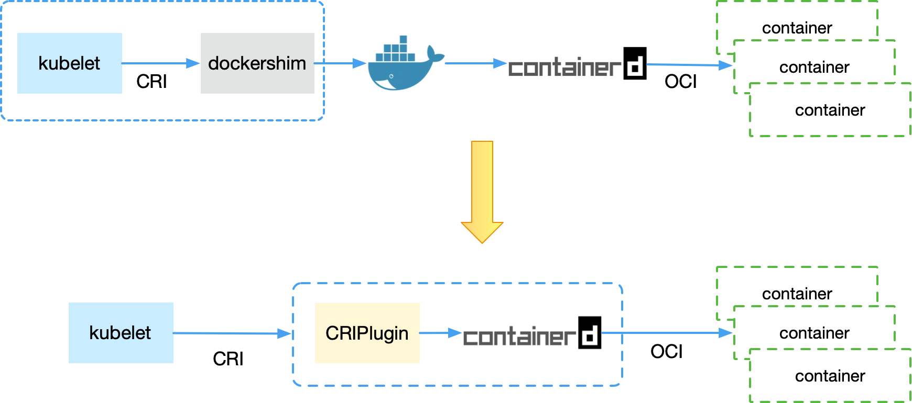
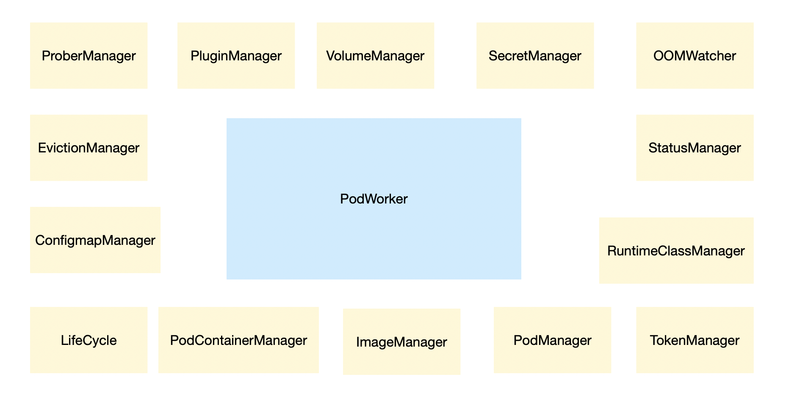
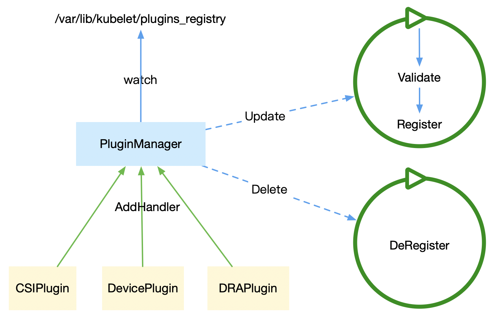
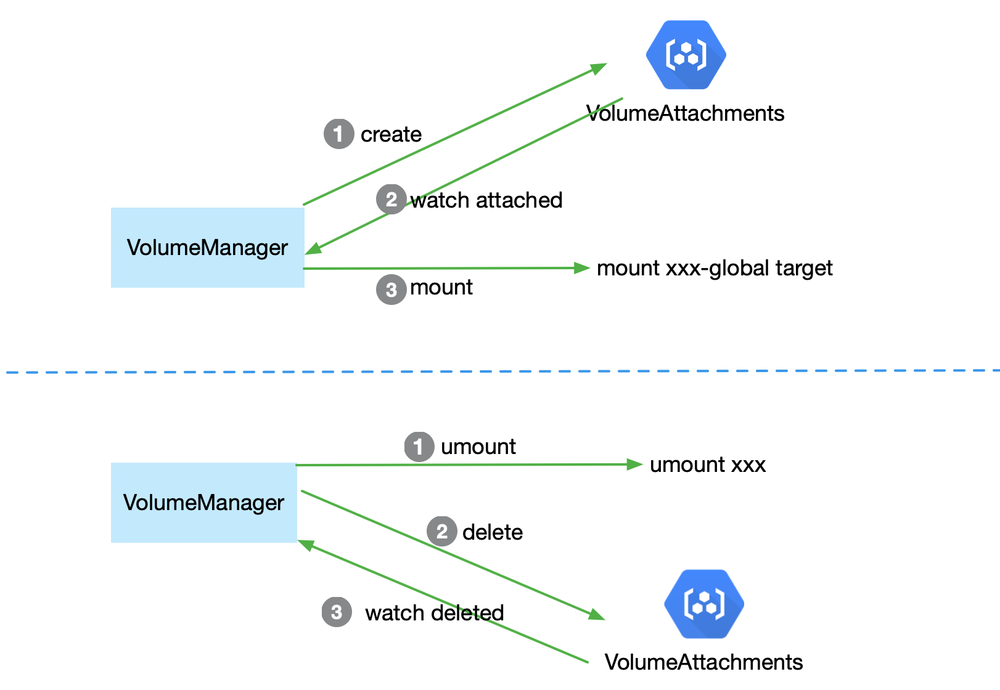
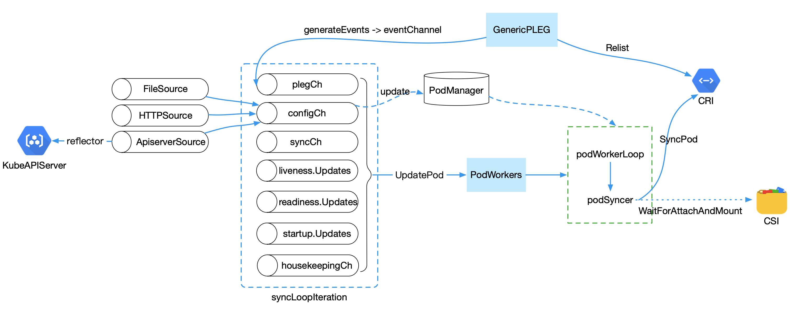
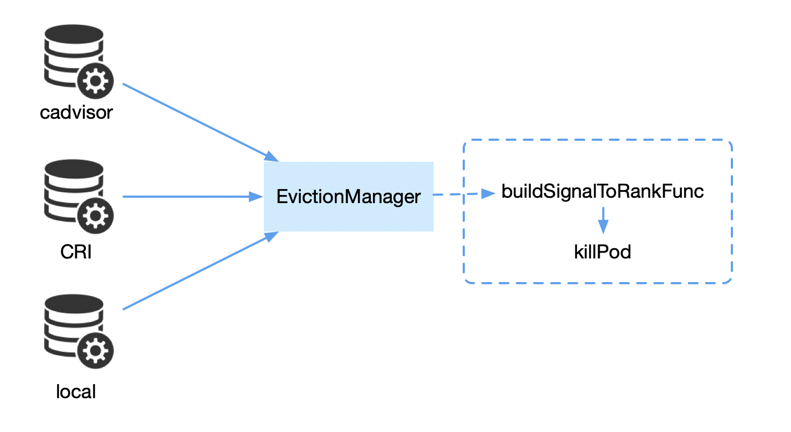

TOC

* [Kubelet 对 Pod 的生命周期管理](#kubelet-对-pod-的生命周期管理)
  * [名词介绍](#名词介绍)
  * [Manager](#manager)
    * [SecretManager && ConfigmapManager](#secretmanager--configmapmanager)
    * [VolumeManager](#volumemanager)
      * [PluginManager](#pluginmanager)
      * [挂载 && 卸载](#挂载--卸载)
    * [ProberManager](#probermanager)
  * [Pod 流程变化](#pod-流程变化)
    * [整体流程](#整体流程)
    * [podSyncer.SyncPod](#podsyncersyncpod)
      * [资源和状态检查](#资源和状态检查)
      * [containerRuntime.SyncPod](#containerruntimesyncpod)
        * [创建 Pod](#创建-pod)
          * [RunPodSandbox](#runpodsandbox)
          * [StartContainer](#startcontainer)
        * [删除 Pod](#删除-pod)
          * [StopContainer](#stopcontainer)
  * [其他流程](#其他流程)
    * [驱逐](#驱逐)
    * [抢占](#抢占)

# Kubelet 对 Pod 的生命周期管理

> 当前文档和逻辑来自 [Kubernetes 1.24](https://github.com/kubernetes/kubernetes/tree/release-1.24)

`Pod` 是 `Kubernetes` 最小的调度单元，它只是一个逻辑概念，真正运行的是一组共享部分资源的容器集合。一个 `Pod` 由类似 `kubelet` 等类似工具向 `Kube-APIServer` 发起创建请求并提交 `Pod` 描述(json/yaml/pb)，把元数据信息存入到 `ETCD` 中。然后通过 `Kube-scheduler` 进行调度，选择合适的节点运行。到这里 `Pod` 还没有真正运行起来，剩下创建和运行的逻辑全部都在 `Kubelet` 中。接下来我们一起看一下 `Kubelet` 如何对 `Pod` 进行管理的。

## 名词介绍

在 `Kubernetes` 相关技术中，经常会有这几个名词：`CRI`、`CNI`、`CSI`、`OCI` 等，下面介绍一下他们的概念和关系：

CRI(Container Runtime Interface): 容器运行时接口，`CRI` 定义了两个接口(容器和镜像)。

`Kubelet` 中 `CRI` 架构由最开始的 `dockershim` 到 `CRI` 接口的变化：



OCI(Open Container Initiative): 开放容器标准

* `runtime-spec`: 容器运行时标准，定义容器运行的配置、环境和生命周期(`Namespace`，`Cgroup` 等)；
* `image-spec`: 容器镜像标准，定义镜像格式，配置和元数据等；
* `distribution-spec`: 容器分发标准。

`runc`: 根据 `OCI` 规范的一个生成和运行容器的 `CLI` 工具。

CNI(Container Network Interface): 容器网络接口
CSI(Container Storage Interface): 容器存储接口

## Manager

`Kubelet` 中有很多 `Manager` 共同协作完成对 `Pod` 生命周期的管理。



### SecretManager && ConfigmapManager

ConfigMapAndSecretChangeDetectionStrategy:

* `Get`: 直接通过 `client` 请求 `kube-apiserver` 获取资源信息；
* `Cache`: 直接通过 `client` 请求 `kube-apiserver` 获取资源信息，存入到本地缓存设置一个 TTL(node.annotations["node.alpha.kubernetes.io/ttl"])
* `Watch`(默认值): 通过 `watch` 机制获取资源信息，可以动态感知资源变化。

> 通过 Kubelet 参数 `ConfigMapAndSecretChangeDetectionStrategy` 来选择使用哪种方式获取信息

### VolumeManager

`VolumeManager` 通过 `PluginManager` 注入的 `CSI` 插件，将 `Pod` 所需的 `Volume` 进行挂载和卸载

#### PluginManager



`PluginManager` 通过 `Watch` `/var/lib/kubelet/plugins_registry` 目录中的 `sock` 文件变化，动态的注册和取消注册各类插件，需要插件实现 `RegistrationClient` 接口:

```go
type RegistrationClient interface {
 GetInfo(ctx context.Context, in *InfoRequest, opts ...grpc.CallOption) (*PluginInfo, error)
 NotifyRegistrationStatus(ctx context.Context, in *RegistrationStatus, opts ...grpc.CallOption) (*RegistrationStatusResponse, error)
}
```

用于获取插件的信息(类型、版本，连接 `Endpoint`等)，然后调用本地的 `PluginHandler` 方法(`PluginHandler` 目前有 `CSIPlugin`、`DevicePlugin`和`DRAPlugin`)这些插件。

> DRAPlugin（Dynamic Resource Allocation Plugin）是 Kubelet 中用于动态资源分配的插件机制，可以扩展其他类型的资源（除 CPU & 内存），如 GPU、存储等。

#### 挂载 && 卸载



挂载：

* 创建 `VolumeAttachments` 资源；
* 等待 CSI Controller 调用 IaaS 资源接口，将真实的设备挂载到节点上，并把 `VolumeAttachments` 资源变为 `attached`
* 进行挂载，只需要 `mount /var/lib/kubelet/plugins/kubernetes.io/csi/pv/{PVNAME}/globalmount {TARGET}`

_挂载不一定需要 `Attach` 阶段，在 `CSIPlugin` 有一个 `CanAttach` 判断，如果插件返回 `false` 则不需要 `Attach`，直接进行 `Mount`。_

挂载示例：

```shell
[root@VM-0-32-tencentos /]# mount | grep /dev/vdb
/dev/vdb on /var/lib/kubelet/plugins/kubernetes.io/csi/pv/pvc-dd17fdaa-3f8b-48bd-899f-debba450e65a/globalmount type ext4 (rw,relatime)
/dev/vdb on /var/lib/kubelet/pods/2bebd297-e0c1-4420-a6fd-ba31aa1d610e/volumes/kubernetes.io~csi/pvc-dd17fdaa-3f8b-48bd-899f-debba450e65a/mount type ext4 (rw,relatime)
```

卸载：

* 进行 `unmount {TARGET}`;
* 删除 `VolumeAttachments` 资源;
* 等待 `VolumeAttachments` 被完全删除，就结束。

### ProberManager

`ProberManager` 用于探测 `Pod` 的健康状态，来守护 `Pod` 的可用性。将探测 "变化的结果" 更新到 `ResultManager` 中，调用 `ResultManager.Set` 方法：

```go
// Manager provides a probe results cache and channel of updates.
type Manager interface {
 // Get returns the cached result for the container with the given ID.
 Get(kubecontainer.ContainerID) (Result, bool)
 // Set sets the cached result for the container with the given ID.
 // The pod is only included to be sent with the update.
 Set(kubecontainer.ContainerID, Result, *v1.Pod)
 // Remove clears the cached result for the container with the given ID.
 Remove(kubecontainer.ContainerID)
 // Updates creates a channel that receives an Update whenever its result changes (but not
 // removed).
 // NOTE: The current implementation only supports a single updates channel.
 Updates() <-chan Update
}
```

还有 `livenessManager`、`readinessManager` 和 `startupManager` 都是通过这个 `ResultManager` 的 `Update` 事件来触发对应的业务逻辑。

## Pod 流程变化

### 整体流程



`Kubelet` 中有一个 `syncLoopIteration` 用来接受各个数据源：

* `configCh`: `Pod` 更改事件
* `plegCh`: 更新运行时缓存，同步 `Pod`
* `syncCh`: 同步所有等待的 `Pod`
* `housekeepingCh`: 触发清理 `Pod`
* `health manager`: 一个或多个 `Container` 健康检查失败

其中 `configCh` 有三种来源：

* `file`: 通过文件变化，监听 `StaticPod` 数据变化
* `http`: 通过 http 请求，监听 `StaticPod` 数据变化
* `api`: 通过 `client` 监听 `KubeAPIServer` 数据变化

所有的变化最终都会调用 `podWorkers.UpdatePod -> podWorkers.podWorkerLoop -> podSyncer.SyncPod`。其中 `podSyncer.SyncPod` 就是主要的 `Pod` 更新逻辑。

> 源码: [https://github.com/kubernetes/kubernetes/blob/39683505b630ff2121012f3c5b16215a1449d5ed/pkg/kubelet/kubelet.go#L1723](https://github.com/kubernetes/kubernetes/blob/39683505b630ff2121012f3c5b16215a1449d5ed/pkg/kubelet/kubelet.go#L1723)

### podSyncer.SyncPod

一个 Pod 在创建过程主要在 `kubelet` 的 `SyncPod` 方法中([源码](https://github.com/kubernetes/kubernetes/blob/39683505b630ff2121012f3c5b16215a1449d5ed/pkg/kubelet/kubelet.go#L1723))

#### 资源和状态检查

* `generateAPIPodStatus`: 根据当前 `Container` 状态，以及重启策略，来补全 `Pod` 的状态和 `IP` 信息;
* `canRunPod`: 调用 `topologyManager`, `evicationManager`, `nodeshutdownManager`, `sysctlAllowList` 的 `Admit` 函数来确认是否可以运行，如果不能，则删除所有正在运行的 `Container`;
* 检查 "NetworkReady"，如果没有 "Ready" 只能允许 `HostNetwork Pod` 运行;
* 把 `Pod` 添加到 `secretManager` 和 `configmapManager` 中;
* `PodContainerManager` 对 `Pod` 的 `Cgroup` 进行创建和更新;
* 如果 `MirrorPod` 和 `StaticPod` 不一样(`hash`)，则需要通过 `mirrorPodClient` 删除 `MirrorPod`，如果没有 MirrorPod，则创建 `MirrorPod`;
* 创建 `Pod` 数据目录(0750):
  * /var/lib/kubelet/pods/{PodUID}
  * /var/lib/kubelet/pods/{PodUID}/volumes
  * /var/lib/kubelet/pods/{PodUID}/plugins
* `WaitForAttachAndMount`: 等待 `volumeManager` 把当前 `Pod` 所需的所有 `volume` 都进行 `Mount`;
* `getPullSecretsForPod`: 获取当前 `Pod` 所需的 `ImagePullSecrets` 列表，并获取对应的 `secret`(如果没有找到，只是打印告警信息);
* `proberManager.AddPod` 添加状态检查。

所有的状态和资源都检查完成之后，会调用 `containerRuntime.SyncPod` 对 `Pod` 进行更新。

#### containerRuntime.SyncPod

用于创建、更新或者删除 `Pod`，会进行以下步骤：

* 计算 `Sandbox` 和 `Container` 是否有变化;
* 如果必要的话，删除 `Sandbox`;
* 如果不需要运行，则删除所有的 `Container`;
* 如果需要的话，创建 `Sandbox`;
* 创建 `ephemeral Container`;
* 创建 `init Container`;
* 创建 `normal Container`。

下面就主要介绍一下如何创建和删除 `Pod` 的流程。

##### 创建 Pod

###### RunPodSandbox

`Sandbox` 没有明确的定义，是一种抽象概念，是 `Pod` 中所有 `Container` 共享的操作系统环境。如果是容器， `Sandbox` 可以是一组 `Linux Namespace`；如果是 `KVM`，`Sandbox` 可以是一个 `VM`。**对于容器而言，并非需要，但是对于 `Pod` 而言，就是必须的。**

如果没有 `Sandbox`，就需要创建 `Sandbox` 容器：

* `generatePodSandboxConfig` 构建 `Sandbox` 的配置：
  * 根据网络策略来构建 dns 配置；
* 创建 `Pod` 标准输出日志目录: `/var/log/pods/{NAMESPACE}_{NAME}_{UID}`
* 如果配置了 `pod.spec.runtimeclass` 获取对应的 `runtimeHandler`
* 调用 `CRI` 接口 `RunPodSandbox`，传入 `sandboxConfig` 和 `runtimeHandler`

CRI.RunPodSandbox(来自于 containerd 的逻辑 [internal/cri/server/sandbox_run.go](https://github.com/containerd/containerd/blob/27de5fea738a38345aa1ac7569032261a6b1e562/internal/cri/server/sandbox_run.go#L51))

* 生成随机 `ID` 作为 `sandboxID`;
* 在 /var/run/netns 创建一个 cni-xx-xx-xx-xx-xx 空的文件来作为挂载点;
* 把 `cni` 文件挂载到 /proc/PID/task/{TID}/ns/net;
* 调用 `CNI` 插件创建网络，传入 `containerid`, `ns` 信息;
* 把 `eth0` 的 `IP` 信息作为 `sandbox IP`；
* 调用 `sandboxService.CreateSandbox`;
* 调用 `sandboxService.StartSandbox`:
  * 确保 `sandbox` 镜像是否存在，不存在就拉取【老版本是先检查】
  * 创建 `sandboxRootDir` 0755 /var/lib/containerd/io.containerd.grpc.v1.cri/sandboxes/{SandboxID}
  * 创建 `volatileSandboxRootDir` 0755 /run/containerd/io.containerd.grpc.v1.cri/sandboxes/{SandboxID}
  * `setupSandboxFiles`（创建 /dev/shm /etc/hosts /etc/resolv.conf /etc/hostname 必须的文件）
    * hostname -> sandboxRootDir/hostname 0644 write
    * hosts -> sandboxRootDir/hosts 0644 write
    * resolv.conf -> sandboxRootDir/resolv.conf 0644 write
    * shm -> volatileSandboxRootDir/shm 0700 mount

创建完 `Sandbox` 之后，就可以启动 `normal Container` 了。

###### StartContainer

* `pull image`: 调用 `CRI.ImageManagerService` 接口获取镜像
* 如果 `pod.status` 中有当前 `Container` 信息，`restart count ++`，如果没有的话，就根据日志文件来判断 `restartCount`
* `generateContainerConfig` 生成 `runtimeapi.ContainerConfig`
  * 构建 HostName, Devices（块设备），环境变量，Mounts，PodContainerDir（创建 /var/lib/kubelet/pods/{PodUID}/containers/ContainerName 目录 0750）
  * 调用 `cri.ImageStatus` 获取 `uid` 和 `username`，并验证是否和 `nonRoot` 配置是否有冲突
  * 通过 `env` 替换 `command` 和 `args`
  * 创建日志文件夹 `logDir` /var/log/pods/podNamespace_podName_podUID/containerName (default) 0755，并根据重启次数构建文件 {resourceCount}.log
  * `applyPlatformSpecificContainerConfig->generateLinuxContainerConfig` 创建资源的限额（`Cgroup`）
* `PreCreateContainer` 调用 NUMA CPU、Memory 预分配
* 调用 `cri.CreateContainer`（internal/cri/server/container_create.go）
  * 生成随机 `containerID`
  * 创建 `containerRootDir`
  * 创建 `volatileContainerRootDir`
* `PreStartContainer` 调用 NUMA CPU、Memory 分配（在内存中分配，异步写入到 CGroup 中）
* `CRI.StartContainer`(internal/cri/server/container_start.go)
* 如果配置了 `lifecycle.PostStart` 会直接执行，如果执行失败会调用 `killContainer`

> InitContainer 也是和 RegularContainer 启动方式一样，只是流程上的差异，RegularContainer 会等待 InitContainer 都正常退出之后才会启动。

##### 删除 Pod

* loop Container:
  * executePreStopHook: 先执行 `prestop` 逻辑
  * CRI.StopContainer
* CRI.StopPodSandbox

GC:

* loop Container:
  * 删除 `Container` 日志
  * CRI.RemoveContainer
* CRI.RemoveSandbox

> 所有的删除操作都会调用 [killContainer](https://github.com/kubernetes/kubernetes/blob/v1.30.2/pkg/kubelet/kuberuntime/kuberuntime_container.go#L732)

###### StopContainer

CRI.StopContainer (来自于 containerd 的逻辑 [internal/cri/server/container_stop.go](https://github.com/containerd/containerd/blob/27de5fe/internal/cri/server/container_stop.go#L38))

* 先 [kill -15 PID](https://github.com/containerd/containerd/blob/27de5fe/internal/cri/server/container_stop.go#L124)
* 最后 [kill -9 PID](https://github.com/containerd/containerd/blob/27de5fe/internal/cri/server/container_stop.go#L186)

## 其他流程

### 驱逐



* 通过监听 `metrics` 数据是否达到阈值，产生对应的 `signal`;
* 根据 `signal` 对应的排序算法，对 `Pod` 进行排序;
* 调用 `killPod` 对 `Pod` 进行驱逐。

以下 `Pod` 不能被驱逐：

* Static Pod;
* Mirror Pod;
* pod.Spec.Priority >= scheduling.SystemCriticalPriority (20_0000_0000)

> 这里的驱逐是 Kubelet 主动发起的驱逐，会保留 Pod 的定义，和 Kube-Controller-Manager 发起的驱逐不一样（和 Delete 逻辑一样）。

### 抢占

抢占的逻辑大多数来自于调度器层面，如果调度器选择需要对正在运行的 `Pod` 进行抢占，则调用 `killPod` 逻辑对 `Pod` 进行删除。

> 抢占是会删除 Pod 定义，对于 Kubelet 来说也是 Delete 操作。

---

总结一下 `Kubelet` 对 `Pod` 的生命周期管理：

* 通过各种事件来处理 `Pod` 的状态(创建/更新/删除)；
* 根据异常情况进行部分 `Pod` 的驱逐，从而使得保证 `Pod` 的可用性；
* 各种 `Manager` 共同协作完成对 `Pod` 生命周期的管理；
* 定义各种接口：`CSI`、`CNI`、`Plugin` 满足对特殊环境下 `Pod` 运行的扩展（自定义存储）。
