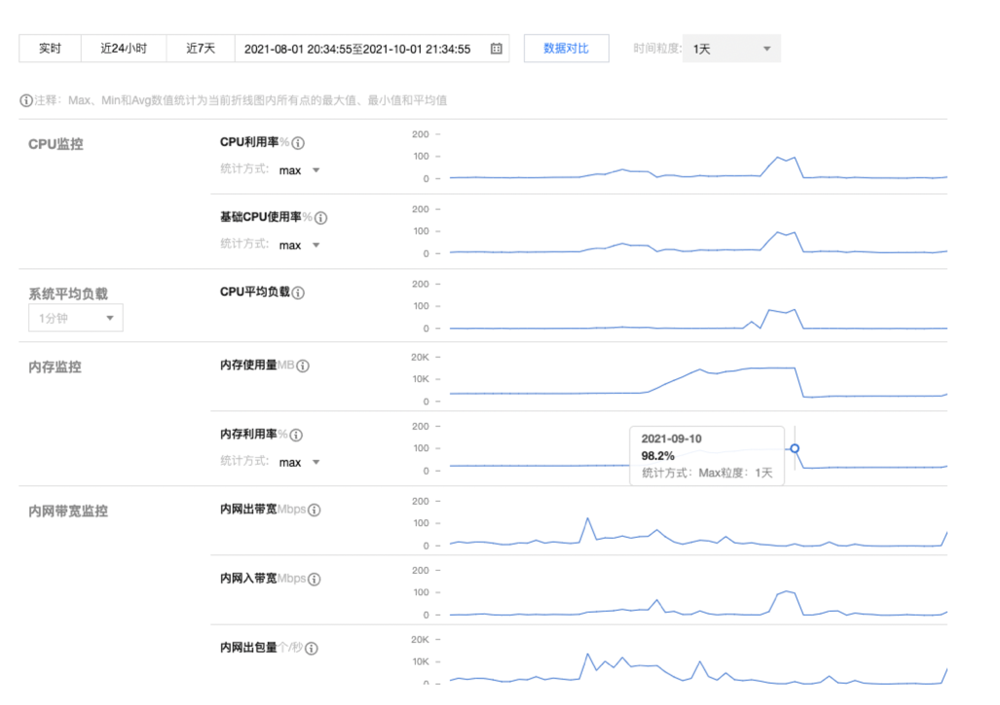
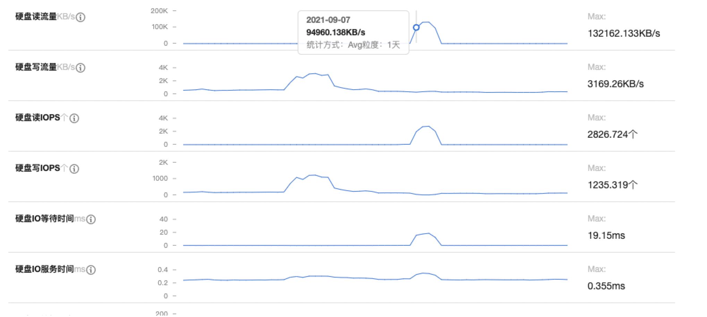
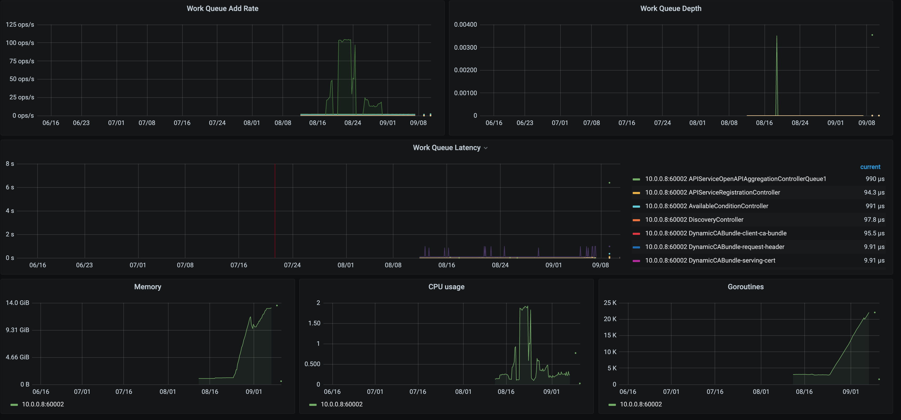
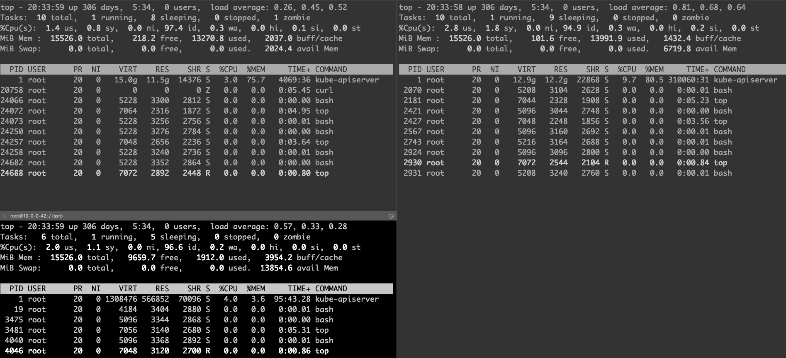
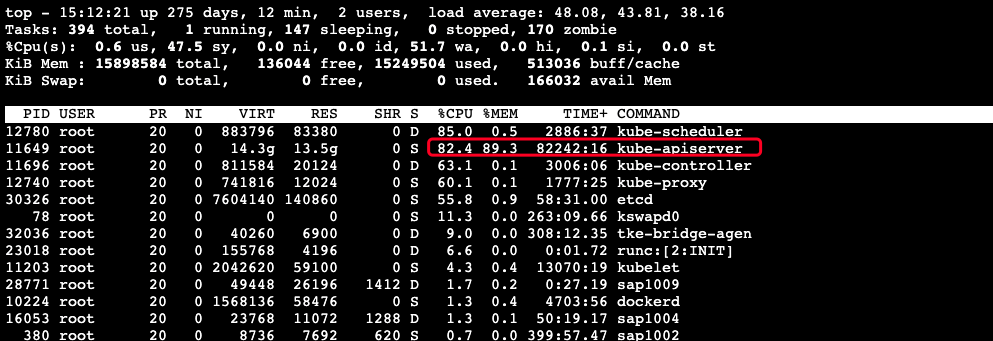
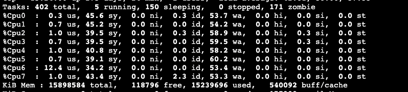
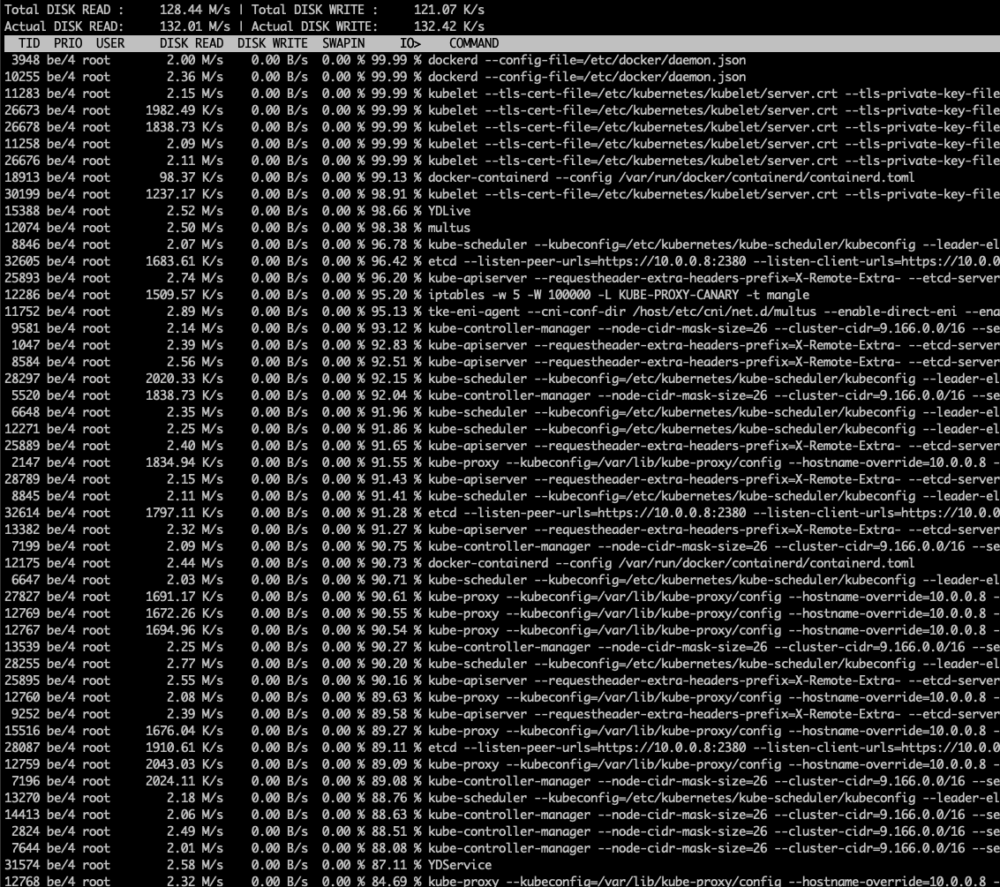
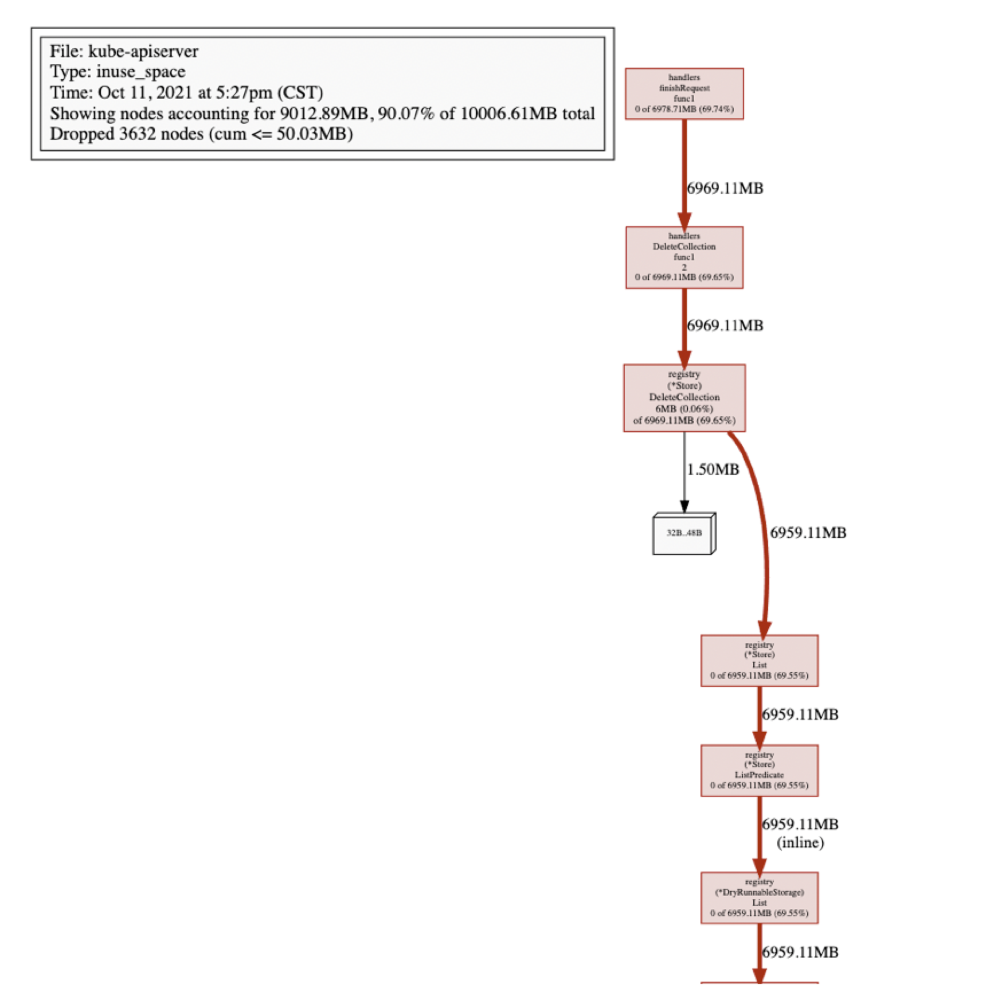

# 记一次k8s control-plane 排障经历【PR-105606 Merged】

集群以及环境信息的信息：

- k8s v1.18.4
- 3节点Master均为8核16Gi, 50Gi-SSD
- 差异化配置的19节点Minion
- control-plane组件(kube-apiserver,etcd,kube-controller-manager, kube-scheduler)以static-pod的模式进行部署
- 3个kube-apiserver前端有一个VIP进行流量的LoadBalance
- 腾讯云的SSD性能大概是130MB/s

## 故障描述

> 在2021-9-10下午“诡异”的事情开始出现： kubectl偶尔卡住无法正常CRUDW标准资源(Pod, Node等)，此时已经意识到是部分的kube-apiserver无法正常工作，然后尝试分别接入3台kube-apiserver所在宿主机，发现以下不正常的情况：

## 现场的信息

### k8s control-plane kube-apiserver Pod信息

```bash
$ kubectl get pods -n kube-system kube-apiserver-x.x.x.x -o yaml
...
  containerStatuses:
  - containerID: docker://xxxxx
    ....
    lastState:
      terminated:
        containerID: docker://yyyy
        exitCode: 137
        finishedAt: "2021-09-10T09:29:02Z"
        reason: OOMKilled
        startedAt: "2020-12-09T07:02:23Z"
    name: kube-apiserver
    ready: true
    restartCount: 1
    started: true
    state:
      running:
        startedAt: "2021-09-10T09:29:08Z"
...
```

> 9月10日， kube-apiserver因为OOM被Kill过

### 周边监控

#### IaaS层提供监控信息(control-plane所在宿主的黑盒监控信息)：





有效信息:

* 内存,CPU,读取磁盘呈现正相关，并且在9月10日开始明显下降各方面指标回归正常

#### Kube-apiserver Prometheus的监控信息:



有效信息:

* kube-apiserver的IO出现了问题，prometheus在中途的某段事件无法正常的刮取kube-apiserver的metrics指标
* kube-apiserver占用的内存单调递增，内部workqueue的`ADD`iops很高

#### 实时的Debug信息









有效信息:

* 两个Master节点的内存都几乎被占用了80%~90%的样子
* 大量的内存都被`kube-apiserver`进程吃掉了
* 有一台Master组件格外特殊，除了内存之外，CPU也已经被打满，并且大量的CPU陷入内核态，wa很高
* 机器上几乎每个进程都"疯"了，都在进行大量的读盘操作，接入的shell已经基本不可用
* 唯一内存消耗相对较低（当时占用8Gi）的Master节点上，kube-apiserver曾经被OOM-Kill过

## 一些疑问以及相关的猜想

那么为什么kube-apiserver消耗大量内存？

1. 存在Client在进行全量List核心资源
2. etcd无法提供正常服务，引发kube-apiserver无法正常为其他的control-plane组件无法提供选主服务，kube-controller-manager, kube-scheduler不断重启，不断ListAndWatch进而打垮整个机器
3. kube-apiserver代码有bug，存在内存泄漏


etcd集群为何无法正常工作？

1. etcd集群内网络抖动
2. 磁盘性能下降，无法满足正常的etcd工作
3. etcd所在宿主机计算资源匮乏(CPU, RAM)，etcd只能分配到很少的时间轮片。而代码中设置的网络描述符的Deadline到期

kube-controller-manager，kube-scheduler这种无状态服务为什么会大量的读盘？

1. kube-controller-manager，kube-scheduler读取本地的配置文件
2. 操作系统内存极度紧缩的情况下，会将部分代码段很大的进程的内存页驱逐。保证被调度的进程能够运行。当被驱逐的进程再度被调度的时候会重新读入内存。这样会导致I/O增加

## 一些日志

kube-apiserver相关:
```
I0907 07:04:17.611412       1 trace.go:116] Trace[1140445702]: "Get" url:/apis/storage.k8s.io/v1/volumeattachments/csi-b8d912ae5f2cd6d9cfaecc515568c455afdc729fd4c721e4a6ed24ae09d9bcb6,user-agent:kube-controller-manager/v1.18.4 (linux/amd64) kubernetes/f8797eb/system:serviceaccount:kube-system:attachdetach-controller,client:10.0.0.42 (started: 2021-09-07 07:04:16.635225967 +0800 CST m=+23472113.230522917) (total time: 976.1773ms):
Trace[1140445702]: [976.164659ms] [976.159045ms] About to write a response
I0907 07:04:17.611478       1 trace.go:116] Trace[630463685]: "Get" url:/apis/storage.k8s.io/v1/volumeattachments/csi-30c942388d7a835b685e5d5a44a15943bfc87b228e3b9ed2fa01ed071fbc1ada,user-agent:kube-controller-manager/v1.18.4 (linux/amd64) kubernetes/f8797eb/system:serviceaccount:kube-system:attachdetach-controller,client:10.0.0.42 (started: 2021-09-07 07:04:16.627643544 +0800 CST m=+23472113.222940496) (total time: 983.823847ms):
Trace[630463685]: [983.812225ms] [983.803546ms] About to write a response
I0907 07:04:17.611617       1 trace.go:116] Trace[1538026391]: "Get" url:/apis/storage.k8s.io/v1/volumeattachments/csi-3360a8de64a82e17aa96f373f6dc185489bbc653824b3099c81a6fce754a3f6f,user-agent:kube-controller-manager/v1.18.4 (linux/amd64) kubernetes/f8797eb/system:serviceaccount:kube-system:attachdetach-controller,client:10.0.0.42 (started: 2021-09-07 07:04:16.565151702 +0800 CST m=+23472113.160448667) (total time: 1.046416117s):
Trace[1538026391]: [1.046397533s] [1.046390931s] About to write a response

....N条类似的日志....
I0907 07:04:24.171900       1 trace.go:116] Trace[1679666311]: "Get" url:/apis/storage.k8s.io/v1/volumeattachments/csi-b5ee4d68917fbf1262cc0a8047d9c37133a4a766f53f3566c40f868edd8a0bf0,user-agent:kube-controller-manager/v1.18.4 (linux/amd64) kubernetes/f8797eb/system:serviceaccount:kube-system:attachdetach-controller,client:10.0.0.42 (started: 2021-09-07 07:04:17.116692376 +0800 CST m=+23472113.711989328) (total time: 5.467094616s):
Trace[1679666311]: [4.69843064s] [4.698422403s] About to write a response
Trace[1679666311]: [5.467093266s] [768.662626ms] Transformed response object
I0907 07:04:24.142154       1 trace.go:116] Trace[2029984150]: "Get" url:/apis/storage.k8s.io/v1/volumeattachments/csi-29407a58f021e9911d3ed9b5745dddfd40e61d64e1ecc62cf71ab9e037f83107,user-agent:kube-controller-manager/v1.18.4 (linux/amd64) kubernetes/f8797eb/system:serviceaccount:kube-system:attachdetach-controller,client:10.0.0.42 (started: 2021-09-07 07:04:17.102181932 +0800 CST m=+23472113.697478883) (total time: 5.50528966s):
Trace[2029984150]: [4.704869664s] [4.704865103s] About to write a response
Trace[2029984150]: [5.505288975s] [800.419311ms] Transformed response object
E0907 07:04:37.327057       1 authentication.go:53] Unable to authenticate the request due to an error: [invalid bearer token, context canceled]
I0907 07:04:40.391602       1 trace.go:116] Trace[2032502471]: "Update" url:/apis/coordination.k8s.io/v1/namespaces/kube-node-lease/leases/10.0.0.8,user-agent:kubelet/v1.18.4 (linux/amd64) kubernetes/f8797eb,client:10.0.0.8 (started: 2021-09-07 07:04:17.392952999 +0800 CST m=+23472113.988249966) (total time: 20.164329656s):
Trace[2032502471]: [286.281637ms] [286.281637ms] About to convert to expected version
Trace[2032502471]: [481.650367ms] [195.36873ms] Conversion done
Trace[2032502471]: [674.825685ms] [193.175318ms] About to store object in database
Trace[2032502471]: [20.164329656s] [19.489503971s] END
I0907 07:04:41.502454       1 trace.go:116] Trace[951110924]: "Get" url:/apis/storage.k8s.io/v1/volumeattachments/csi-0938f8852ff15a3937d619216756f9bfa5b0d91c0eb95a881b3caccbf8e87fb2,user-agent:kube-controller-manager/v1.18.4 (linux/amd64) kubernetes/f8797eb/system:serviceaccount:kube-system:attachdetach-controller,client:10.0.0.42 (started: 2021-09-07 07:04:17.29109778 +0800 CST m=+23472113.886395069) (total time: 20.41128212s):
Trace[951110924]: [12.839487235s] [12.839478549s] About to write a response
Trace[951110924]: [20.411280569s] [7.571793334s] Transformed response object

W0907 07:10:39.496915       1 clientconn.go:1208] grpc: addrConn.createTransport failed to connect to {https://etcd0:2379  <nil> 0 <nil>}. Err :connection error: desc = "transport: Error while dialing context deadline exceeded". Reconnecting...
I0907 07:10:39.514215       1 clientconn.go:882] blockingPicker: the picked transport is not ready, loop back to repick
E0907 07:10:39.514473       1 status.go:71] apiserver received an error that is not an metav1.Status: &errors.errorString{s:"context canceled"}
E0907 07:10:39.514538       1 status.go:71] apiserver received an error that is not an metav1.Status: &errors.errorString{s:"context canceled"}
I0907 07:10:39.514662       1 clientconn.go:882] blockingPicker: the picked transport is not ready, loop back to repick
E0907 07:10:39.514679       1 status.go:71] apiserver received an error that is not an metav1.Status: &errors.errorString{s:"context canceled"}
E0907 07:10:39.514858       1 status.go:71] apiserver received an error that is not an metav1.Status: &errors.errorString{s:"context canceled"}
W0907 07:10:39.514925       1 clientconn.go:1208] grpc: addrConn.createTransport failed to connect to {https://etcd0:2379  <nil> 0 <nil>}. Err :connection error: desc = "transport: Error while dialing context deadline exceeded". Reconnecting...
```

> 可以看到对etcd的操作耗时越来越慢。并且最后甚至丢失了与etcd的连接


etcd日志【已经丢失9月7日的日志】:

```bash
{"level":"warn","ts":"2021-09-10T17:14:50.559+0800","caller":"embed/config_logging.go:279","msg":"rejected connection","remote-addr":"10.0.0.42:49824","server-name":"","error":"read tcp 10.0.0.8:2380->10.0.0.42:49824: i/o timeout"}
{"level":"warn","ts":"2021-09-10T17:14:58.993+0800","caller":"embed/config_logging.go:279","msg":"rejected connection","remote-addr":"10.0.0.6:54656","server-name":"","error":"EOF"}
{"level":"warn","ts":"2021-09-10T17:15:03.961+0800","caller":"embed/config_logging.go:279","msg":"rejected connection","remote-addr":"10.0.0.6:54642","server-name":"","error":"EOF"}
{"level":"warn","ts":"2021-09-10T17:15:32.253+0800","caller":"embed/config_logging.go:279","msg":"rejected connection","remote-addr":"10.0.0.6:54658","server-name":"","error":"EOF"}
{"level":"warn","ts":"2021-09-10T17:15:49.299+0800","caller":"embed/config_logging.go:279","msg":"rejected connection","remote-addr":"10.0.0.42:49690","server-name":"","error":"EOF"}
{"level":"warn","ts":"2021-09-10T17:15:55.930+0800","caller":"embed/config_logging.go:279","msg":"rejected connection","remote-addr":"10.0.0.42:49736","server-name":"","error":"EOF"}
{"level":"warn","ts":"2021-09-10T17:16:29.446+0800","caller":"embed/config_logging.go:279","msg":"rejected connection","remote-addr":"10.0.0.6:54664","server-name":"","error":"EOF"}
{"level":"warn","ts":"2021-09-10T17:16:24.026+0800","caller":"embed/config_logging.go:279","msg":"rejected connection","remote-addr":"10.0.0.42:49696","server-name":"","error":"EOF"}
{"level":"warn","ts":"2021-09-10T17:16:36.625+0800","caller":"embed/config_logging.go:279","msg":"rejected connection","remote-addr":"10.0.0.42:49714","server-name":"","error":"EOF"}
{"level":"warn","ts":"2021-09-10T17:17:54.241+0800","caller":"embed/config_logging.go:279","msg":"rejected connection","remote-addr":"10.0.0.42:49878","server-name":"","error":"read tcp 10.0.0.8:2380->10.0.0.42:49878: i/o timeout"}
{"level":"warn","ts":"2021-09-10T17:18:31.712+0800","caller":"embed/config_logging.go:279","msg":"rejected connection","remote-addr":"10.0.0.42:49728","server-name":"","error":"EOF"}
{"level":"warn","ts":"2021-09-10T17:18:31.785+0800","caller":"embed/config_logging.go:279","msg":"rejected connection","remote-addr":"10.0.0.42:49800","server-name":"","error":"EOF"}
```

> 可以看出，该节点的etcd与集群中的其他节点的通信也异常了。无法正常对外提供服务


## 深入调查

### 查看kube-apiserver Heap-Profile



获取到kube-apiserver最近的Profile可以发现大量的内存都被 `registry(*Store).DeleteCollection` 吃掉了。DeleteCollection会先进行List操作，然后并发删除每个Item。瞬间吃掉大量内存也在情理之中。也许我这么倒霉，这次抓的时候就正好处于Delete的疯狂调用期间，休息10分钟，等下再抓一次看看。

怎么回事？怎么`DeleteCollection`还是持有这么多内存。此处其实已经开始怀疑kube-apiserver有goroutine泄漏的可能了。

> 看来heap的Profile无法提供足够的信息进行进一步的问题确定，继续抓取kube-apiserver goroutine的profile

### 查看kube-apiserver goroutine-profile

1.8W goroutine

```
goroutine 18970952966 [chan send, 429 minutes]:
k8s.io/kubernetes/vendor/k8s.io/apiserver/pkg/registry/generic/registry.(*Store).DeleteCollection.func1(0xc00f082ba0, 0xc04e059b90, 0x9, 0x9, 0xc235e37570)
--
goroutine 18971918521 [chan send, 394 minutes]:
k8s.io/kubernetes/vendor/k8s.io/apiserver/pkg/registry/generic/registry.(*Store).DeleteCollection.func1(0xc01f5a7c20, 0xc025cf8750, 0x9, 0x9, 0xc128042620)
--
goroutine 18975541850 [chan send, 261 minutes]:
k8s.io/kubernetes/vendor/k8s.io/apiserver/pkg/registry/generic/registry.(*Store).DeleteCollection.func1(0xc08bb1c780, 0xc095222240, 0x9, 0x9, 0xc128667340)
--
goroutine 18972733441 [chan send, 363 minutes]:
k8s.io/kubernetes/vendor/k8s.io/apiserver/pkg/registry/generic/registry.(*Store).DeleteCollection.func1(0xc015c2c9c0, 0xc0db776240, 0x9, 0x9, 0xc124b0f570)
--
goroutine 18973170460 [chan send, 347 minutes]:
k8s.io/kubernetes/vendor/k8s.io/apiserver/pkg/registry/generic/registry.(*Store).DeleteCollection.func1(0xc07a804c60, 0xc04ee83200, 0x9, 0x9, 0xc23e555c00)
--
goroutine 18974040729 [chan send, 316 minutes]:
k8s.io/kubernetes/vendor/k8s.io/apiserver/pkg/registry/generic/registry.(*Store).DeleteCollection.func1(0xc028d40780, 0xc243ea0cf0, 0x9, 0x9, 0xc14a6be770)
--
goroutine 18974695712 [chan send, 292 minutes]:
k8s.io/kubernetes/vendor/k8s.io/apiserver/pkg/registry/generic/registry.(*Store).DeleteCollection.func1(0xc04573b5c0, 0xc04f0af290, 0x9, 0x9, 0xc1982732d0)
--
goroutine 18974885774 [chan send, 285 minutes]:
k8s.io/kubernetes/vendor/k8s.io/apiserver/pkg/registry/generic/registry.(*Store).DeleteCollection.func1(0xc26065b9e0, 0xc06f025710, 0x9, 0x9, 0xc229945f80)
--
goroutine 18971511296 [chan send, 408 minutes]:
k8s.io/kubernetes/vendor/k8s.io/apiserver/pkg/registry/generic/registry.(*Store).DeleteCollection.func1(0xc021e74480, 0xc0313a54d0, 0x9, 0x9, 0xc1825177a0)
--
goroutine 18975459144 [chan send, 263 minutes]:
k8s.io/kubernetes/vendor/k8s.io/apiserver/pkg/registry/generic/registry.(*Store).DeleteCollection.func1(0xc26cb9d1a0, 0xc17672b440, 0x9, 0x9, 0xc156fcd810)
--
goroutine 18973661056 [chan send, 331 minutes]:
k8s.io/kubernetes/vendor/k8s.io/apiserver/pkg/registry/generic/registry.(*Store).DeleteCollection.func1(0xc2ba3f1680, 0xc19df40870, 0x9, 0x9, 0xc24b888a10)
--
goroutine 18973633598 [chan send, 331 minutes]:
k8s.io/kubernetes/vendor/k8s.io/apiserver/pkg/registry/generic/registry.(*Store).DeleteCollection.func1(0xc24a0ef5c0, 0xc05472a900, 0x9, 0x9, 0xc01ec14af0)
--
goroutine 18974804879 [chan send, 288 minutes]:
k8s.io/kubernetes/vendor/k8s.io/apiserver/pkg/registry/generic/registry.(*Store).DeleteCollection.func1(0xc0863f9ce0, 0xc04fcee090, 0x9, 0x9, 0xc2257a1d50)
--
goroutine 18974203255 [chan send, 310 minutes]:
k8s.io/kubernetes/vendor/k8s.io/apiserver/pkg/registry/generic/registry.(*Store).DeleteCollection.func1(0xc2727ed8c0, 0xc021d4ae10, 0x9, 0x9, 0xc173af3570)
...还有很多，就不列举了...
```

果然大量密集的goroutine全部都Block在chan send，并且时间上很密集。DeleteCollection该接口的调用一般都是kube-controller-manager的namespace_deleter。如果kube-apiserver的接口调用异常会进行Backoff，然后继续请求，此处的异常是**和kube-apiserver的通讯没问题，但是kube-apiserver无法正常和etcd交互**

查看kube-controller-manager的日志

```
E1027 15:15:01.016712       1 leaderelection.go:320] error retrieving resource lock kube-system/kube-controller-manager: etcdserver: request timed out
I1027 15:15:01.950682       1 leaderelection.go:277] failed to renew lease kube-system/kube-controller-manager: timed out waiting for the condition
F1027 15:15:01.950760       1 controllermanager.go:279] leaderelection lost
I1027 15:15:01.962210       1 certificate_controller.go:131] Shutting down certificate controller "csrsigning"
```

虽然没有输出调用DeleteCollection相关的日志，但是kube-controller-manager进行LeaderElection的ConfigMap也无法正常的刷新了。并且报错也非常明确的指出是kube-apiserver请求etcd出现timeout。

### kube-apiserver DeleteCollection实现


```golang
func (e *Store) DeleteCollection(ctx context.Context, deleteValidation rest.ValidateObjectFunc, options *metav1.DeleteOptions, listOptions *metainternalversion.ListOptions) (runtime.Object, error) {

    ...
	listObj, err := e.List(ctx, listOptions)
	if err != nil {
		return nil, err
	}
	items, err := meta.ExtractList(listObj)
	...
	wg := sync.WaitGroup{}
	toProcess := make(chan int, 2*workersNumber)
	errs := make(chan error, workersNumber+1)

	go func() {
		defer utilruntime.HandleCrash(func(panicReason interface{}) {
			errs <- fmt.Errorf("DeleteCollection distributor panicked: %v", panicReason)
		})
		for i := 0; i < len(items); i++ {
			toProcess <- i
		}
		close(toProcess)
	}()

	wg.Add(workersNumber)
	for i := 0; i < workersNumber; i++ {
		go func() {
			// panics don't cross goroutine boundaries
			defer utilruntime.HandleCrash(func(panicReason interface{}) {
				errs <- fmt.Errorf("DeleteCollection goroutine panicked: %v", panicReason)
			})
			defer wg.Done()

			for index := range toProcess {
			    ...
				if _, _, err := e.Delete(ctx, accessor.GetName(), deleteValidation, options.DeepCopy()); err != nil && !apierrors.IsNotFound(err) {
					klog.V(4).InfoS("Delete object in DeleteCollection failed", "object", klog.KObj(accessor), "err", err)
					errs <- err
					return
				}
			}
		}()
	}
	wg.Wait()
	select {
	case err := <-errs:
		return nil, err
	default:
		return listObj, nil
	}
}
```

> 如果`e.Delete`发生异常（也就是我们场景下的etcd异常）。worker goroutine将会正常退出，但是任务分配goroutine无法正常退出，Block在发送toProcess chan的代码块中。如果该Goroutine无法结束，那么通过etcd的List接口获取到的**items**也无法被GC，在内存中大量堆积，导致OOM

## 总结

1. 排障之前需要对正常有一个比较明确的定位，何谓“正常”？

> 根据之前的实践经验: 100Node，1400Pod, 50 Configmap, 300 event.`kube-apiserver`消耗的资源大概在2Gi的内存以及单核心10%的计算资源.

2. 本次排障过程中大概如下:
  * 通过一些不正常的表现，感觉到问题的存在
  * 大概确定引发故障的组件，通过管理工具获取该组件相关的信息
  * 在相关的监控系统中寻找异常发生的时间，提取相关的有效信息比如CPU，RAM，Disk的消耗
  * 对触发故障的原因做假设
  * 查找相关组件的日志, Profile来印证假设

3. 如何防止control-plane链式崩溃
   * 明确设置kube-apiserver的CPU资源内存资源的消耗。防止在混部模式下因为kube-apiserver消耗大量内存资源的前提下影响到etcd的正常工作
   * etcd集群独立于control-plane其他的组件部署

## 修复kube-apiserver Goroutine泄漏的PR

https://github.com/kubernetes/kubernetes/pull/105606   Merged
