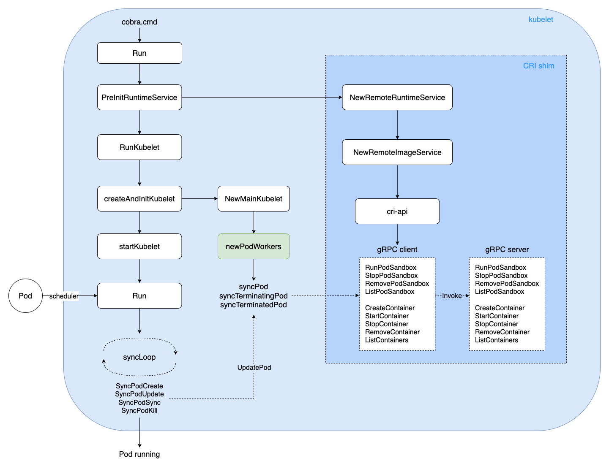
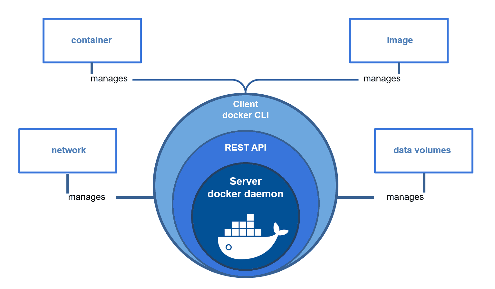
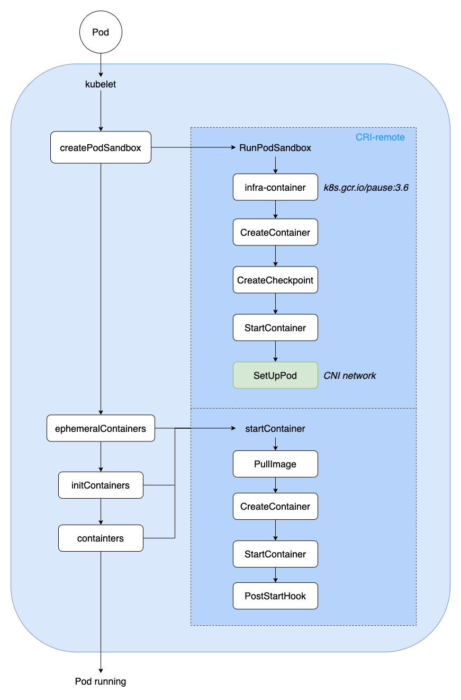
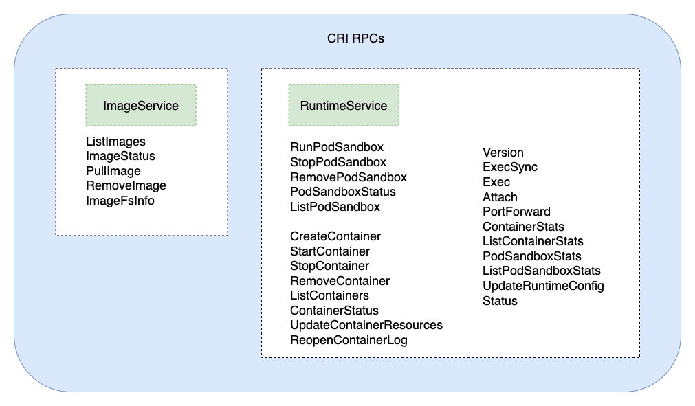

TOC
- [概述](#1-概述)
- [从 Docker 说起](#2-从-Docker-说起)
    - [Docker Engine](#21-Docker-Engine)
    - [OCI](#22-OCI)
    - [runc](#23-runc)
- [CRI](#3-CRI)
    - [dockershim](#31-dockershim)
    - [CRI shim](#32-CRI-shim)
    - [RuntimeClass](#33-RuntimeClass)
- [Kubelet 启动](#4-Kubelet-启动)
- [Pod 创建/删除](#5-Pod-创建删除)
- [Container 创建/删除](#6-Container-创建删除)
- [CRI RPC 接口](#7-CRI-RPC-接口)
- [小结](#8-小结)

## 1. 概述
进入 K8s 的世界，会发现有很多方便扩展的 Interface，包括 CRI, CSI, CNI 等，将这些接口抽象出来，是为了更好的提供开放、扩展、规范等能力。

K8s CRI(Container Runtime Interface) 是 K8s 定义的一组与容器运行时进行交互的接口，用于将 K8s 平台与特定的容器运行时实现解耦。CRI 在 Kubernetes 1.5 中引入，并充当 kubelet 和容器运行时之间的桥梁。目前实现了 CRI spec 的 Runtime 有 Docker Engine、containerd、CRI-O、Mirantis Container Runtime(Docker 企业版) 等。

2020 年，K8s [宣布弃用 dockershim](https://kubernetes.io/blog/2022/02/17/dockershim-faq/)，标志着容器运行时正式向 CRI 切换，一方面是为了将 kubelet 核心主干代码与 Runtime 相关代码解耦，便于更好的维护；另一方面则是为了便于生态圈按 CRI spec 实现自己的运行时插件，提供个性化的运行时扩展能力，以满足对更多 Runtime 的支持，提高 K8s 生态的开放性和扩展性。

本文将从 Docker Engine、Kubelet 启动、Pod 创建/删除、Container 创建/删除、CRI RPC 调用等核心流程，对 CRI 实现机制进行了解析。

流程概览如下：



> 本文及后续相关文章都基于 K8s v1.23

## 2. 从 Docker 说起
### 2.1 Docker Engine
Docker Engine 是用来运行和管理容器的核心软件。通常人们会简单地将其代指为 Docker 或 Docker 平台。

Docker Engine 主要的组件构成：Docker 客户端（Docker Client）、Docker 守护进程（Docker daemon）、Docker APIs、containerd 以及 runc，它们共同负责容器的创建和运行。



### 2.2 OCI
OCI（Open Container Initiative，开放容器计划），是在 2015 年由 Docker、CoreOS 等公司共同成立的项目，并由 Linux 基金会进行管理，致力于 container runtime 标准的制定和 runc 的开发等工作。

所谓 container runtime，主要负责的是容器的生命周期的管理。OCI 主要分为容器运行时规范(runtime-spec) 和镜像规范(image-spec) 两部分，runtime-spec 标准对容器的创建、删除、查看、状态等操作进行了定义，image-spec 对镜像格式、打包(Bundle)、存储等进行了定义。

### 2.3 runc
runc，是由 Docker 贡献的对于 OCI 标准的一个参考实现，是一个可以用于创建和运行容器的 CLI(command-line interface) 工具。runc 直接与容器所依赖的 Cgroup/OS 等进行交互，负责为容器配置 Cgroup/namespace 等启动容器所需的环境，创建启动容器的相关进程。

为了兼容 OCI 标准，Docker 也做了架构调整。将容器运行时相关的程序从 Docker daemon 剥离出来，形成了containerd。containerd 向 Docker 提供运行容器的 API，二者通过 gRPC 进行交互。containerd 最后会通过 runc 来实际运行容器。


## 3. CRI
CRI（Container Runtime Interface，容器运行时接口）是 K8s 定义的一组与容器运行时进行交互的接口，用于将 K8s 平台与特定的容器实现解耦。在 K8s 早期的版本中，对于容器环境的支持是通过 Dockershim(hard code) 方式直接调用 Docker API 的，后来为了支持更多的容器运行时和更精简的容器运行时，K8s 在遵循 OCI 基础上提出了CRI。

### 3.1 dockershim
dockershim 是 Kubernetes 的一个组件，主要目的是为了通过 CRI 操作 Docker。Kubernetes 在创建之初便采用Docker 作为它的默认容器进行时，后续代码当中包含了很多对 Docker 相关的操作逻辑。后期 Kubernetes 为了能够做解耦，兼容更多的容器进行时，将操作 Docker 相关逻辑整体独立起来组成了 dockershim。

2020 年，K8s [宣布弃用 dockershim](https://kubernetes.io/blog/2022/02/17/dockershim-faq/)，标志着容器运行时正式向 CRI 切换，以满足对更多 Runtime 的支持，提高 K8s 生态的开放性和扩展性。

### 3.2 CRI shim
当前实现了 CRI 的 remote shim 有如下：
- [containerd](https://kubernetes.io/docs/setup/production-environment/container-runtimes/#containerd)：由 Docker 公司创建，并且在 2017 年捐赠给了 CNCF，2019 年毕业。
- [CRI-O](https://kubernetes.io/docs/setup/production-environment/container-runtimes/#cri-o)：基于 OCI 规范的作为 CRI 和 OCI 之间的一座桥梁。
- [Docker Engine](https://kubernetes.io/docs/setup/production-environment/container-runtimes/#docker)：Docker 运行时的支持，由 cri-dockerd 进行实现。
- [Mirantis Container Runtime](https://kubernetes.io/docs/setup/production-environment/container-runtimes/#mcr)：Docker 企业版(Enterprise Edition) 运行时的支持，由 Mirantis Container Runtime(MCR) 进行实现。

CRI shim 小结如下：


### 3.3 RuntimeClass
RuntimeClass 是 v1.12 引入的新 API 对象，用来支持多个容器运行时，可通过 Pod 字段直接指定。
定义一个 RuntimeClass 如下，对应的 CRI handler 即为目标容器运行时，比如 containerd、crio：
```
apiVersion: node.k8s.io/v1  # RuntimeClass is defined in the node.k8s.io API group
kind: RuntimeClass
metadata:
  name: myclass  # The name the RuntimeClass will be referenced by
  # RuntimeClass is a non-namespaced resource
handler: myconfiguration  # The name of the corresponding CRI configuration
```
在 Pod 中直接指定对应的 runtimeClassName 即可：
```
apiVersion: v1
kind: Pod
metadata:
  name: mypod
spec:
  runtimeClassName: myclass
  # ...
```

## 4. Kubelet 启动
kubelet 在 Node 节点上负责 Pod 的创建、销毁、监控上报等核心流程，通过 Cobra 命令行解析参数启动二进制可执行文件。

启动入口如下：
```go
// kubernetes/cmd/kubelet/kubelet.go
func main() {
	command := app.NewKubeletCommand()

	// kubelet uses a config file and does its own special
	// parsing of flags and that config file. It initializes
	// logging after it is done with that. Therefore it does
	// not use cli.Run like other, simpler commands.
	code := run(command)
	os.Exit(code)
}
```
接着，一路往下进行初始化：
> cmd -> Run -> PreInitRuntimeService -> RunKubelet -> createAndInitKubelet -> startKubelet -> Run

其中 PreInitRuntimeService 会进一步初始化 CRI shim，分别初始化 RuntimeService、ImageService 对容器运行时和镜像生命周期进行管理；然后启动 gRPC CRI server 监听 client 请求，进行具体的操作如 PodSandbox、Container 创建与删除。

kubelet 启动后，会负责：
- Pod、Volume 事件的监听，创建/删除对应的 Pod/Volume；
- Node 资源监控与更新、Pod 健康探测(Probe) 及上报；
- 当 Node 资源紧张时，还负责 Pod Preemption(抢占) 与 Eviction(驱逐)；
- Metrics 监控采集、Image/Container GC 工作等；

其中，Pod 事件流程图请看上面概述中的流程概览图。

## 5. Pod 创建/删除
K8s 中 Pod 的调谐采用 channel 生产者-消费者模型实现，具体通过 PLEG(Pod Lifecycle Event Generator) 进行 Pod 生命周期事件管理。
```
// kubernetes/pkg/kubelet/pleg/pleg.go
// 通过 PLEG 进行 Pod 生命周期事件管理
type PodLifecycleEventGenerator interface {
	Start() // 通过 relist 获取所有 Pods 并计算事件类型
	Watch() chan *PodLifecycleEvent // 监听 eventChannel，传递给下游消费者
	Healthy() (bool, error)
}
```

Pod 事件生产者(producer) - 相关代码：
```
// kubernetes/pkg/kubelet/pleg/generic.go
// 生产者：获取所有 Pods 列表，计算出对应的事件类型，进行 Sync
func (g *GenericPLEG) relist() {
	klog.V(5).InfoS("GenericPLEG: Relisting")
	...
	// 获取当前所有 Pods 列表
	podList, err := g.runtime.GetPods(true)
	if err != nil {
		klog.ErrorS(err, "GenericPLEG: Unable to retrieve pods")
		return
	}
	
	for pid := range g.podRecords {
		allContainers := getContainersFromPods(oldPod, pod)
		for _, container := range allContainers {

			// 计算事件类型：running/exited/unknown/non-existent
			events := computeEvents(oldPod, pod, &container.ID)
			for _, e := range events {
				updateEvents(eventsByPodID, e)
			}
		}
	}

	// 遍历所有事件
	for pid, events := range eventsByPodID {
		for i := range events {
			// Filter out events that are not reliable and no other components use yet.
			if events[i].Type == ContainerChanged {
				continue
			}
			select {
			case g.eventChannel <- events[i]: // 生产者：发送到事件 channel，对应监听的 goroutine 会消费
			default:
				metrics.PLEGDiscardEvents.Inc()
				klog.ErrorS(nil, "Event channel is full, discard this relist() cycle event")
			}
		}
	}
	...
}
```

Pod 事件消费者(Consumer) - 相关代码：
```
// kubernetes/pkg/kubelet/kubelet.go
// 消费者：根据 channel 获取的各类事件，进行 Pod Sync
func (kl *Kubelet) syncLoopIteration(configCh <-chan kubetypes.PodUpdate, handler SyncHandler,
	syncCh <-chan time.Time, housekeepingCh <-chan time.Time, plegCh <-chan *pleg.PodLifecycleEvent) bool {
	select {
	...
	// 消费者：监听 plegCh 的事件
	case e := <-plegCh:
		if e.Type == pleg.ContainerStarted {
			// 更新容器的最后启动时间
			kl.lastContainerStartedTime.Add(e.ID, time.Now())
		}
		if isSyncPodWorthy(e) {
			if pod, ok := kl.podManager.GetPodByUID(e.ID); ok {
				klog.V(2).InfoS("SyncLoop (PLEG): event for pod", "pod", klog.KObj(pod), "event", e)

				// 进行相关 Pod 事件的 Sync
				handler.HandlePodSyncs([]*v1.Pod{pod})
			} else {
				// If the pod no longer exists, ignore the event.
				klog.V(4).InfoS("SyncLoop (PLEG): pod does not exist, ignore irrelevant event", "event", e)
			}
		}

		// 容器销毁事件处理：清除 Pod 内相关 Container
		if e.Type == pleg.ContainerDied {
			if containerID, ok := e.Data.(string); ok {
				kl.cleanUpContainersInPod(e.ID, containerID)
			}
		}
		...
	}
	return true
}
```

当 kubelet 监听到 Pod 事件时，进行对应 Pod 的创建或删除，流程如下：
> kubelet -> Run -> syncLoop -> SyncPodCreate/Kill -> UpdatePod -> syncPod/syncTerminatingPod -> dockershim gRPC -> Pod running/teminated

## 6. Container 创建/删除
当 Pod-Sandbox 创建出来以后，首先会创建基础容器(infra-container，也叫 pause 容器)，通过 [CNI 机制](https://github.com/k8s-club/k8s-club/blob/main/articles/K8s%20%E7%B3%BB%E5%88%97(%E5%85%AD)%20-%20%E6%B5%85%E8%B0%88%20CNI.md) 配置 Pod 网络环境，创建临时数据目录(存放 container logs)，为下一步 Container 创建做好相关准备工作。

Container 目前分为三种类型：
- Ephemeral Container：临时容器，用于 debug 及排障所需的一次性容器。
- Init Container：初始化容器，在正常业务容器之前、按序启动，一般做一些准备工作。
- Regular Container：普通业务容器，应用使用的主容器。

创建 Container 的过程主要有：
> PullImage -> CreateContainer -> StartContainer -> PostStartHook -> Container running

当 Pod 内所有 Container 启动并正常运行起来后，Pod-phase 更新为 Running，表示 Pod 正常运行。

Pod-Container 创建流程小结如下：




## 7. CRI RPC 接口
CRI 标准规范接口，包含了 ImageService、RuntimeService 两方面的接口：
- ImageService：管理镜像的查询、拉取、删除、统计等操作；
- RuntimeService：管理 PodSandbox 和容器的生命周期，包括查询、创建、启动、删除、统计等操作，另外还提供版本(Version)、执行命令(Exec)、端口转发(PortForward) 等接口能力；



可以看到，用户只要按照 CRI RPC 接口规范进行具体实现，就可以实现自己的 Runtime 插件，提高了 K8s 生态的高扩展性与灵活性。

## 8. 小结
本文通过分析 K8s 中 Kubelet 启动、Pod 创建/删除、Container 创建/删除、CRI RPC 调用等核心流程，对 K8s CRI 实现机制进行了解析。通过源码、图文方式说明了相关流程逻辑，以期更好的理解 K8s CRI 实现细节。

K8s CRI 经历了从 in-tree Dockershim 到 CRI remote-shim(out-of-tree) 的 [迁移](https://kubernetes.io/blog/2022/02/17/dockershim-faq/)，一方面是为了将 kubelet 核心主干代码与 Runtime 相关代码解耦，便于更好的维护；另一方面则是为了便于生态圈按 CRI spec 实现自己的运行时插件，提供个性化的运行时扩展能力，以期达到容器生态圈的开放共赢。


*PS: 更多内容请关注 [k8s-club](https://github.com/k8s-club/k8s-club)*


### 参考资料
1. [Docker Engine](https://docs.docker.com/engine/)
2. [Kubernetes 源码](https://github.com/kubernetes/kubernetes)
3. [OCI spec 及 runc](https://github.com/opencontainers)
4. [Container runtimes](https://kubernetes.io/docs/setup/production-environment/container-runtimes/)
5. [CRI RPC](https://github.com/kubernetes/cri-api/blob/master/pkg/apis/runtime/v1/api.proto)
6. [xinkun 的博客](https://www.cnblogs.com/xuxinkun/p/8036832.html)
