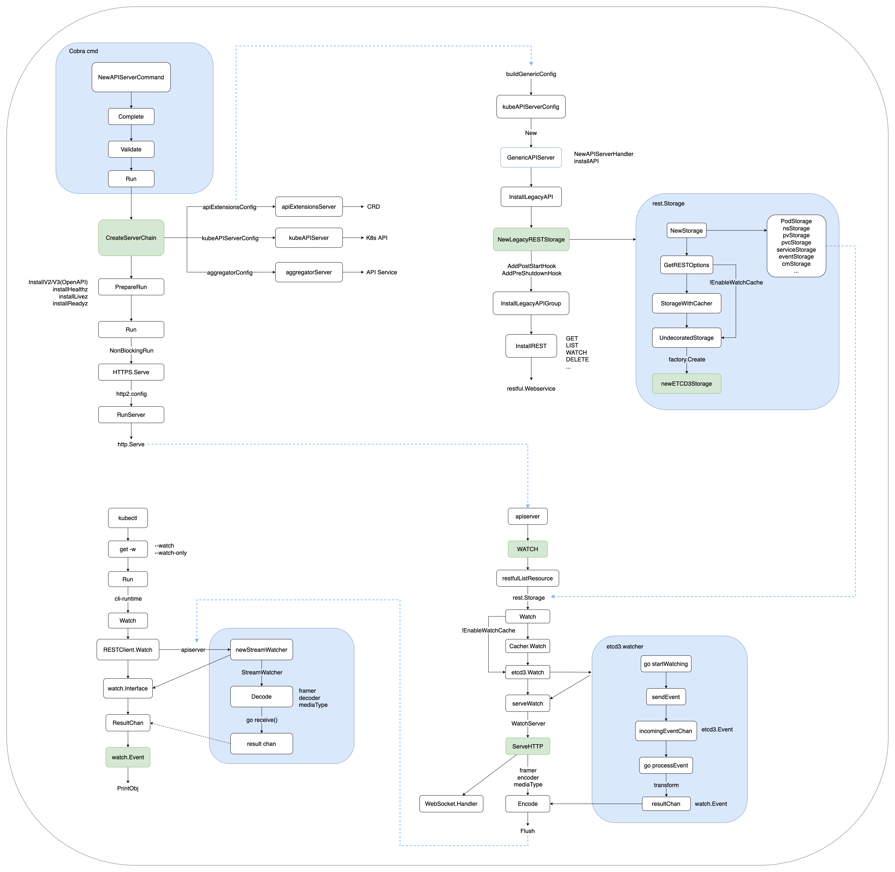
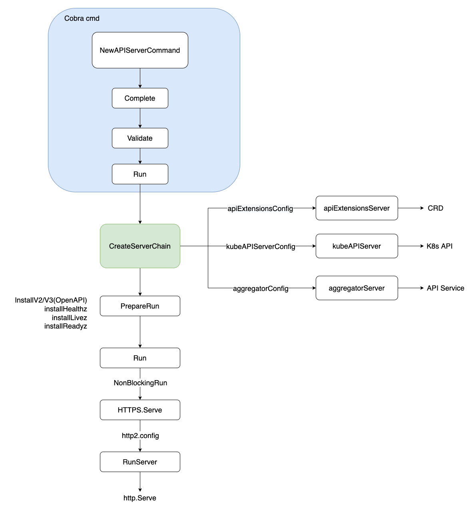
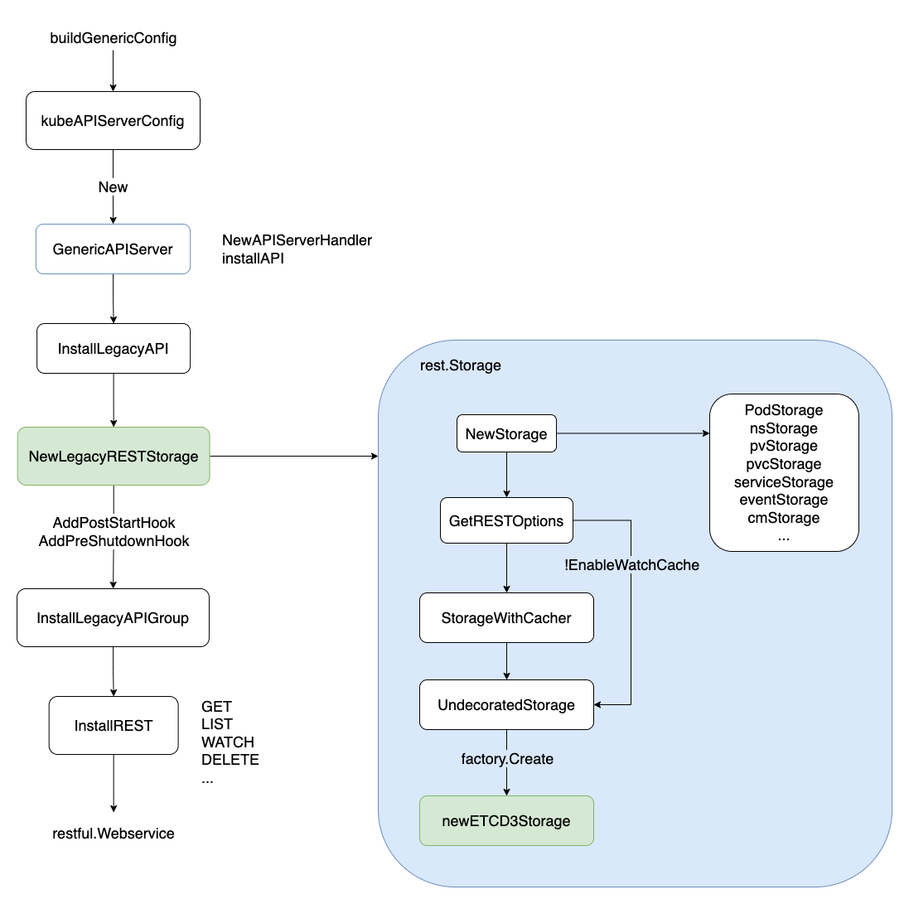
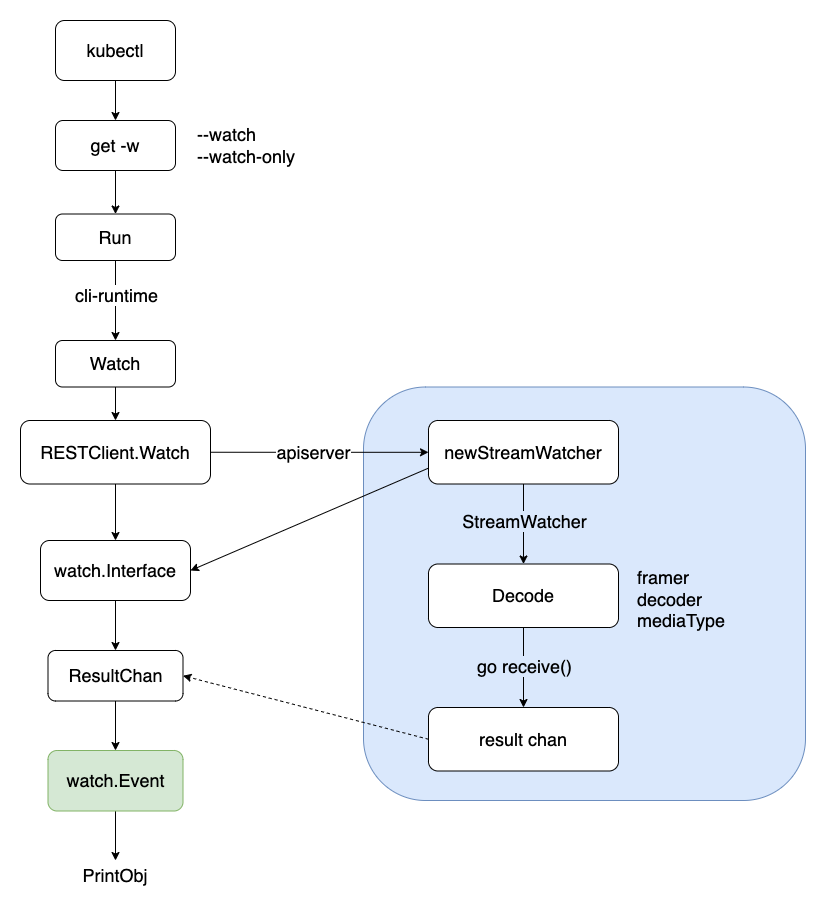
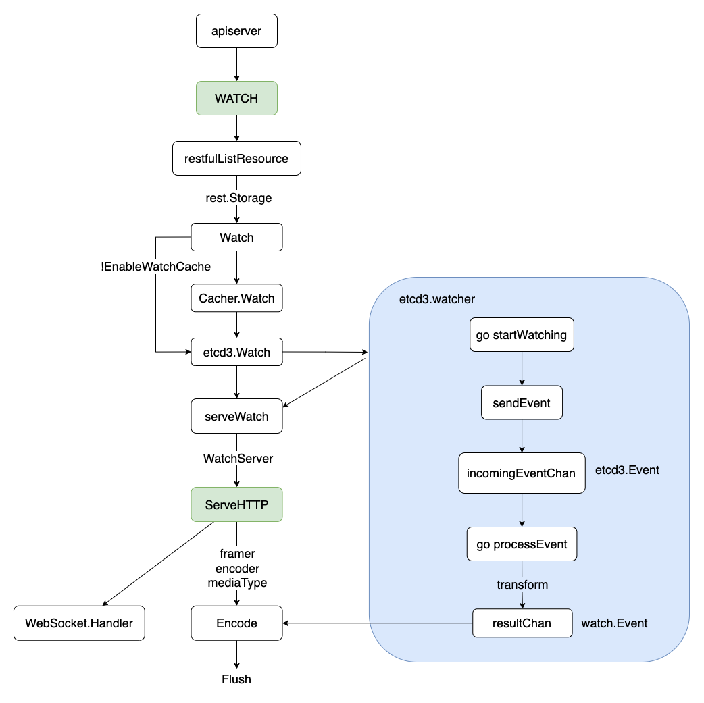
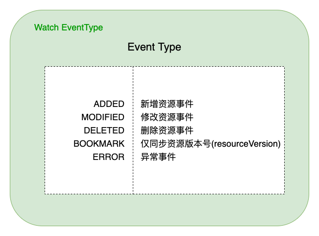

TOC
- [概述](#1-概述)
- [从 HTTP 说起](#2-从-HTTP-说起)
  - [Content-Length](#21-Content-Length)
  - [Chunked Transfer Encoding](#22-Chunked-Transfer-Encoding)
  - [HTTP/2](#23-HTTP2)
- [APIServer 启动](#3-APIServer-启动)
- [ETCD 资源封装](#4-ETCD-资源封装)
- [客户端 Watch 实现](#5-客户端-Watch-实现)
- [服务端 Watch 实现](#6-服务端-Watch-实现)
- [小结](#7-小结)

## 1. 概述
进入 K8s 的世界，会发现几乎所有对象都被抽象为了资源(Resource)，包括 K8s Core Resources(Pod, Service, Namespace 等)、CRD、APIService 扩展的资源类型。同时 K8s 底层将这些资源统一抽象为了 RESTful 的存储(Storage)，一方面服务端按目录形式(/registry/xxx) 存放在 ETCD 中，另一方面也为客户端提供了 RESTful API 接口，便于对资源的操作(get/post/put/patch/delete 等)。

K8s Watch API 就是为资源提供的一种持续监听其变化的机制，当资源有任何变化的时候，都可以实时、顺序、可靠的传递给客户端，使得用户可以针对目标资源进行灵活应用与操作。

那 K8s Watch 机制是怎么实现的呢？底层具体依赖了哪些技术？

本文将从 HTTP 协议、APIServer 启动、ETCD Watch 封装、服务端 Watch 实现、客户端 Watch 实现等方面，对 K8s Watch 实现机制进行了解析。

流程概览如下：



> 本文及后续相关文章都基于 K8s v1.23

## 2. 从 HTTP 说起
### 2.1 Content-Length
如下图所示，HTTP 发送请求 Request 或服务端 Response，会在 HTTP header 中携带 Content-Length，以表明此次传输的总数据长度。如果 Content-Length 长度与实际传输长度不一致，则会发生异常(大于实际值会超时, 小于实际值会截断并可能导致后续的数据解析混乱)。

```
curl baidu.com -v

> GET / HTTP/1.1
> User-Agent: curl/7.29.0
> Host: baidu.com
> Accept: */*

< HTTP/1.1 200 OK
< Date: Thu, 17 Mar 2022 04:15:25 GMT
< Server: Apache
< Last-Modified: Tue, 12 Jan 2010 13:48:00 GMT
< ETag: "51-47cf7e6ee8400"
< Accept-Ranges: bytes
< Content-Length: 81
< Cache-Control: max-age=86400
< Expires: Fri, 18 Mar 2022 04:15:25 GMT
< Connection: Keep-Alive
< Content-Type: text/html

<html>
<meta http-equiv="refresh" content="0;url=http://www.baidu.com/">
</html>
```

如果服务端提前不知道要传输数据的总长度，怎么办？

### 2.2 Chunked Transfer Encoding
HTTP 从 1.1 开始增加了分块传输编码（Chunked Transfer Encoding），将数据分解成一系列数据块，并以一个或多个块发送，这样服务器可以发送数据而不需要预先知道发送内容的总大小。数据块长度以十六进制的形式表示，后面紧跟着 \r\n，之后是分块数据本身，后面也是 \r\n，终止块则是一个长度为 0 的分块。
```
> GET /test HTTP/1.1
> Host: baidu.com
> Accept-Encoding: gzip

< HTTP/1.1 200 OK
< Server: Apache
< Date: Sun, 03 May 2015 17:25:23 GMT
< Content-Type: text/html
< Transfer-Encoding: chunked
< Connection: keep-alive
< Content-Encoding: gzip

4\r\n        (bytes to send)
Wiki\r\n     (data)
6\r\n        (bytes to send)
pedia \r\n   (data)
E\r\n        (bytes to send)
in \r\n
\r\n
chunks.\r\n  (data)
0\r\n        (final byte - 0)
\r\n         (end message)
```

为了实现以流（Streaming）的方式 Watch 服务端资源变更，HTTP1.1 Server 端会在 Header 里告诉 Client 要变更 Transfer-Encoding 为 chunked，之后进行分块传输，直到 Server 端发送了大小为 0 的数据。

### 2.3 HTTP/2
HTTP/2 并没有使用 Chunked Transfer Encoding 进行流式传输，而是引入了以 Frame(帧) 为单位来进行传输，其数据完全改变了原来的编解码方式，整个方式类似很多 RPC协议。Frame 由二进制编码，帧头固定位置的字节描述 Body 长度，就可以读取 Body 体，直到 Flags 遇到 END_STREAM。这种方式天然支持服务端在 Stream 上发送数据，不需要通知客户端做什么改变。
```
+-----------------------------------------------+
|                 Body Length (24)                   | ----Frame Header
+---------------+---------------+---------------+
|   Type (8)    |   Flags (8)   |
+-+-------------+---------------+-------------------+
|R|                 Stream Identifier (31)          |
+=+=================================================+
|                   Frame Payload (0...)        ...    ----Frame Data
+---------------------------------------------------+
```
K8s 为了充分利用 HTTP/2 在 Server-Push、Multiplexing 上的高性能 Stream 特性，在实现 RESTful Watch 时，提供了 HTTP1.1/HTTP2 的协议协商(ALPN, Application-Layer Protocol Negotiation) 机制，在服务端优先选中 HTTP2，协商过程如下：
```
curl  https://{kube-apiserver}/api/v1/watch/namespaces/default/pods/mysql-0 -v

* ALPN, offering h2
* ALPN, offering http/1.1
* SSL verify...
* ALPN, server accepted to use h2
* Using HTTP2, server supports multiplexing
* Connection state changed (HTTP/2 confirmed)
* Copying HTTP/2 data in stream buffer to connection buffer after upgrade: len=0
* Using Stream ID: 1 (easy handle 0x7f2b921a6a90)
> GET /api/v1/watch/namespaces/default/pods/mysql-0 HTTP/2
> Host: 9.165.12.1
> user-agent: curl/7.79.1
> accept: */*
> authorization: Bearer xxx
> 
* TLSv1.3 (IN), TLS handshake, Newsession Ticket (4):
* Connection state changed (MAX_CONCURRENT_STREAMS == 250)!

< HTTP/2 200 
< cache-control: no-cache, private
< content-type: application/json
< date: Thu, 17 Mar 2022 04:46:36 GMT

{"type":"ADDED","object":{"kind":"Pod","apiVersion":"v1","metadata":xxx}}
```

## 3. APIServer 启动
APIServer 启动采用 Cobra 命令行，解析相关 flags 参数，经过 Complete(填充默认值)->Validate(校验) 逻辑后，通过 Run 启动服务。启动入口如下：
```go
// kubernetes/cmd/kube-apiserver/app/server.go
// NewAPIServerCommand creates a *cobra.Command object with default parameters
func NewAPIServerCommand() *cobra.Command {
	s := options.NewServerRunOptions()
	cmd := &cobra.Command{
		Use: "kube-apiserver",
		...
		RunE: func(cmd *cobra.Command, args []string) error {
			...
			// set default options
			completedOptions, err := Complete(s)
			if err != nil {
				return err
			}

			// validate options
			if errs := completedOptions.Validate(); len(errs) != 0 {
				return utilerrors.NewAggregate(errs)
			}

			return Run(completedOptions, genericapiserver.SetupSignalHandler())
		},
	}
	...

	return cmd
}
```
在 Run 函数中，按序分别初始化 APIServer 链(APIExtensionsServer、KubeAPIServer、AggregatorServer)，分别服务于 CRD(用户自定义资源)、K8s API(内置资源)、API Service(API 扩展资源) 对应的资源请求。相关代码如下：
```go
// kubernetes/cmd/kube-apiserver/app/server.go
// 创建 APIServer 链(APIExtensionsServer、KubeAPIServer、AggregatorServer)，分别服务 CRD、K8s API、API Service
func CreateServerChain(completedOptions completedServerRunOptions, stopCh <-chan struct{}) (*aggregatorapiserver.APIAggregator, error) {
	// 创建 APIServer 通用配置
	kubeAPIServerConfig, serviceResolver, pluginInitializer, err := CreateKubeAPIServerConfig(completedOptions)
	if err != nil {
		return nil, err
	}
	...

	// 第一：创建 APIExtensionsServer
	apiExtensionsServer, err := createAPIExtensionsServer(apiExtensionsConfig, genericapiserver.NewEmptyDelegateWithCustomHandler(notFoundHandler))
	if err != nil {
		return nil, err
	}

	// 第二：创建 KubeAPIServer
	kubeAPIServer, err := CreateKubeAPIServer(kubeAPIServerConfig, apiExtensionsServer.GenericAPIServer)
	if err != nil {
		return nil, err
	}
	...

	// 第三：创建 AggregatorServer
	aggregatorServer, err := createAggregatorServer(aggregatorConfig, kubeAPIServer.GenericAPIServer, apiExtensionsServer.Informers)
	if err != nil {
		// we don't need special handling for innerStopCh because the aggregator server doesn't create any go routines
		return nil, err
	}

	return aggregatorServer, nil
}
```
之后，经过非阻塞(NonBlockingRun) 方式启动 SecureServingInfo.Serve，并配置 HTTP2(默认开启) 相关传输选项，最后启动 Serve 监听客户端请求。



> K8s APIServer 为了安全考虑，只支持客户端 HTTPS 请求，不支持 HTTP。

## 4. ETCD 资源封装
ETCD 实现 Watch 机制，经历了从 ETCD2 到 ETCD3 实现方式的转变。ETCD2 通过长轮询 Long-Polling 的方式监听资源事件的变更；ETCD3 则通过基于 HTTP2 的 gRPC 实现 Watch stream，性能得到了很大的提升。

> Polling(轮询)：由于 http1.x 没有服务端 push 的机制，为了 Watch 服务端的数据变化，最简单的办法当然是客户端去 pull：客户端每隔定长时间去服务端拉数据同步，无论服务端有没有数据变化。但是必然存在通知不及时和大量无效的轮询的问题。
> 
> Long-Polling(长轮询)：就是在这个 Polling 的基础上的优化，当客户端发起 Long-Polling 时，如果服务端没有相关数据，会 hold 住请求，直到服务端有数据要发或者超时才会返回。

在上一步配置 APIServerConfig 时，封装了底层存储用的 ETCD。以 kubeAPIServerConfig 为例，说明 K8s 内置资源是如何封装 ETCD 底层存储的。

首先，通过 buildGenericConfig 实例化 RESTOptionsGetter，用于封装 RESTStorage。之后通过 InstallLegacyAPI -> NewLegacyRESTStorage 实例化 K8s 内置资源的 RESTStorage，包括 podStorage、nsStorage、pvStorage、serviceStorage 等，用于 APIServer 在处理客户端资源请求时，调用的后端资源存储。

InstallLegacyAPI 源码如下：
```go
// kubernetes/pkg/controlplane/instance.go
// 注册 K8s 的内置资源，并封装到对应的 RESTStorage(如 podStorage/pvStorage)
func (m *Instance) InstallLegacyAPI(c *completedConfig, restOptionsGetter generic.RESTOptionsGetter) error {
	...
	legacyRESTStorage, apiGroupInfo, err := legacyRESTStorageProvider.NewLegacyRESTStorage(c.ExtraConfig.APIResourceConfigSource, restOptionsGetter)
	if err != nil {
		return fmt.Errorf("error building core storage: %v", err)
	}
	if len(apiGroupInfo.VersionedResourcesStorageMap) == 0 { // if all core storage is disabled, return.
		return nil
	}

	controllerName := "bootstrap-controller"
	coreClient := corev1client.NewForConfigOrDie(c.GenericConfig.LoopbackClientConfig)
	bootstrapController, err := c.NewBootstrapController(legacyRESTStorage, coreClient, coreClient, coreClient, coreClient.RESTClient())
	if err != nil {
		return fmt.Errorf("error creating bootstrap controller: %v", err)
	}
	m.GenericAPIServer.AddPostStartHookOrDie(controllerName, bootstrapController.PostStartHook)
	m.GenericAPIServer.AddPreShutdownHookOrDie(controllerName, bootstrapController.PreShutdownHook)

	...
	return nil
}
```
在实例化 ETCD 底层存储中，通过开关 EnableWatchCache 来控制是否启用 Watch 缓存。如果启用了，则会先走 StorageWithCacher 逻辑，然后才走 UndecoratedStorage 真正调用底层 ETCD3 存储。

> K8s 当前只支持 ETCD3，不再支持 ETCD2。K8s 充分信任 ETCD3 的 Watch 机制，保证资源状态与 ETCD 底层存储的一致性。

整个调用过程如下：



> K8s 各类资源(CRD/Core/Aggregator) 都统一以 RESTful 风格暴露 HTTP 请求接口，并支持多种类型的编解码格式，如 json/yaml/protobuf。


## 5. 客户端 Watch 实现
经过上面的步骤，APIServer 服务端已准备好 K8s 各类资源的 RESTStorage(底层封装了 ETCD3)，此时客户端可通过 RESTful HTTP 接口向 APIServer 发出资源请求，包括 GET/POST/PATCH/WATCH/DELETE 等操作。

> 客户端 Watch 包括：
> 
> (1). kubectl get xxx -w，获取某类资源、并持续监听资源变化；
> 
> (2). client-go 中 Reflector ListAndWatch APIServer 各类资源，[点此查看](https://github.com/k8s-club/k8s-club/blob/main/articles/K8s%20%E7%B3%BB%E5%88%97(%E5%9B%9B)%20-%20%E6%B5%85%E8%B0%88%20Informer.md)；

我们以 kubectl get pod -w 为例，说明客户端是如何实现资源的 Watch 操作。

首先，kubectl 也是通过 Cobra 命令行解析参数(--watch，或 --watch-only)，然后调用 Run 调用 cli-runtime 包下面的 Watch 接口，之后通过 RESTClient.Watch 向 APIServer 发起 Watch 请求，获得一个流式 watch.Interface，然后不断从其中 ResultChan 获取 watch.Event。之后，根据客户端发送的编解码类型(json/yaml/protobuf)，从 stream 中按帧(Frame) 读取并解码(Decode) 数据，输出显示到命令行终端。

客户端通过 RESTClient 发起 Watch 请求，代码如下：
```go
// kubernetes/staging/src/k8s.io/cli-runtime/pkg/resource/helper.go
func (m *Helper) Watch(namespace, apiVersion string, options *metav1.ListOptions) (watch.Interface, error) {
	options.Watch = true
	return m.RESTClient.Get().
		NamespaceIfScoped(namespace, m.NamespaceScoped).
		Resource(m.Resource).
		VersionedParams(options, metav1.ParameterCodec).
		Watch(context.TODO())
}
```

客户端 Watch 实现过程小结如下：




## 6. 服务端 Watch 实现
服务端 APIServer 启动后，一直在持续监听着各类资源的变更事件。在接收到某类资源的 Watch 请求后，调用 RESTStorage 的 Watch 接口，通过开关 EnableWatchCache 来控制是否启用 Watch 缓存，最终通过 etcd3.Watch 封装实现了 ETCD 底层的 Event 变更事件。

> RESTStorage 就是在 APIServer 启动时候，提前注册、封装的 ETCD 资源存储。

etcd3.watcher 通过两个 channel(incomingEventChan、resultChan，默认容量都为 100) 实现 ETCD 底层事件到 watch.Event 的转换，然后通过 serveWatch 流式监听返回的 watch.Interface，不断从 resultChan 中取出变更事件。之后，根据客户端发送的编解码类型(json/yaml/protobuf)，编码(Encode) 数据，按帧(Frame) 组装后发送到 stream 中给客户端。

服务端通过 serveWatch 流式监听返回的 watch.Interface，代码如下：
```go
// kubernetes/staging/src/k8s.io/apiserver/pkg/endpoints/handlers/get.go
func ListResource(r rest.Lister, rw rest.Watcher, scope *RequestScope, forceWatch bool, minRequestTimeout time.Duration) http.HandlerFunc {
	return func(w http.ResponseWriter, req *http.Request) {
		...

		if opts.Watch || forceWatch {
			...
			watcher, err := rw.Watch(ctx, &opts)
			if err != nil {
				scope.err(err, w, req)
				return
			}
			requestInfo, _ := request.RequestInfoFrom(ctx)
			metrics.RecordLongRunning(req, requestInfo, metrics.APIServerComponent, func() {
				serveWatch(watcher, scope, outputMediaType, req, w, timeout)
			})
			return
		}
		...
	}
}
```

> K8s 在 v1.11 之后将 WATCH/WATCHLIST 类型的 action.Verb 废弃了，统一都交由 LIST -> restfulListResource 处理。

服务端 Watch 实现过程小结如下：



> APIServer 除了支持 HTTP2，也支持 WebSocket 通信。当客户端请求包含了 Upgrade: websocket，Connection: Upgrade 时，则服务端会通过 WebSocket 与客户端进行数据传输。

值得注意的是，底层 ETCD 事件通过 transform 函数转换为 watch.Event，包括以下几种类型(Type)：




## 7. 小结
本文通过分析 K8s 中 APIServer 启动、ETCD watch 封装、服务端 Watch 实现、客户端 Watch 实现等核心流程，对 K8s Watch 实现机制进行了解析。通过源码、图文方式说明了相关流程逻辑，以期更好的理解 K8s Watch 实现细节。

K8s 底层完全信任 ETCD(ListAndWatch)，将各类资源统一抽象为了 RESTful 的存储(Storage)，通过 Watch 机制获取各类资源的变更事件，然后通过 Informer 机制分发给下游监听的 ResourceEventHandler，最终由 Controller 实现资源的业务逻辑处理。随着 ETCD3 在 HTTP/2 基础上不断优化完善，K8s 将提供更高效、更稳定的编排能力。


*PS: 更多内容请关注 [k8s-club](https://github.com/k8s-club/k8s-club)*


### 参考资料
1. [HTTP/2 Wikipedia](https://en.wikipedia.org/wiki/HTTP/2)
2. [Chunked Transfer Encoding](https://en.wikipedia.org/wiki/Chunked_transfer_encoding)
3. [Kubernetes 源码](https://github.com/kubernetes/kubernetes)
4. [ETCD watch-api](https://etcd.io/docs/v3.2/learning/api/#watch-api)
5. [K8s API Concepts](https://kubernetes.io/docs/reference/using-api/api-concepts/)
6. [Server Push 与 Client Poll](https://ninokop.github.io/2018/07/25/watch-push-or-pull/)
